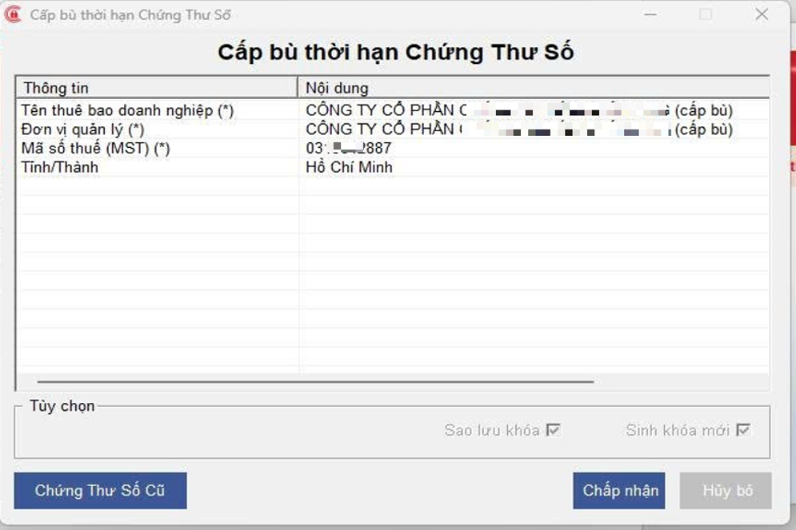
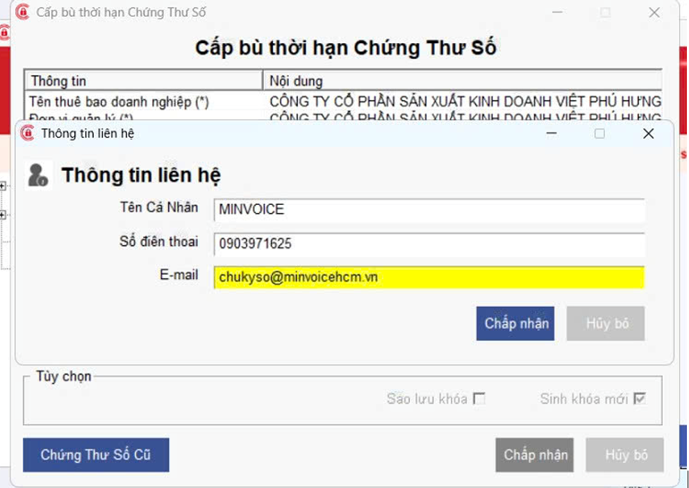
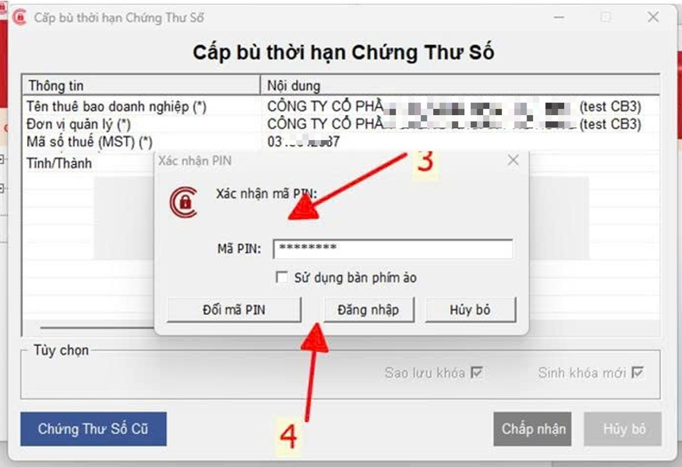
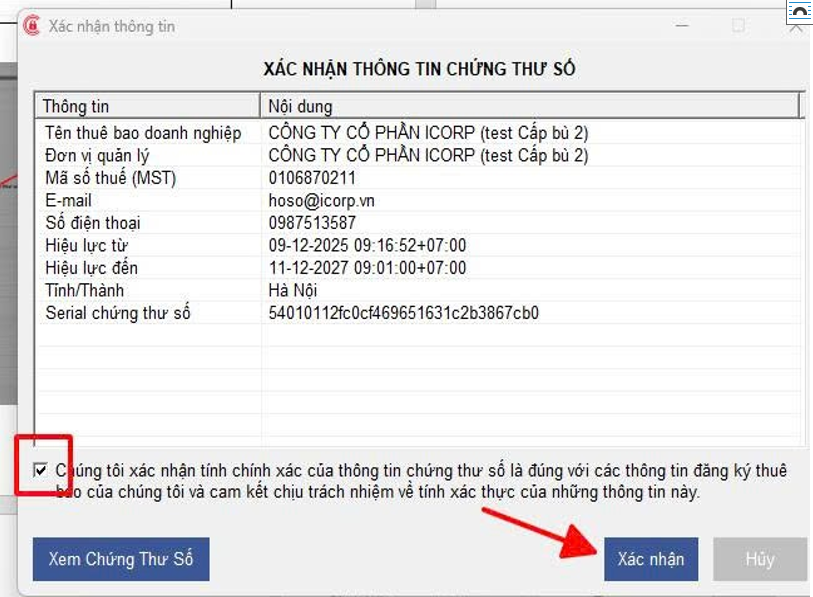
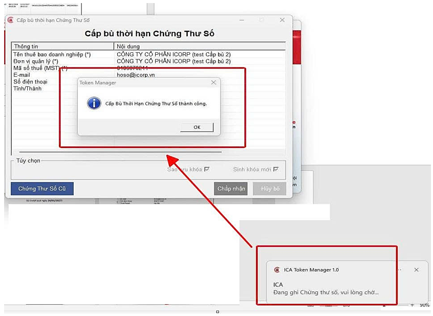
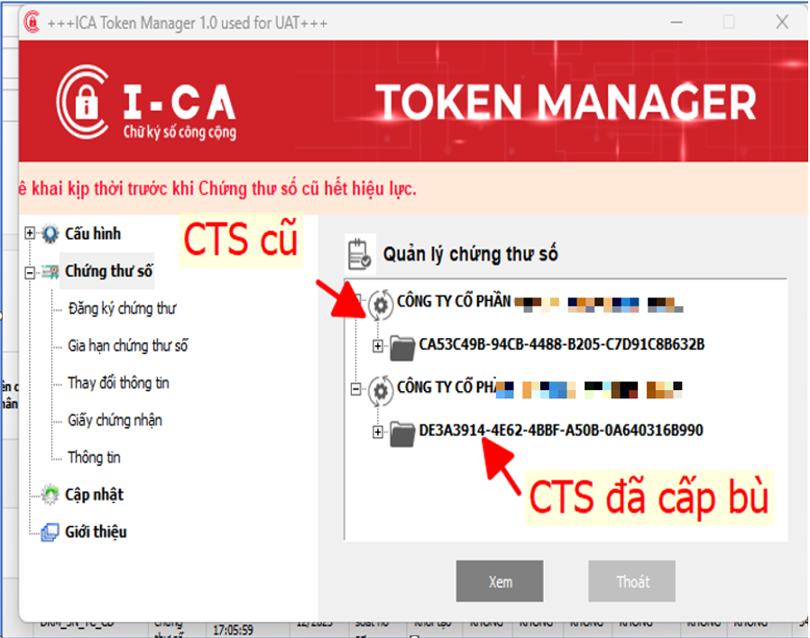
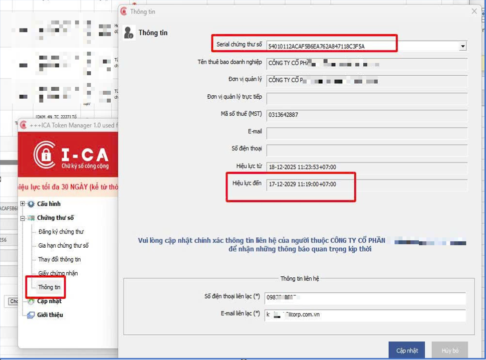
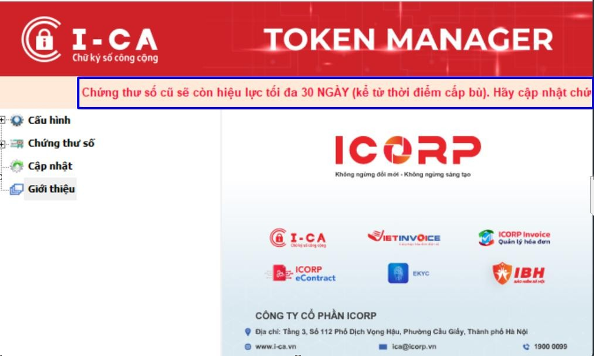

# **Hướng dẫn nghiệp vụ cấp bù chứng thư số**

🔹 THAO TÁC TRÊN TOKEN (để hoàn tất cấp bù)

 

⚠️ Chỉ áp dụng với Chứng thư số sử dụng Token

### **Bước 1: Cắm Token vào máy -> nhập đầy đủ thông tin liên hệ -> bấm Chấp nhận -> Popup Cấp bù thời hạn chứng thư số -> bấm Chấp nhận**

!!! info "📌 Thông tin liên hệ A/C vui lòng nhập như sau"

    **📧 Email:** chukyso@minvoicehcm.vn  
    **📞 SĐT:** 0903971625

### **Bước 2: Nhập mã PIN -> bấm Đăng nhập**

### **Bước 3: Tick chọn và bấm Xác nhận để xác nhận sinh khóa mới -> Bấm OK và chờ ghi CTS (luôn luôn cắm Token trong suốt quá trình thao tác) -> cấp bù thành công.**

### **Bước 4: Sau Cấp bù, Token sẽ hiển thị 2 cer chứng thư số.**

Serial CTS cũ sẽ hết hiệu lực sau 30 NGÀY. Đại lý cần hỗ trợ khách hàng cập nhật serial CTS mới (đã được cấp bù) lên các trang sử dụng ký số để tránh bị gián đoạn khi sử dụng.

Chứng thư chữ ký số sau khi cấp bù trên Token sẽ hiển thị dòng nhắc nhở thuê bao về việc cập nhật cer lên các trang kê khai

???+ info "Xin chân thành cảm ơn quý khách hàng đã tin dùng sản phẩm của M-Invoice"

    Có bất kỳ vướng mắc nào trong quá trình sử dụng hãy liên hệ với M-Invoice tại mục Hỗ trợ kỹ thuật góc phải bên dưới màn hình hoặc gọi tổng đài kỹ thuật của M-Invoice (1900.955.557 Nhánh 1)

Last updated on <strong>Feb 26, 2026</strong> by <strong>nhatth</strong>

