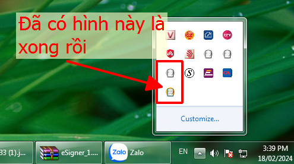
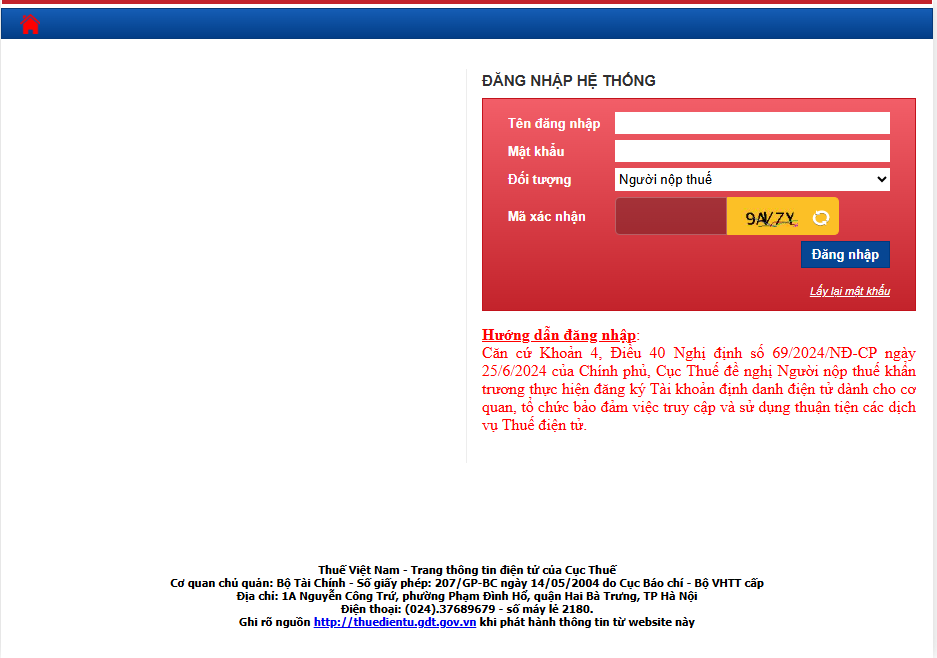
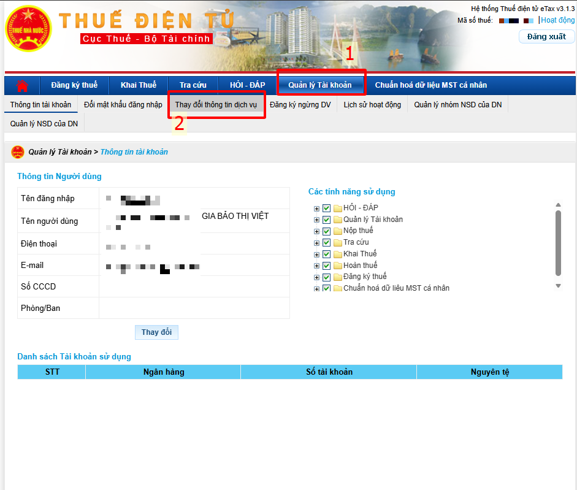
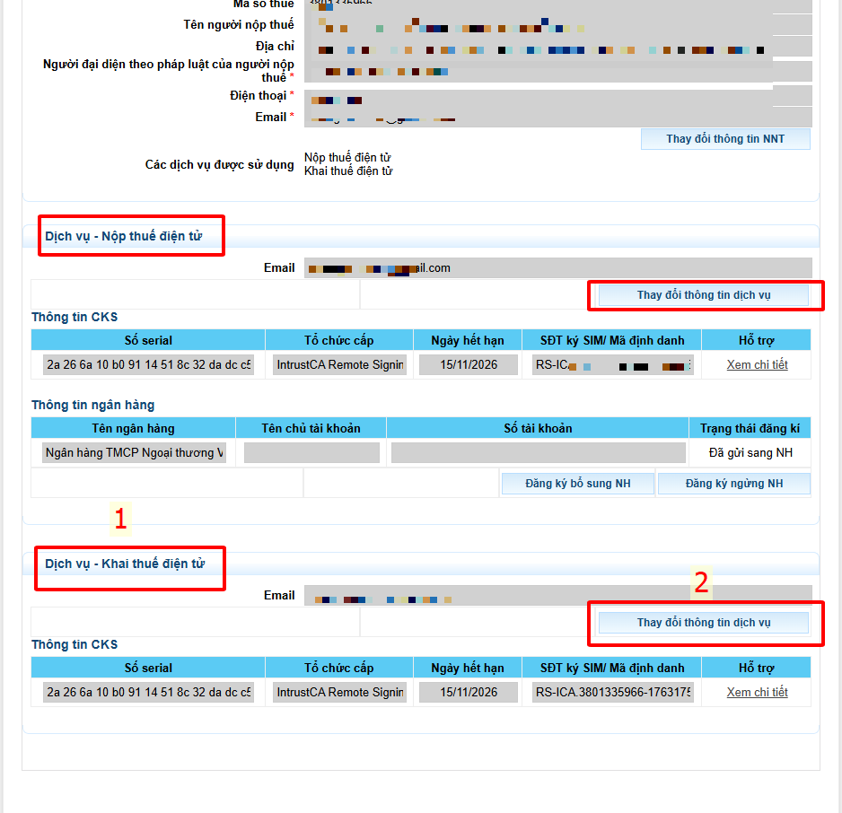
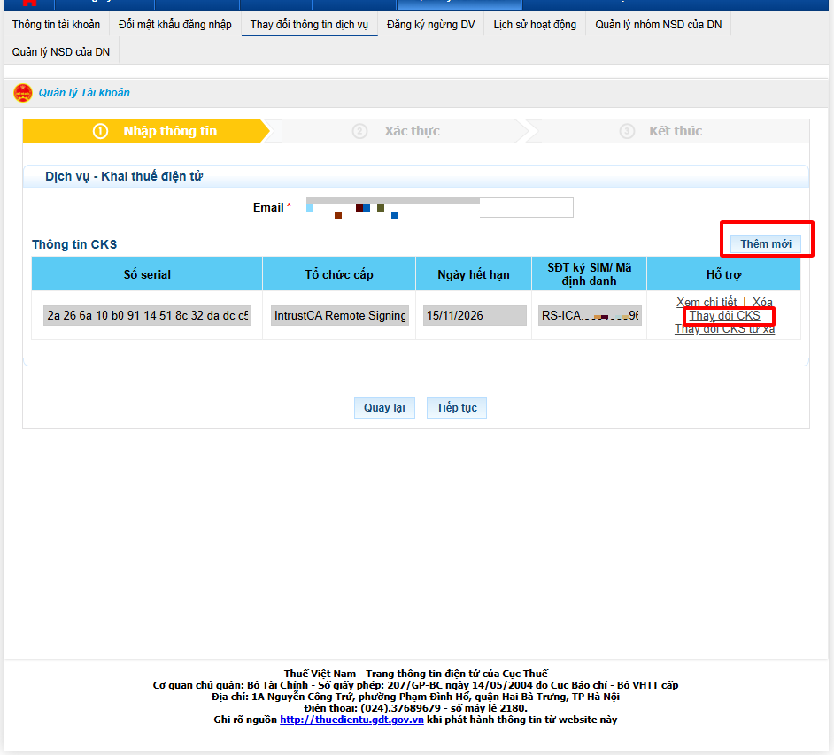
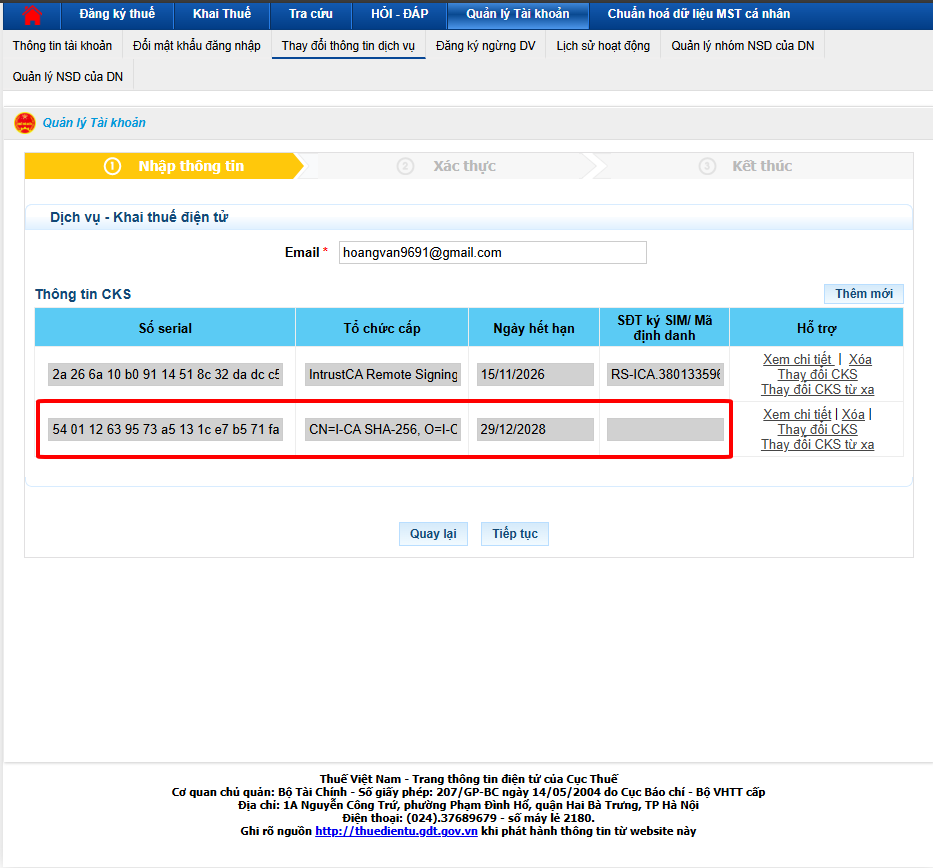
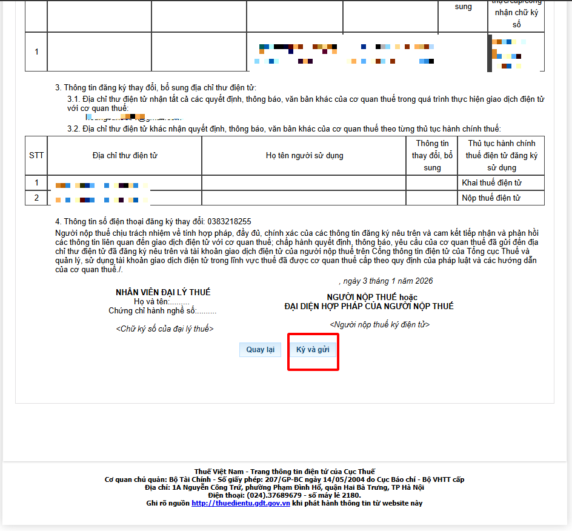
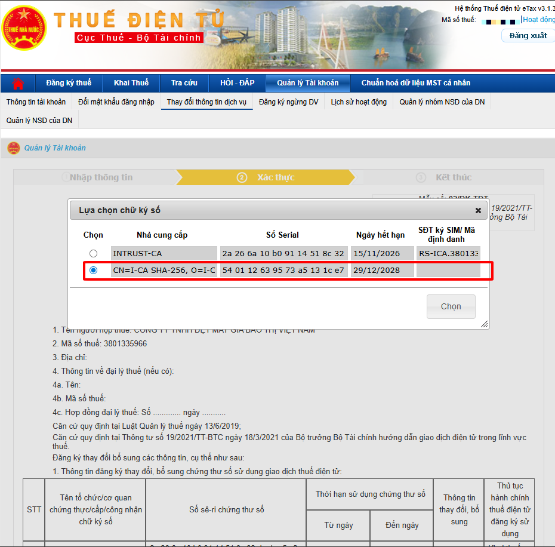
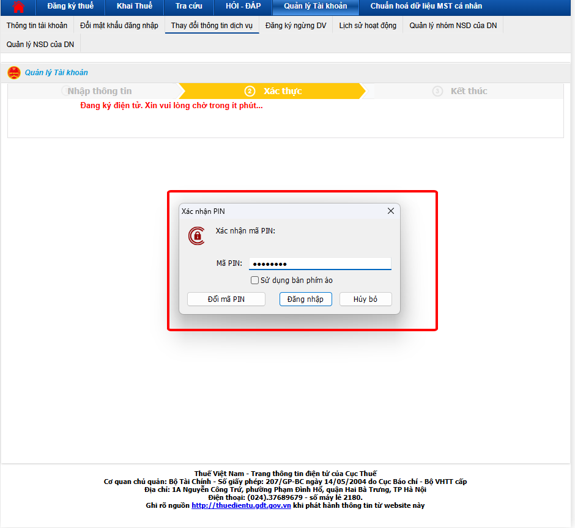
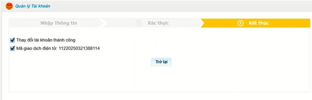

# **Thay đổi cks USB trên thuế điện tử**

???+ Note "Mục đích"

    Hướng dẫn người dùng thực hiện thay đổi chữ ký số (CKS) USB trên hệ thống thuế điện tử một cách chính xác và an toàn, đảm bảo các giao dịch khai báo, nộp thuế, khai thuế và ký hồ sơ điện tử được tiếp tục thực hiện mà không gián đoạn do thay đổi thiết bị chữ ký số hay thêm mới chữ ký số.

???+ Danger "Điều kiện để thay đổi cks USB"

    **1. Máy tính đã cài phần mềm ký số eSigner của thuế**
    
    

    **Nếu chưa cài đặt anh chị có thể cài đặt [tại đây](https://www.fshare.vn/file/2KG8LZXF3UR1?token=1767404286){:target="\_blank"}**

    **2. Đã cài đặt phần mềm chữ ký số USB mà anh chị đang dùng**

## **HƯỚNG DẪN THAY ĐỔI CKS USB TRÊN THUẾ ĐIỆN TỬ**

**Bước 1**: Truy cập trang thuế điện tử [Thuế điện tử](https://thuedientu.gdt.gov.vn/){:target="\_blank"} bằng tài khoản thuế đã được cấp, trường hợp chưa có tài khoản thuế đơn vị thực hiện Đăng ký tài khoản dành cho Doanh nghiệp.

- Sau khi đăng nhập **Chọn quản lý tài khoản** => **Thay đổi thông tin dịch vụ**

**Bước 2**: Tại dịch vụ cần thay đổi chữ ký số **(Khai thuế, Nộp thuế)** chọn Thay đổi thông tin dịch vụ

**Dưới đây sẽ chọn khai thuế, trường hợp muốn thay đổi cả 2 sau khi làm xong khai thuế anh chị có thể làm tương tự các bước ở nộp thuế**

=> Chọn Thêm mới chữ ký số hoặc chọn Thay đổi chữ ký số

Hệ thống tự động lấy thông tin chữ ký số => chọn Tiếp tục

**Bước 3**: Hệ thống hiển thị tờ khai thay đổi thông tin => Chọn Ký và gửi

Hệ thống hiển thị danh sách chứng thư => tích chọn chứng thư dùng ký

**Nhập mã pin cks**

Hệ thống thông báo thay đổi thông tin thành công.

???+ info "Xin chân thành cảm ơn quý khách hàng đã tin dùng sản phẩm của M-Invoice"

    Có bất kỳ vướng mắc nào trong quá trình sử dụng hãy liên hệ với M-Invoice tại mục Hỗ trợ kỹ thuật góc phải bên dưới màn hình hoặc gọi tổng đài kỹ thuật của M-Invoice (1900.955.557 Nhánh 1)

Last updated on <strong>Jan 03, 2025</strong> by <strong>nhatth</strong>

