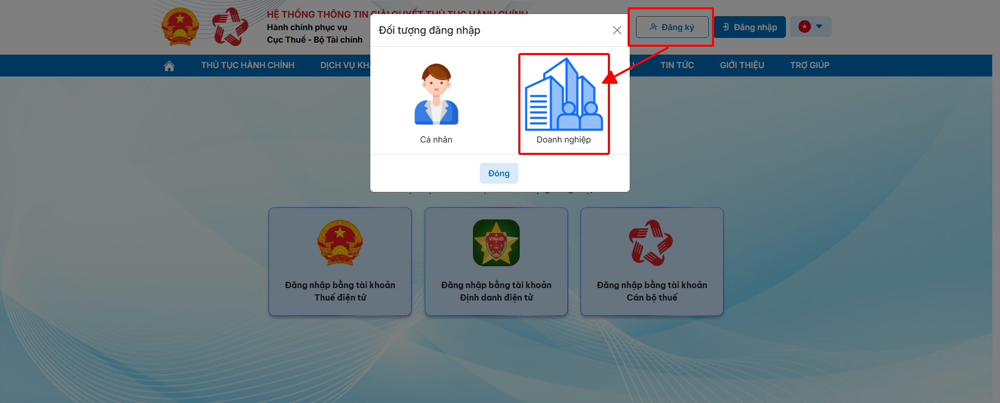
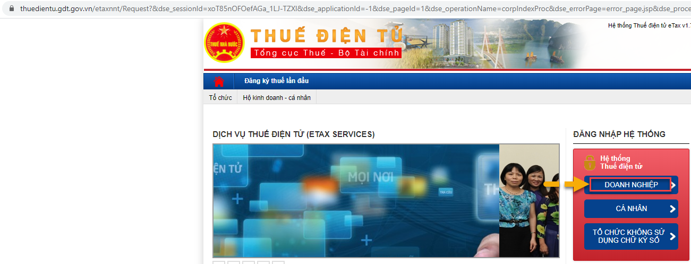
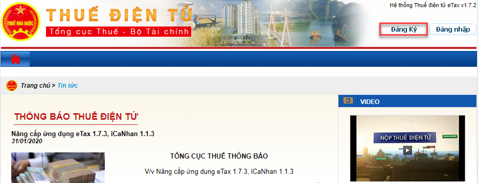
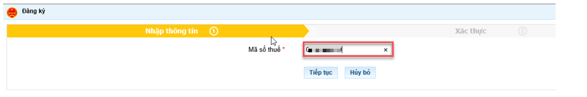
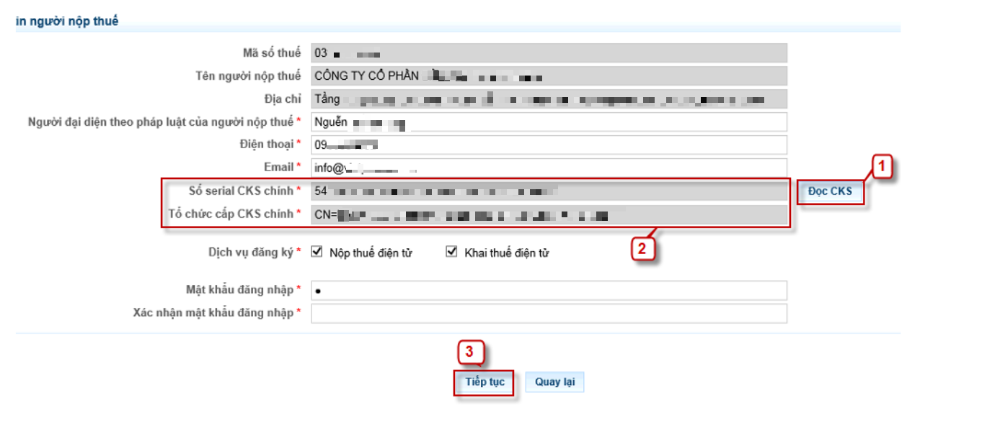
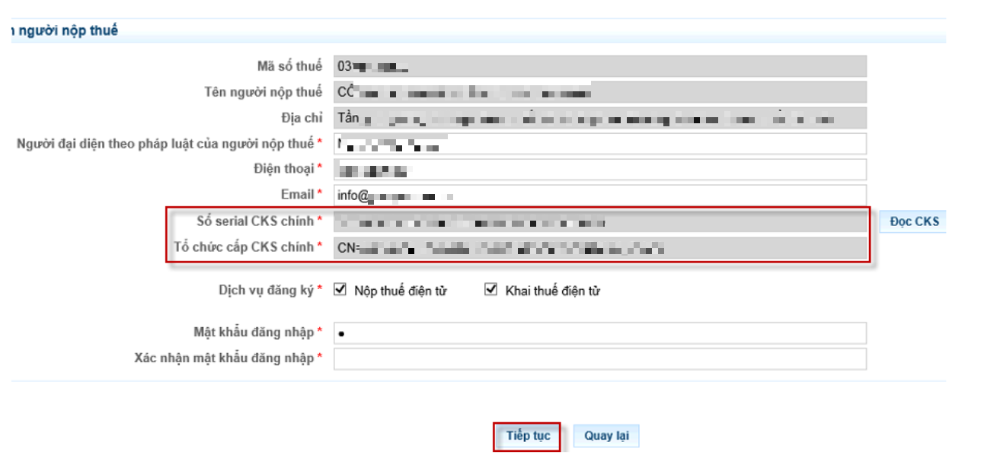
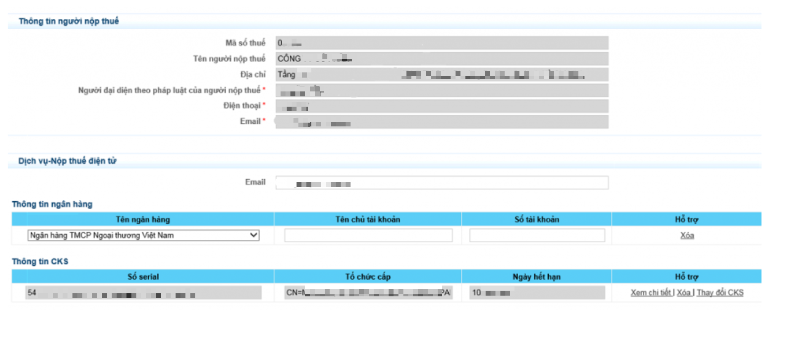
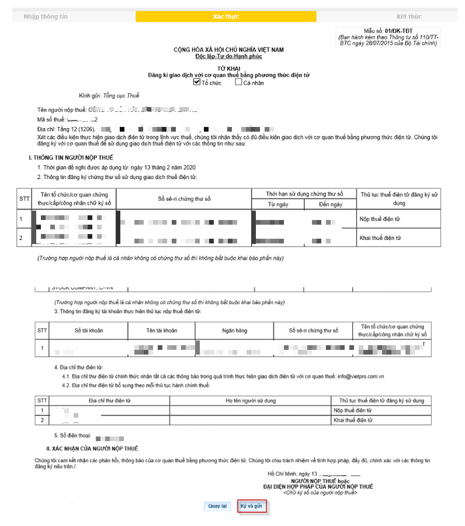
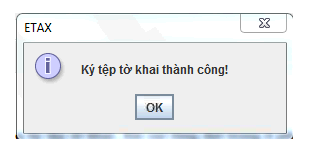
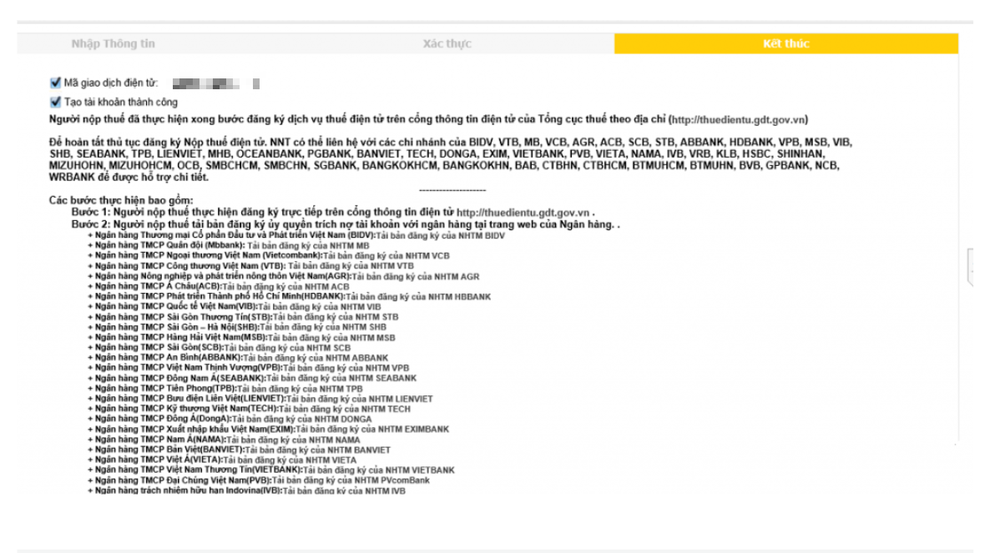

# **Đăng ký tài khoản trên trang Cổng dịch vụ công thuế điện tử (dichvucong.gdt.gov.vn) áp dụng với doanh nghiệp mới**

???+ Note "Mục đích"

    Bài viết hướng dẫn đăng ký tài khoản Cổng dịch vụ công cho doanh nghiệp mới sử dụng chữ ký số qua USB Token.

## **Cách 1. Đăng ký tài khoản trực tiếp trên trang dichvucong.gdt.gov.vn**

### Bước 1. Thực hiện truy cập vào trang **dichvucong.gdt.gov.vn**, chọn **Đăng ký**, chọn **Đối tượng đăng nhập** là **Doanh nghiệp**, màn hình sẽ chuyển hướng sang **Hướng dẫn đăng ký và kích hoạt tài khoản định danh điện tử**  

  Thực hiện đăng ký và kích hoạt tài khoản định danh điện tử theo
 [Hướng dẫn](https://vneid.gov.vn/huongdan/huong-dan-dang-ky-tai-khoan-vneid.html){:target="\_blank"}

### **Bước 2. Sau khi kích hoạt xong tài khoản, thực hiện đăng nhập theo hướng dẫn sau**  

???+ info "Nội dung"

    Bài viết hướng dẫn quy trình nộp tờ khai thuế qua website mới của Dịch vụ công Tổng cục Thuế.

    Nội dung bài viết bao gồm các bước thực hiện nộp tờ khai, hướng dẫn thao tác trên hệ thống và các lưu ý quan trọng khi sử dụng dịch vụ.

    Phạm vi đáp ứng: Áp dụng cho doanh nghiệp, tổ chức, cá nhân thực hiện nộp tờ khai thuế điện tử trên hệ thống Dịch vụ công của Tổng cục Thuế.

- Người nộp thuế truy cập thành công vào Hệ thống Dịch vụ công về Thuế (địa chỉ: https://dichvucong.gdt.gov.vn). Chọn chức năng Đăng nhập, hệ thống hiển thị màn hình chọn loại tài khoản đăng nhập.

1. Đăng nhập bằng tài khoản Định danh điện tử

2. Đăng nhập bằng tài khoản Thuế điện tử

#### 1. Đăng nhập bằng tài khoản Định danh điện tử (VNeID)

- NNT chọn Đăng nhập bằng tài khoản Định danh điện tử

- NNT nhập tên đăng nhập/mật khẩu nhấn Đăng nhập, hệ thống hiển thị màn hình nhập mã xác nhận đăng nhập.

- Nhập mã xác nhận, nhấn Xác nhận, hệ thống VNeID kiểm tra

- Trường hợp NNT được định danh với vai trò Cá nhân và Tổ chức, sẽ hiển thị màn hình chọn Loại tài khoản “Cá nhân”, “Tổ chức”

- Trường hợp NNT được định danh với vai trò Cá nhân, sẽ không hiển thị màn hình chọn loại tài khoản.

#### 2. Đăng nhập bằng tài khoản Thuế điện tử 

- NNT chọn **Đăng nhập bằng tài khoản Thuế điện tử**, chọn **Đối tượng đăng nhập** là **Cá nhân** hoặc **Doanh nghiệp**

- NNT nhập thông tin đăng nhập là tài khoản đăng nhập vào trang thuế điện tử (thuedientu.gdt.gov.vn) đối với đối tượng Doanh nghiệp và trang canhan (canhan.gdt.gov.vn) đối với đối tượng Cá nhân

## **Cách 2. Thực hiện đăng ký tài khoản trên trang thuedientu.gdt.gov.vn**

???+ info "Điều kiện"

    Sau khi đăng ký các thử tục về đăng ký doanh nghiệp, công ty sẽ được sở kế hoạch đầu tư cấp giấy phép đăng ký kinh doanh. Để thực hiện 
    
    đăng ký tài khoản thuế điện tử cho doanh nghiệp mới dùng chữ ký số qua USB Token theo hướng dẫn dưới đây:

    Công cụ cần cài đặt:

    1. Cài đặt và kích hoạt USB Token

    2. Công cụ java

### **Bước 1. Đăng ký TK trên trang TCT**  

- Truy cập theo địa chỉ: **thuedientu.gdt.gov.vn** chọn Doanh nghiệp

Góc trên cùng bên tay phải màn hình có mục **Đăng Ký** các bạn click vào đó.

### **Bước 2. Khai báo thông tin**  

Hệ thống chuyển sang trang đăng ký tài khoản như dưới đây. Quý khách nhập **Mã Số Thuế** của doanh nghiệp vào. >> Click vào **”Tiếp Tục“**

Sau khi nhập xong mã số thuế doanh nghiệp >> Tiếp Tục đến trang thông tin như sau: tất cả các doanh nghiệp khi đăng ký mới thông tin sẽ kiểm tra lần lượt các thông tin: Mã số thuế, Tên người nộp thuế, địa chỉ… Lúc này Quý khách nhập bổ sung thêm các thông tin như:

– Người đại diện theo pháp luật.

– Điện thoại.

– Email.

– Số serial CKS chính 

– Tổ chức cấp CKS chính 

– Mật Khẩu đăng nhập

– Tích vào đọc CKS, sẽ tự động cập thông tin chữ ký số

Lưu ý:  Lúc này người máy tính người sử dụng đã cài đặt phần mềm chữ ký số

Trên giao diện đã tự động lấy ra thông tin Chữ ký số, chọn ấn **Tiếp tục**

Kê khai thêm **Thông tin về ngân hàng** nộp thuế, sau đó ấn **Tiếp tục.**

Kiểm tra toàn bộ thông tin đăng ký, ấn **Ký và gửi**

### **Bước 2. Ký số**  

Sau khi đã hiển thị đầy đủ thông tư Chữ ký số rồi thì tích **Tiếp tục**

Nhập mã PIN/ ấn OK. Sau đó ấn Nộp tờ khai

Thông báo khi thực hiện ký thành công

Sau khi ký số sẽ có thông báo về việc đăng ký TK thành công của TCT.

???+ info "Xin chân thành cảm ơn quý khách hàng đã tin dùng sản phẩm của M-Invoice"

    Có bất kỳ vướng mắc nào trong quá trình sử dụng hãy liên hệ với M-Invoice tại mục Hỗ trợ kỹ thuật góc phải bên dưới màn hình hoặc gọi tổng đài kỹ thuật của M-Invoice (1900.955.557 Nhánh 1)

Last updated on <strong>Jan 20, 2025</strong> by <strong>NHATTH</strong>

