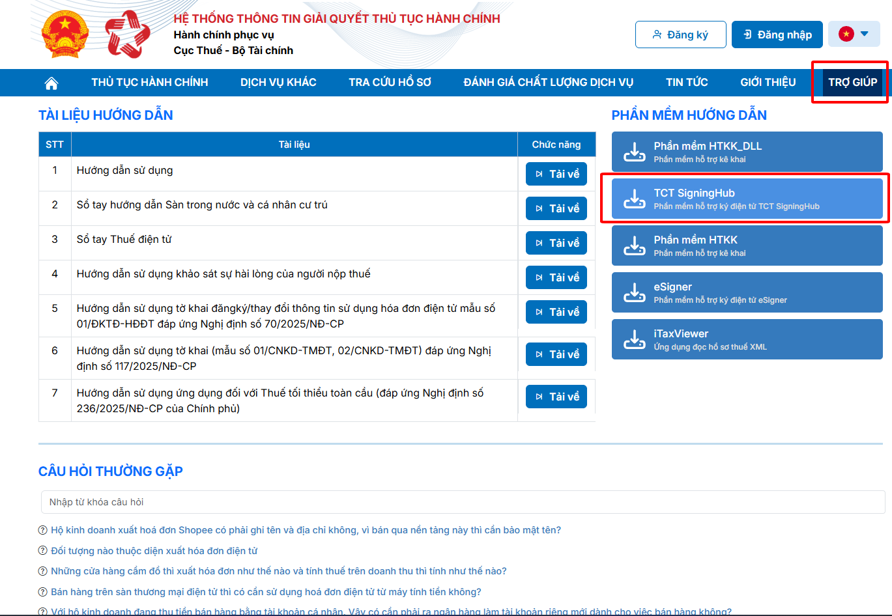
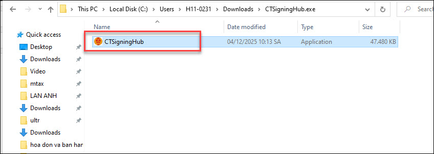
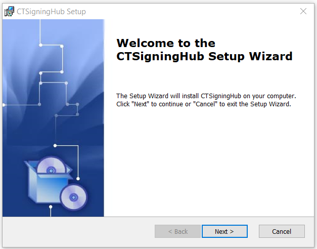
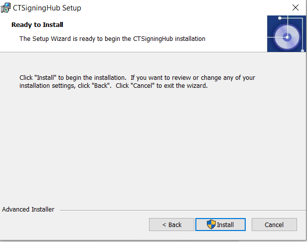
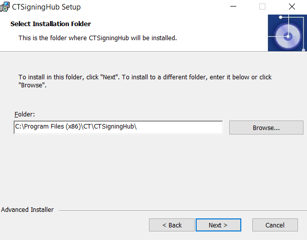
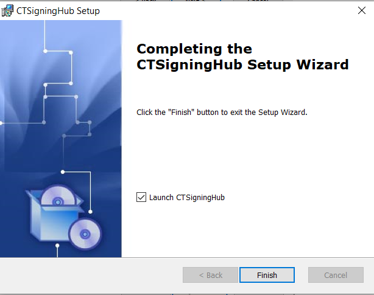
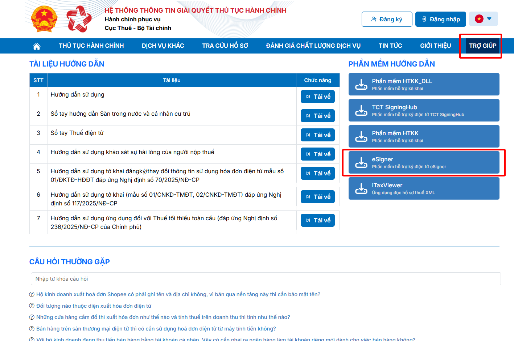
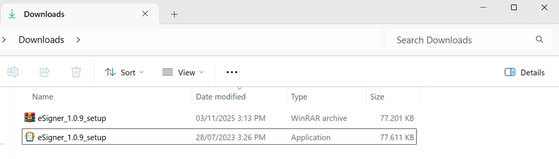

# **Hướng dẫn cài đặt cấu hình ký số trên Cổng dịch vụ công thuế điện tử (dichvucong.gdt.gov.vn)**

???+ Note "Mục đích"

    Bài viết hướng dẫn cài đặt các phần mềm hỗ trợ ký điện tử để thực hiện ký tờ khai trên trang dichvucong.gdt.gov.vn.

## **Phần 1. Cài đặt phần mềm hỗ trợ ký điện tử TCT SigningHub**

### **Tải và cài đặt phần mềm TCT SigningHub**  

- Truy cập vào mục **“Trợ giúp”** của Cổng Dịch vụ công Thuế, chọn tải xuống TCT SigningHub như hình:

Sau khi tải xuống hoàn tất, truy cập vào thư mục Downloads (hoặc thư mục đã chọn để lưu tệp), giải nén và chạy file **CTSigningHub.**

Thực hiện cài đặt: Cửa sổ setup hiển thị. Bấm nút .**“Next”.**, .**“Install”.** để thực hiện cài đặt.

Sau khi cài đặt xong bấm **“Finish”** để hoàn thành quá trình cài đặt.

## **Phần 2. Cài đặt phần mềm hỗ trợ ký điện tử eSigner**

### **Tải và cài đặt phần mềm eSigner**  

- Truy cập vào mục “Trợ giúp” của Cổng Dịch vụ công Thuế, chọn tải xuống eSigner như hình:

- Sau khi tải xuống hoàn tất, truy cập vào thư mục Downloads (hoặc thư mục đã chọn để lưu tệp), giải nén và chạy file **eSigner_setup**:

- Thực hiện cài đặt: Cửa sổ setup hiển thị. Bấm nút “Next”, “Install” để thực hiện cài đặt.

- Sau khi cài đặt xong, trên thanh tác vụ hiển thị biểu tượng HĐĐT plugin và eSigner như hình.

???+ info "Xin chân thành cảm ơn quý khách hàng đã tin dùng sản phẩm của M-Invoice"

    Có bất kỳ vướng mắc nào trong quá trình sử dụng hãy liên hệ với M-Invoice tại mục Hỗ trợ kỹ thuật góc phải bên dưới màn hình hoặc gọi tổng đài kỹ thuật của M-Invoice (1900.955.557 Nhánh 1)

Last updated on <strong>Jan 20, 2025</strong> by <strong>NHATTH</strong>

