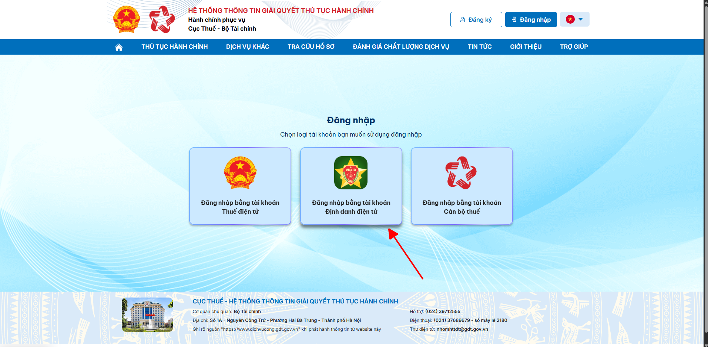
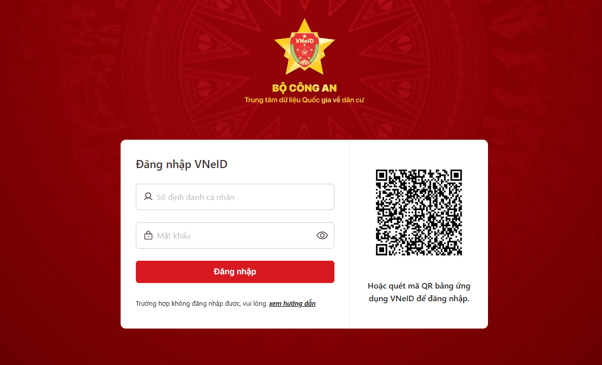
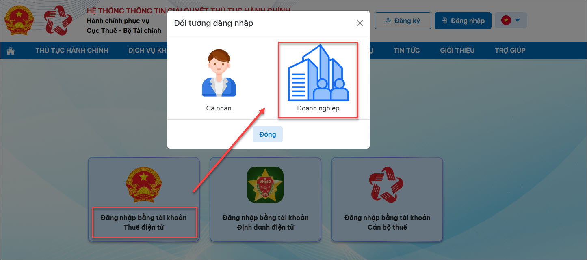
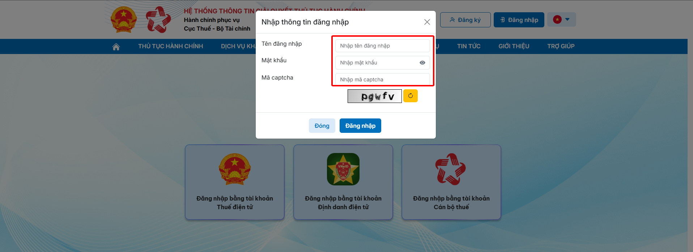

# **Hướng dẫn đăng nhập trên Cổng dịch vụ công thuế điện tử (dichvucong.gdt.gov.vn)**

???+ Note "Mục đích"

    Bài viết hướng dẫn quy trình nộp tờ khai thuế qua website mới của Dịch vụ công Tổng cục Thuế.

???+ info "Nội dung"

    Người nộp thuế truy cập thành công vào Hệ thống Dịch vụ công về Thuế (địa chỉ: https://dichvucong.gdt.gov.vn). Chọn chức năng Đăng nhập, hệ thống hiển thị màn hình chọn loại tài khoản đăng nhập.

    1. Đăng nhập bằng tài khoản Định danh điện tử
   
    2. Đăng nhập bằng tài khoản Thuế điện tử

#### 1. Đăng nhập bằng tài khoản Định danh điện tử (VNeID)

- NNT chọn Đăng nhập bằng tài khoản Định danh điện tử

- NNT nhập tên đăng nhập/mật khẩu nhấn Đăng nhập, hệ thống hiển thị màn hình nhập mã xác nhận đăng nhập.

- Nhập mã xác nhận, nhấn Xác nhận, hệ thống VNeID kiểm tra

- Trường hợp NNT được định danh với vai trò Cá nhân và Tổ chức, sẽ hiển thị màn hình chọn Loại tài khoản “Cá nhân”, “Tổ chức”

- Trường hợp NNT được định danh với vai trò Cá nhân, sẽ không hiển thị màn hình chọn loại tài khoản.

#### 2. Đăng nhập bằng tài khoản Thuế điện tử 

- NNT chọn **Đăng nhập bằng tài khoản Thuế điện tử**, chọn **Đối tượng đăng nhập** là **Cá nhân** hoặc **Doanh nghiệp**

- NNT nhập thông tin đăng nhập là tài khoản đăng nhập vào trang thuế điện tử (thuedientu.gdt.gov.vn) đối với đối tượng Doanh nghiệp và trang canhan (canhan.gdt.gov.vn) đối với đối tượng Cá nhân

???+ info "Xin chân thành cảm ơn quý khách hàng đã tin dùng sản phẩm của M-Invoice"

    Có bất kỳ vướng mắc nào trong quá trình sử dụng hãy liên hệ với M-Invoice tại mục Hỗ trợ kỹ thuật góc phải bên dưới màn hình hoặc gọi tổng đài kỹ thuật của M-Invoice (1900.955.557 Nhánh 1)

Last updated on <strong>Jan 20, 2025</strong> by <strong>NHATTH</strong>

