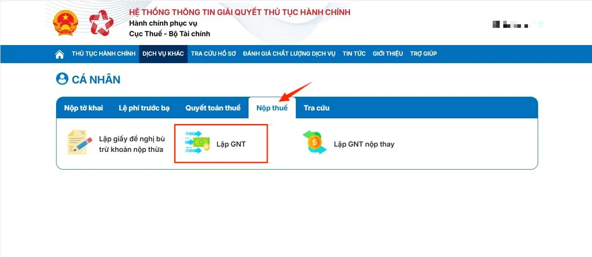
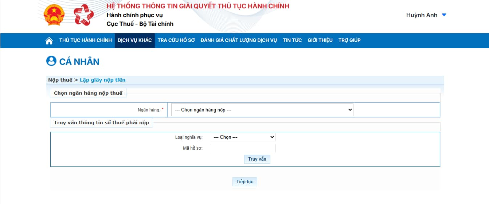
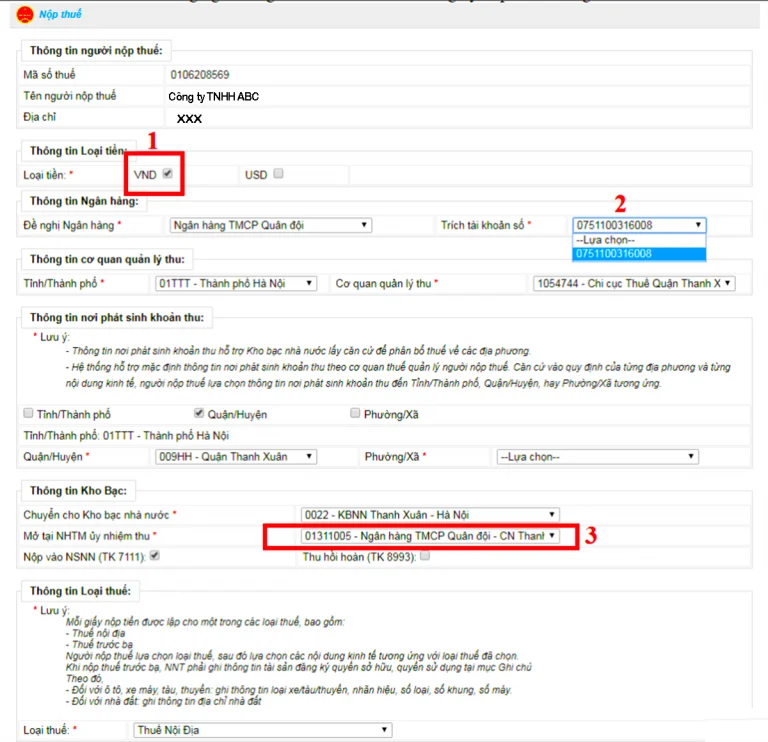
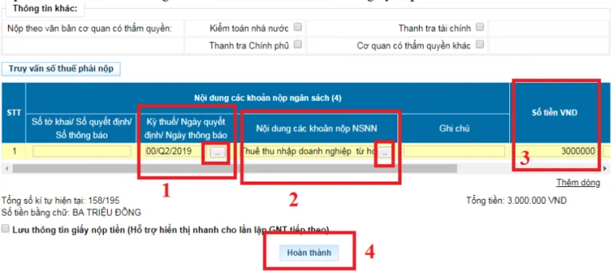
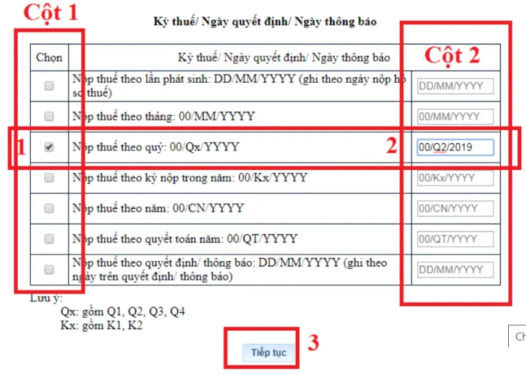
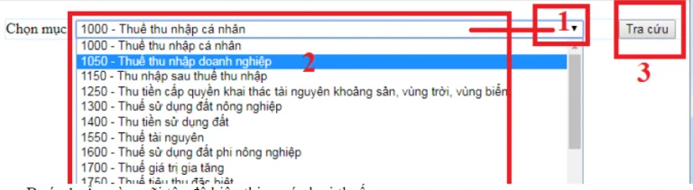
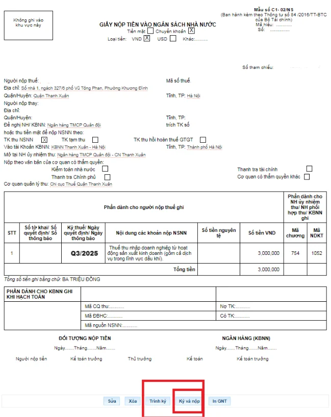
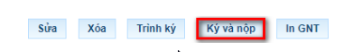

# **Hướng dẫn nộp tiền thuế trên Cổng dịch vụ công (dichvucong.gdt.gov.vn)**

???+ Note "Mục đích"

    Bài viết hướng dẫn quy trình nộp tiền thuế trên Cổng dịch vụ công của Tổng cục Thuế.

    Nội dung bài viết bao gồm các bước đăng nhập, lập giấy nộp tiền, điền thông tin, lựa chọn loại thuế, kiểm tra và hoàn tất nộp thuế.

## I. **Các bước thực hiện**

### **Bước 1: Đăng nhập trang Cổng dịch vụ công**

Người nộp thuế đăng nhập vào trang Cổng thông tin điện tử **https://dichvucong.gdt.gov.vn**

### **Bước 2: Lập giấy nộp tiền. Người nộp thuế chọn Mục Dịch vụ khác trên thanh tiện ích.**

### **Bước 3: Chọn mục Nộp thuế và chọn Lập GNT.**

### **Bước 4: Hệ thống hiển thị màn hình chọn ngân hàng nộp thuế và tra cứu thông tin số thuế phải nộp gồm các thông tin về Ngân hàng, Loại nghĩa vụ, Mã hồ sơ**

### **Bước 5: Lập giấy nộp tiền, NNT điền hoàn tất các thông tin theo hướng dẫn sau:**

- **Thông tin loại tiền:** Chọn **VND**

- **Thông tin ngân hàng:** Chọn **ngân hàng** và **số tài khoản trích tiền**

- **Thông tin kho bạc:** Chọn chi nhánh ngân hàng dùng để đóng thuế

### **Bước 6: NT kéo xuống cuối màn hình để hoàn thành nốt thông tin phần “Truy vấn số thuế phải nộp” tại bảng “Nội dung các khoản nộp ngân sách” và Hoàn thành thông tin phần “Truy vấn số thuế phải nộp”.**

### **Bước 7: Tại mục “Kỳ thuế/Ngày quyết định/Ngày thông báo”,NTT nhấn vào ô “…” để giao diện “Kỳ thuế/Ngày quyết định/Ngày thông báo” hiển thị:**

- Nhấn tích tích chọn vào đúng kỳ NTT tiến hành kê khai thuế ở cột 1.

- Điền cụ thể thông tin của kỳ (tháng/quý/năm) tiến hành nộp thuế ở cột 2.

**Ví dụ:** NNT nộp thuế vào quý 3 năm 2025 thì điền là **“00/Q3/2025”**.

Nhấn ô **“Tiếp tục”** để hoàn tất.

### **Bước 8: Tại mục “Nội dung các khoản nộp vào NSNN”, NNT nhấn ô “…” để giao diện của “Nội dung các khoản nộp vào NSNN” hiển thị.**

ô **“Chọn mục”**, NTT nhấn vào phần mũi tên để hiển thị các loại thuế.

Nhấn chọn đúng loại thuế cần nộp tiền.

- Thuế GTGT chọn mục **1700**, nhấn **“Tra cứu”** rồi chọn **“1701 – Thuế giá trị gia tăng hàng sản xuất kinh doanh trong nước”**.
  
- Thuế TNDN NTT chọn **1050**, nhấn **“Tra cứu”** rồi chọn **“ 1052 Thuế thu nhập DN của các đơn vị không hạch toán ngành”.**

- Thuế TNCN NTT chọn **1000**, nhấn **“Tra cứu”** rồi chọn **“1001 – Thuế thu nhập từ tiền lương tiền công”.**

- Tại mục **“Số tiền VND**” của bảng **“Nội dung các khoản nộp ngân sách”**, NNT điền số tiền thuế phải nộp là xong.

- Cuối cùng, NNT nhấn ô **Hoàn thành.**

Tiếp đó, màn hình sẽ hiển thị ra giấy nộp tiền đúng theo Mẫu số C1-02/NS ban hành kèm theo <a href="https://thuvienphapluat.vn/van-ban/Thue-Phi-Le-Phi/Thong-tu-84-2016-TT-BTC-huong-dan-thu-tuc-thu-nop-ngan-sach-nha-nuoc-thue-thu-noi-dia-301601.aspx"
   target="_blank"
   rel="noopener noreferrer">
Thông tư 84/2016/TT-BTC
</a>

### **Bước 9: Kiểm tra lại thông tin vừa khai báo trong Giấy nộp tiền vào ngân sách nhà nước. Nếu thông tin đã chính xác tiếp tục nhấn Ký và nộp**

Nhập mã PIN sau đó nhấn OK.

???+ info "Xin chân thành cảm ơn quý khách hàng đã tin dùng sản phẩm của M-Invoice"

    Có bất kỳ vướng mắc nào trong quá trình sử dụng hãy liên hệ với M-Invoice tại mục Hỗ trợ kỹ thuật góc phải bên dưới màn hình hoặc gọi tổng đài kỹ thuật của M-Invoice (1900.955.557 Nhánh 1)

Last updated on <strong>Jan 20, 2025</strong> by <strong>NHATTH</strong>

