# **Hướng dẫn nộp tờ khai thuế điện tử trên Dịch vụ công (https://dichvucong.gdt.gov.vn)**

???+ Note "Mục đích"

    Bài viết hướng dẫn quy trình nộp tờ khai thuế qua website mới của Dịch vụ công Tổng cục Thuế.

    Nội dung bài viết bao gồm các bước thực hiện nộp tờ khai, hướng dẫn thao tác trên hệ thống và các lưu ý quan trọng khi sử dụng dịch vụ.

    Phạm vi đáp ứng: Áp dụng cho doanh nghiệp, tổ chức, cá nhân thực hiện nộp tờ khai thuế điện tử trên hệ thống Dịch vụ công của Tổng cục Thuế.

## I. **Các bước thực hiện**

### **Bước 1: Truy cập Hệ thống thông tin giải quyết thủ tục hành chính( Dịch vụ công) https://dichvucong.gdt.gov.vn/tthc/login**

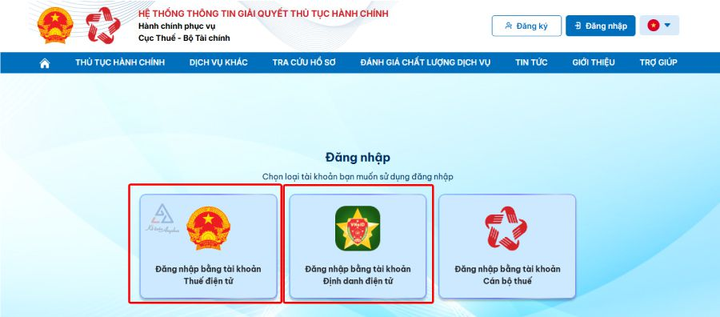

### **Bước 2: Chọn “Đăng nhập” => Người nộp thuế đăng nhập bằng tài khoản định danh điện tử**

- Chọn loại tài khoản bạn muốn sử dụng đăng nhập

- Đối tượng đăng nhập: chọn “Doanh nghiệp”

- Thực hiện nhập thông tin đăng nhập:
    
  + Nhập tên tài khoản và mật khẩu của công ty bạn vào hệ thống
  
  + Nhập Mã captcha

  + Bấm vào “Đăng nhập” để đăng nhập vào Hệ thống thông tin giải quyết thủ tục hành chính

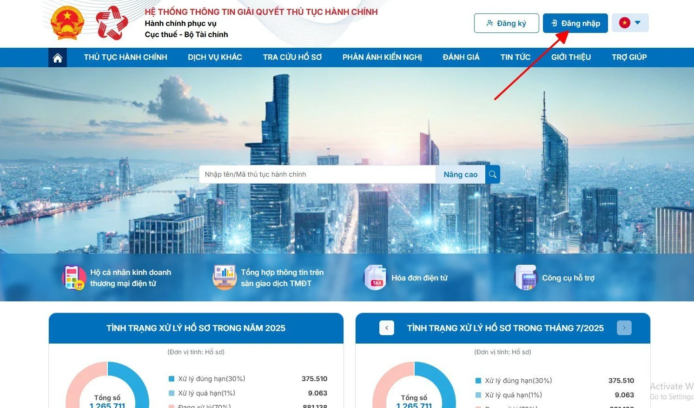

### **Bước 3: Thực hiện nộp tờ khai.**

Anh/chị thao tác theo 1 trong 2 cách sau:

#### **Cách 1** Nộp trên tab **THỦ TỤC HÀNH CHÍNH**

- Chọn mục **Thủ tục hành chính** (gõ mã thủ tục hành chính tương ứng) hoặc **:Tờ khai cần nộp**:. Chọn **:Tìm kiếm**:

- Nhấn biểu tượng cột **:Nộp hồ sơ** chọn tờ khai rồi nhấn **:Tiếp tục**:

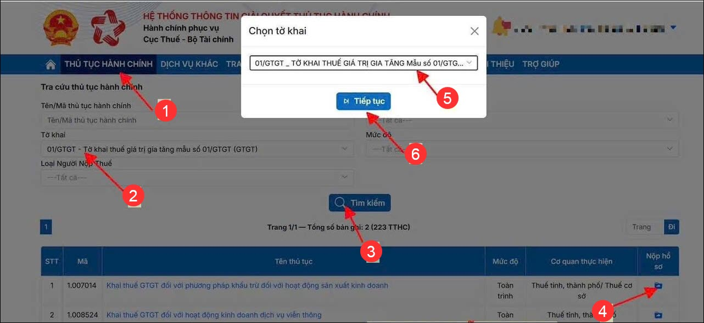

 Chọn Nộp XML và nhấn **Tiếp tục**,

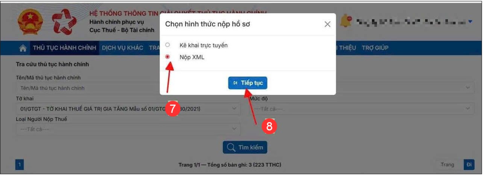

- Tại đây, chọn Tệp sau đó nhấn **View form XML** rồi thực hiện các bước nộp tiếp theo

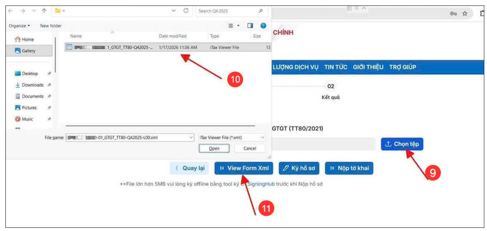

Kiểm tra thông tin, nhấn **Tiếp tục** và **Hoàn thành kê khai**

Chọn chứng thư số, nhập mã Captcha, nhấn Tiếp tục. Nhập mã PIN đúng và chọn nút “Chấp nhận” => Hệ thống báo ký điện tử thành công

#### **Cách 2** Nộp trên tab **DỊCH VỤ KHÁC**

Chọn **“DỊCH VỤ KHÁC”** >> Tiếp theo chọn **“Hồ sơ khai thuế khác”** >> chọn “Trình ký” hoặc “Nộp XML” tùy hình thức muốn nộp tờ khai

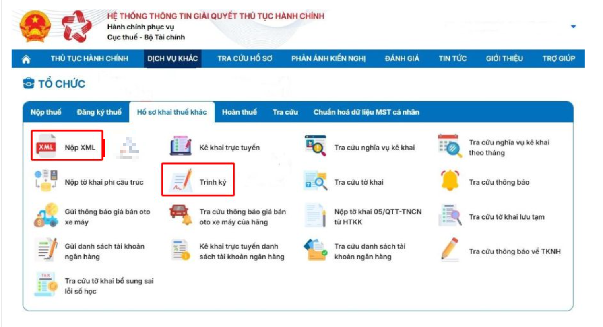

Chọn “Tệp tờ khai” và “Thủ tục hành chính”, sau đó bấm “Trình ký” (bỏ qua bước này nếu chọn hình thức “Nộp XML”)

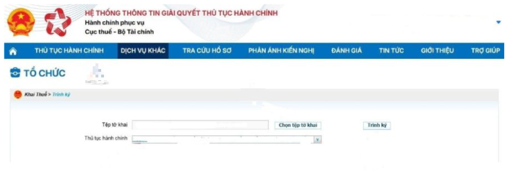

Màn hình hiển thị danh sách các tờ khai đã nộp, bạn kiểm tra lại và bấm chọn “Ký và nộp tờ khai” để hoàn tất thủ tục.

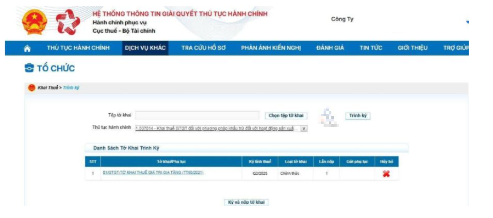

Chọn “Tệp tờ khai” ➜ bấm “Ký điện tử” và “Nộp tờ khai” (bỏ qua bước này nếu chọn hình thức “Trình ký”)

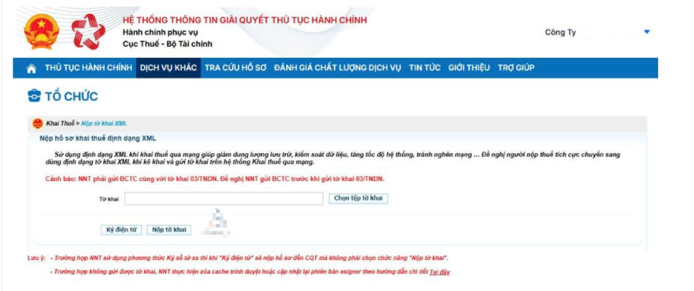

Sau khi kiểm tra xong, chọn Trình ký → Ký và Nộp tờ khai. Hệ thống hiện thị ra mã pin chữ ký số thì nhập mật khẩu (Mã Pin) của chữ ký

Nhập mã PIN đúng và chọn nút “Chấp nhận” => Hệ thống báo ký điện tử thành công

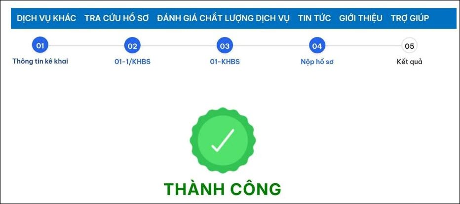

### **Bước 4: Nhận kết quả**

Sau khi ký điện tử xong thì màn hình sẽ hiện thị ra danh sách tờ khai thuế đã nộp qua mạng đến cơ quan thuế. Hệ thống sẽ xử lý và gửi phản hồi về kết quả nộp tờ khai.

## II. **Lưu ý**

- Đăng nhập bằng tài khoản định danh điện tử hoặc thuế điện tử mới thực hiện nộp được.
  
- Mã Thủ tục Hành chính phải chính xác

- Chọn sai mã TTHC có thể khiến hồ sơ không được tiếp nhận hợp lệ.

- Nộp tờ khai đúng thời hạn pháp luật thuế quy định để tránh bị phạt.

- Sau khi nộp, cơ quan thuế sẽ gửi thông báo chấp nhận hoặc không chấp nhận hồ sơ.

- Để kiểm tra trạng thái tờ khai đã nộp, anh/chị vào mục TRA CỨU HỒ SƠ, tab Tra cứu hồ sơ đã nộp trên dịch vụ công

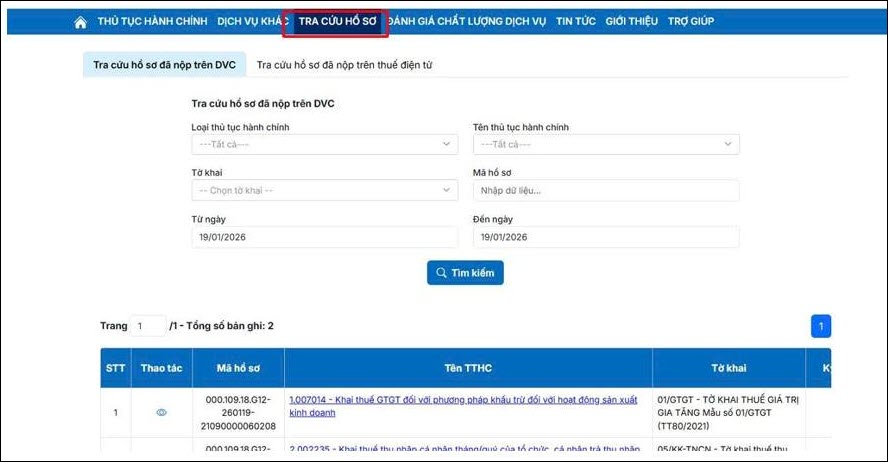

## III. **Danh sách mã thủ tục hành chính**

Khi nộp tờ khai trên dịch vụ công, Doanh nghiệp và kế toán bắt buộc phải chọn đúng loại thủ tục hành chính tương ứng trước khi hoàn tất việc nộp.

- **Mã thủ tục hành chính cần lưu ý:**

| Mã | Tên thủ tục hành chính | Mẫu tờ khai |
|----|------------------------|-------------|
| 1.008338 | Khai lệ phí môn bài | Mẫu 01/MBAI |
| 1.007014 | Khai thuế GTGT đối với phương pháp khấu trừ đối với hoạt động sản xuất kinh doanh | Mẫu 01/GTGT |
| 1.007022 | Khai thuế giá trị gia tăng đối với phương pháp trực tiếp trên doanh thu | Mẫu 04/GTGT |
| 2.002235 | Khai thuế thu nhập từ cá nhân nhận thừa kế/tặng quà của tổ chức, cá nhân trả thu nhập khấu trừ thuế đối với tiền lương, tiền công | Mẫu 05/KK-TNCN |
| 1.008346 | Khai quyết toán thuế thu nhập doanh nghiệp theo phương pháp doanh thu – chi phí | Mẫu 03/TNDN |
| 1.008309 | Khai chính thức – Khai quyết toán thuế thu nhập cá nhân đối với tổ chức, cá nhân trả thu nhập từ tiền lương, tiền công | Mẫu 05/QTT-TNCN |
| 1.008327 | Khai bổ sung – Khai quyết toán thuế thu nhập cá nhân đối với tổ chức, cá nhân trả thu nhập từ tiền lương, tiền công | Mẫu 05/QTT-TNCN |
| 1.008327 | Khai bổ sung hồ sơ khai thuế | Mẫu 01/KHBS |
| 2.002229 (Cục Thuế) / 2.002230 (Chi cục) | Đăng ký giảm trừ gia cảnh | Mẫu 02TH |
| 1.008500 | Đăng ký thuế lần đầu cho người phụ thuộc để giảm trừ gia cảnh của người nộp thuế thu nhập cá nhân – Trường hợp cá nhân ủy quyền đăng ký thuế cho cơ quan chi trả thu nhập |  |
| 1.008499 | Đăng ký thuế lần đầu cho người phụ thuộc để giảm trừ gia cảnh của người nộp thuế thu nhập cá nhân – Trường hợp cá nhân đăng ký thuế trực tiếp với cơ quan thuế |  |
| 9.999999 | Báo cáo tài chính | BÁO CÁO TÀI CHÍNH |

???+ info "Xin chân thành cảm ơn quý khách hàng đã tin dùng sản phẩm của M-Invoice"

    Có bất kỳ vướng mắc nào trong quá trình sử dụng hãy liên hệ với M-Invoice tại mục Hỗ trợ kỹ thuật góc phải bên dưới màn hình hoặc gọi tổng đài kỹ thuật của M-Invoice (1900.955.557 Nhánh 1)

Last updated on <strong>Jan 20, 2025</strong> by <strong>NHATTH</strong>

