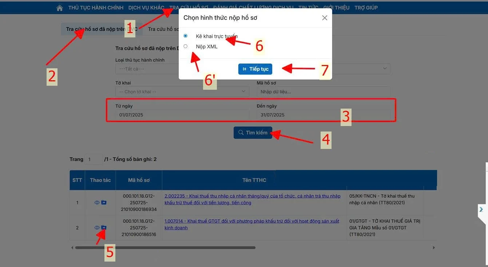
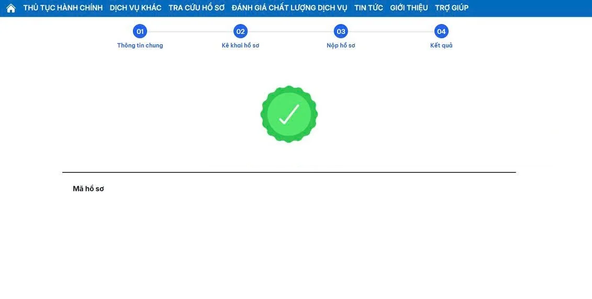

# **Hướng dẫn nộp tờ khai bổ sung trên Cổng dịch vụ công (dichvucong.gdt.gov.vn)**

???+ Note "Mục đích"

    Bài viết hướng dẫn quy trình nộp tờ khai bổ sung thuế qua website mới của Dịch vụ công Tổng cục Thuế. 

## I. **Các bước thực hiện**

### **Bước 1: Vào mục Tra cứu hồ sơ**

- Tra cứu hồ đã nộp trên DVC: tờ khai lần đầu nộp trực tiếp ở trang dichvucong.gdt.gov.vn, hoặc nộp trên trang thuedientu.gdt.gov.vn sau ngày 01/07/2025

- Tra cứu hồ sơ đã nộp trên thuế điện tử: tờ khai lần đầu nộp trên trang thuedientu.gdt.gov.vn từ trước 01/07/2025

Tìm kiếm tờ khai lần đầu đã nộp và được chấp nhận, sau đó nhấn vào biểu tượng đầu dòng Chọn nộp hồ sơ bổ sung

### **Bước 2: Có thể chọn hình thức nộp hồ sơ kê khai trực tuyến hoặc Nộp XML (Chọn tệp/Ký hồ sơ và Nộp tờ khai)**

### **Bước 3: Các bước tương tự như nộp tờ khai lần đầu**

Sau khi chọn tệp xml để tải tờ khai lên, kiểm tra các thông tin kỳ tính thuế, Danh mục ngành nghề, Lần bổ sung rồi nhấn Tiếp tục

### **Bước 4: Check lại dữ liệu trước khi nộp.**

### **Bước 5: Cắm chữ ký số và thực hiện ký nộp tờ khai**

???+ info "Xin chân thành cảm ơn quý khách hàng đã tin dùng sản phẩm của M-Invoice"

    Có bất kỳ vướng mắc nào trong quá trình sử dụng hãy liên hệ với M-Invoice tại mục Hỗ trợ kỹ thuật góc phải bên dưới màn hình hoặc gọi tổng đài kỹ thuật của M-Invoice (1900.955.557 Nhánh 1)

Last updated on <strong>Jan 20, 2025</strong> by <strong>NHATTH</strong>

