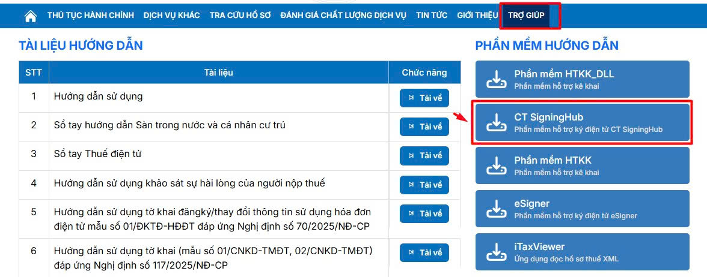
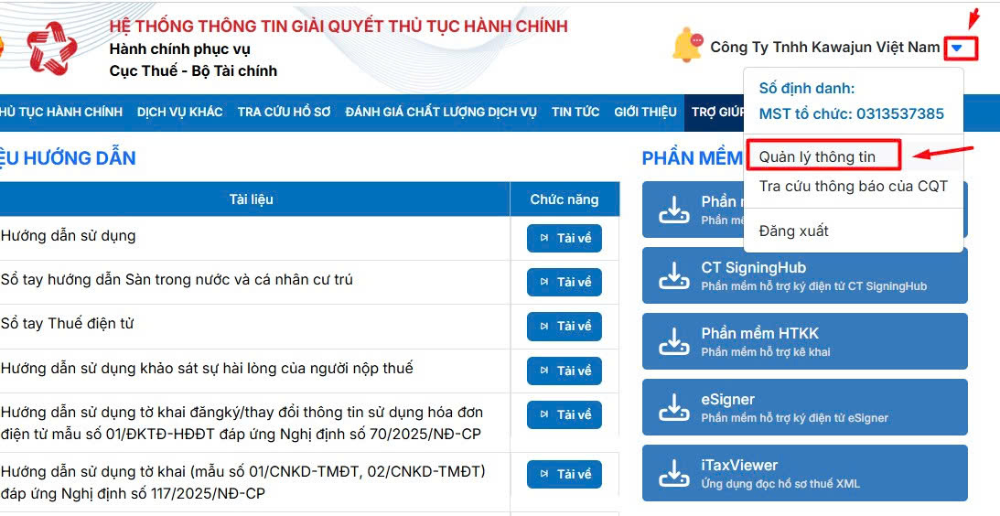
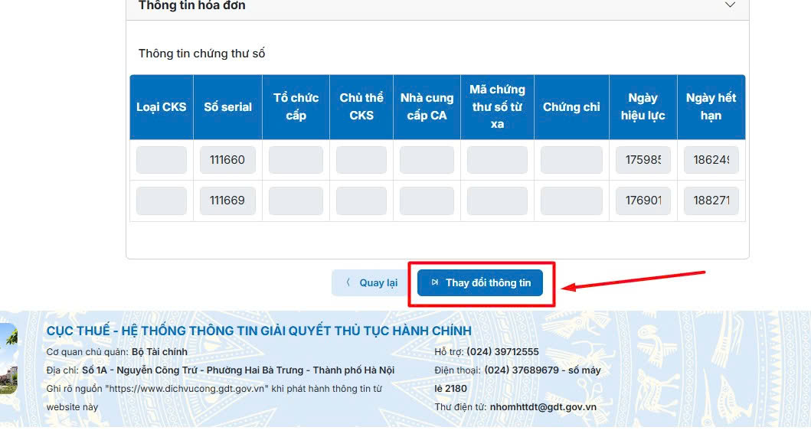
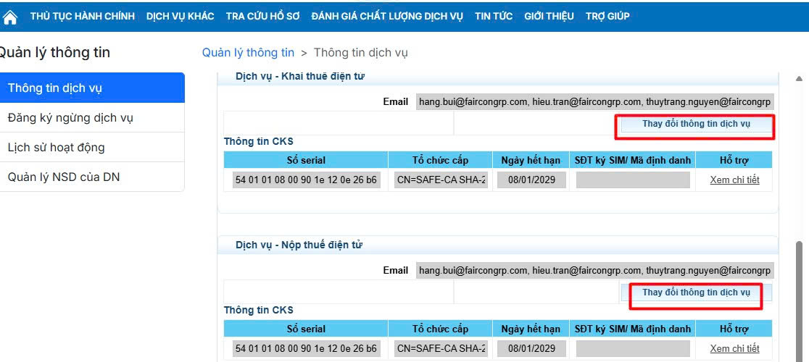
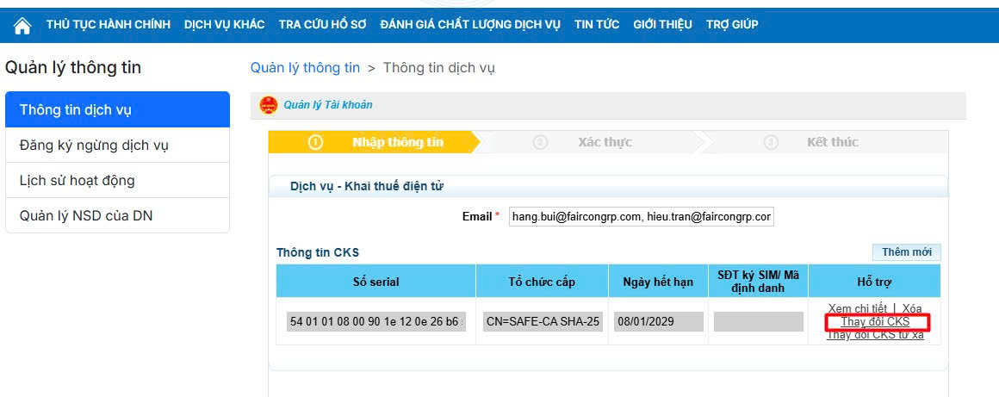
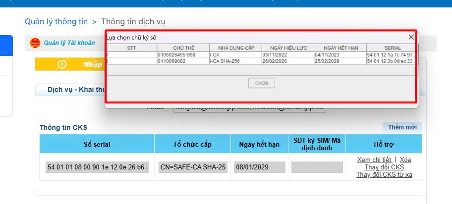

# **Hướng dẫn thay đổi cập nhật chữ ký số trên dịch vụ công (dichvucong.gdt.gov.vn)**

???+ Note "Mục đích"

    Bài viết hướng dẫn quy trình thay đổi cập nhật chữ ký số qua website mới của Dịch vụ công Tổng cục Thuế. 

    Áp dụng cho các trường thay thay đổi cks mới, mua mới, gia hạn, cấp bù

### **Hướng dẫn video thay đổi chữ ký số trên dịch vụ công**

<iframe style="width: 48rem; height: 480px" src="https://www.youtube.com/embed/Scr80ZKislw?si=rP3VlMFAFxTLDn3P" title="YouTube video player" frameborder="0" allow="accelerometer; autoplay; clipboard-write; encrypted-media; gyroscope; picture-in-picture; web-share" referrerpolicy="strict-origin-when-cross-origin" allowfullscreen></iframe>

## **Hướng dẫn ảnh chi tiết từng bước**

## I. **Các bước thực hiện**

### **Bước 1: Đăng nhập vào trang dịch vu công**

- Kiểm tra trên máy đã có plugin ký số của dịch vụ công chưa 

- Nếu chưa có anh chị bấm vào mục Trợ giúp và chọn phần mềm hỗ trợ ký điện tử CT SignungHub [Xem chi tiết](huong-dan-cai-dat-cau-hinh-ky-so-tren-cong-dich-vu-cong.md#attribute-lists){ data-preview }

### **Bước 2: Vào mục quản lý thông tin**

### **Bước 3: Khi đã vào mục quản lý thông tin anh chị khéo chuột xuống bên dưới cùng chọn thay đổi thông tin**

### **Bước 4: Sau đó anh chị chọn đến mục Dịch vụ- khai thuế điện tử hoặc dịch vụ Nộp thuế điện tử anh chị chọn thay đổi thông tin dịch vụ**

### **Bước 5: Bấm chọn thay đổi cks màn hình sẽ hiện ra các cks -> bấm tiếp tục -> bấm ký và gửi**

- Anh chị đã thành công cập nhập cks của kê khai thuế điện tử

### **Bước 6: Phần nộp thuế điện tử anh chị làm tương tự**

???+ info "Xin chân thành cảm ơn quý khách hàng đã tin dùng sản phẩm của M-Invoice"

    Có bất kỳ vướng mắc nào trong quá trình sử dụng hãy liên hệ với M-Invoice tại mục Hỗ trợ kỹ thuật góc phải bên dưới màn hình hoặc gọi tổng đài kỹ thuật của M-Invoice (1900.955.557 Nhánh 1)

Last updated on <strong>Feb 26, 2026</strong> by <strong>NHATTH</strong>

