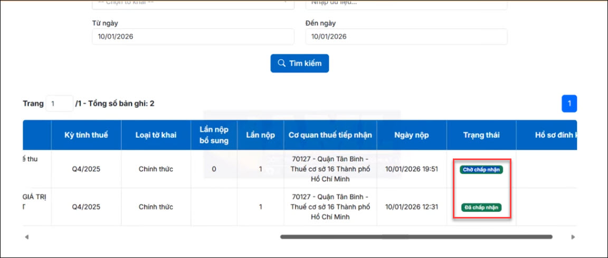
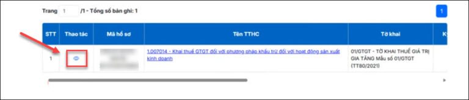
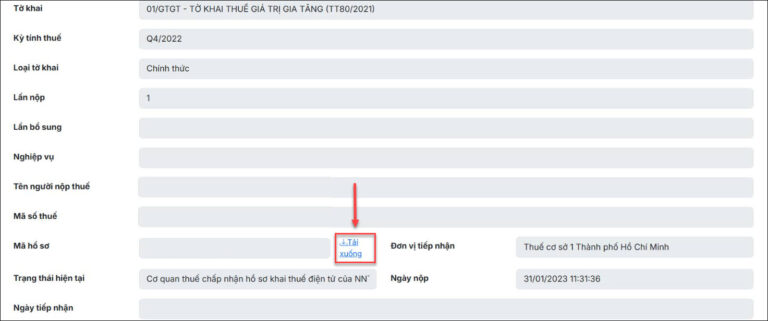

# **Hướng dẫn tra cứu tờ khai đã nộp/ lưu tạm trên Cổng dịch vụ công thuế điện tử (dichvucong.gdt.gov.vn)**

???+ Note "Mục đích"

    Bài viết hướng dẫn cách tra cứu tờ khai đã nộp hoặc lưu tạm trên Cổng dịch vụ công thuế điện tử và kiểm tra trạng thái hồ sơ đã nộp.

## I. **Các bước thực hiện**

### **Bước 1: Vào mục Tra cứu hồ sơ chọn Tra cứu hồ sơ đã nộp/ Tra cứu hồ sơ lưu tạm**

- **Tra cứu hồ đã nộp trên DVC:** tờ khai nộp trực tiếp ở trang **dichvucong.gdt.gov.vn**, hoặc nộp trên trang **thuedientu.gdt.gov.vn** sau ngày **01/07/2025**

- **Tra cứu hồ sơ đã nộp trên thuế điện tử**: tờ khai nộp trên trang **thuedientu.gdt.gov.vn** từ trước **01/07/2025**

### **Bước 2: Thực hiện nhập các thông tin hồ sơ:**

- **Loại thủ tục hành chính, Thủ tục hành chính:** Chọn Tất cả

- **Tờ khai:** Chọn loại tờ khai cần tìm kiếm hoặc để trống

- **Mã hồ sơ:** Nhập mã hồ sơ cần tìm kiếm hoặc để trông

- **Từ ngày, Đến ngày:** Nhập thời gian cần tìm kiếm

### **Bước 3: Nhấn Tìm kiếm để ra kết quả**

### **Bước 4: Tại dang sách hồ sơ, kéo thanh cuộn sang bên phải để kiểm tra trạng thái nộp hồ sơ**

- Để thực hiện tải file xml tờ khai đã nộp, Nhấn vào biểu tượng xem chi tiết

- Tại giao diện thông tin tờ khai, chọn tới dòng Mã hồ sơ, nhấn vào mục Tải xuống để tải tờ khai XML đã nộp

???+ info "Xin chân thành cảm ơn quý khách hàng đã tin dùng sản phẩm của M-Invoice"

    Có bất kỳ vướng mắc nào trong quá trình sử dụng hãy liên hệ với M-Invoice tại mục Hỗ trợ kỹ thuật góc phải bên dưới màn hình hoặc gọi tổng đài kỹ thuật của M-Invoice (1900.955.557 Nhánh 1)

Last updated on <strong>Jan 20, 2025</strong> by <strong>NHATTH</strong>

