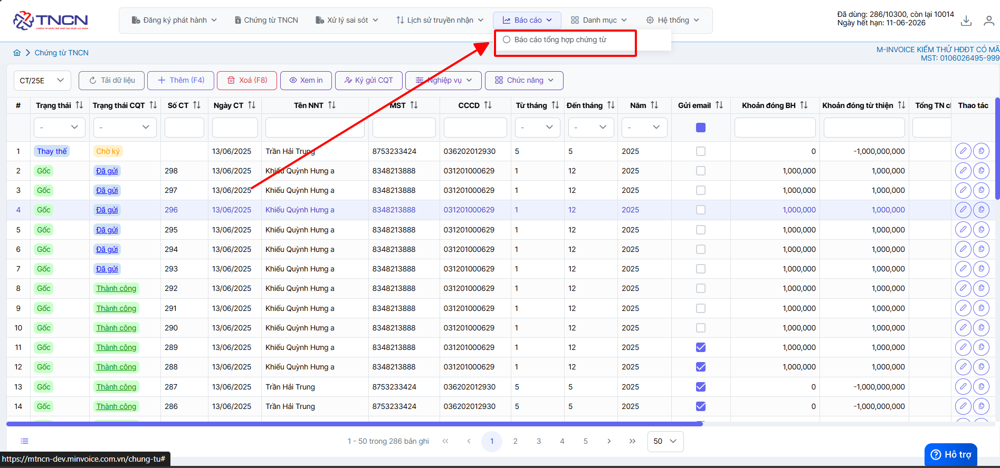
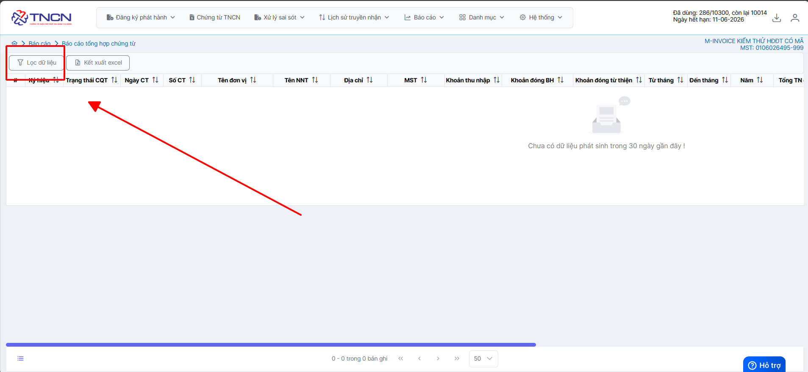
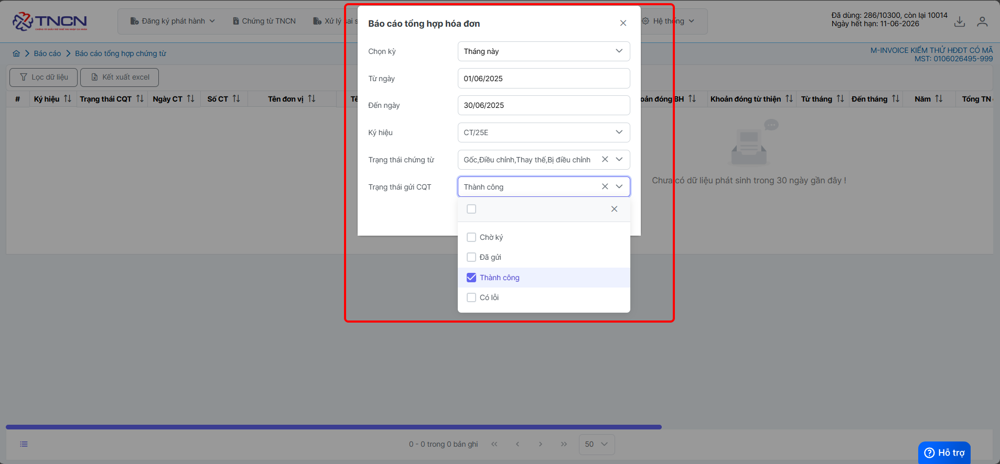
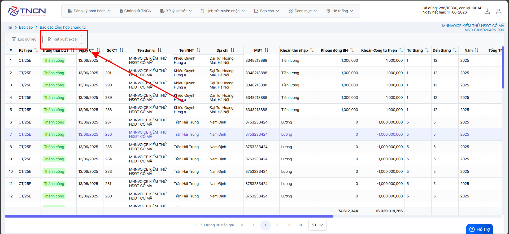
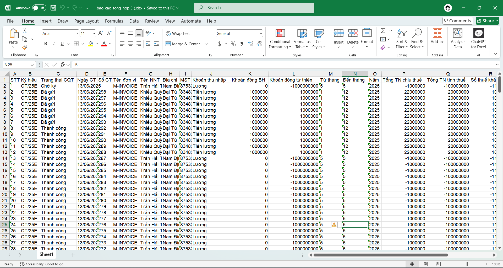

# **Báo cáo tổng hợp chứng từ**

## **Hướng dẫn xem báo cáo tổng hợp chứng từ**

### **Bước 1: Ở giao diện trang chủ chọn Báo cáo --> Báo cáo tổng hợp chứng từ**

### **Bước 2: Bấm lọc dữ liệu --> chọn điều kiện lọc**

**Nhấn nhận để hệ thống tải báo cáo theo điều kiện lọc**

### **Bước 3 : Chọn tải file Excel để kết xuất báo cáo về**

Như vậy quý khách đã xuất báo cáo thành công chứng từ ra excel

???+ info "Xin chân thành cảm ơn quý khách hàng đã tin dùng sản phẩm của M-Invoice"

    Có bất kỳ vướng mắc nào trong quá trình sử dụng hãy liên hệ với M-Invoice tại mục Hỗ trợ kỹ thuật góc phải bên dưới màn hình hoặc gọi tổng đài kỹ thuật của M-Invoice (1900.955.557 Nhánh 1)

Last updated on <strong>Jun 13, 2025</strong> by <strong>NHATTH</strong>

