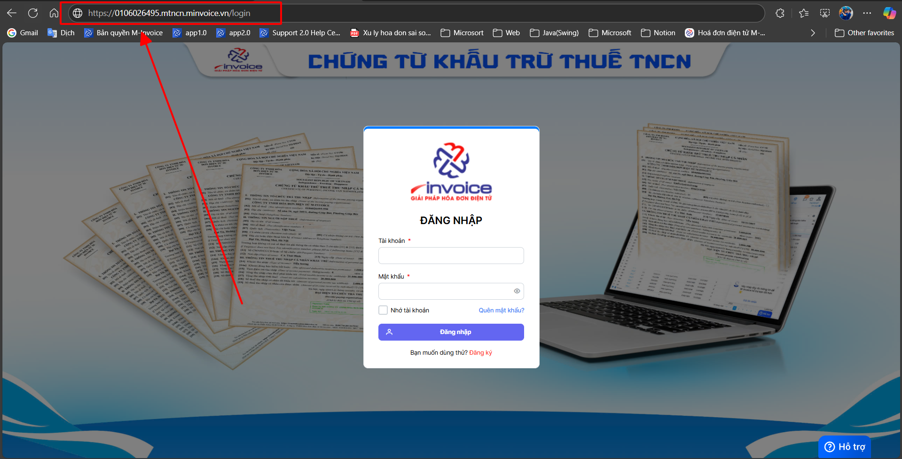
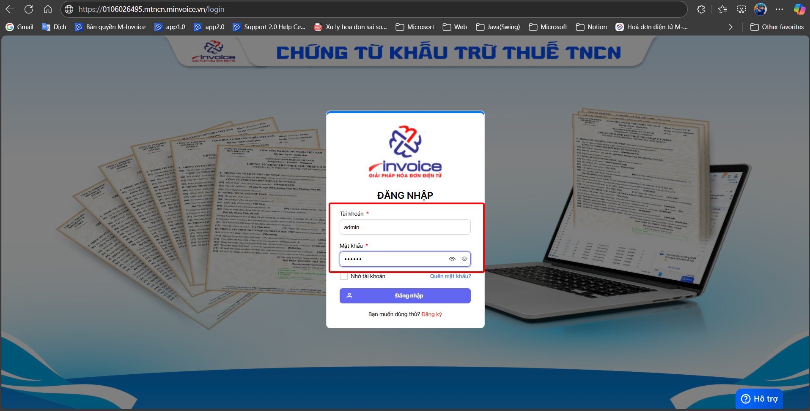
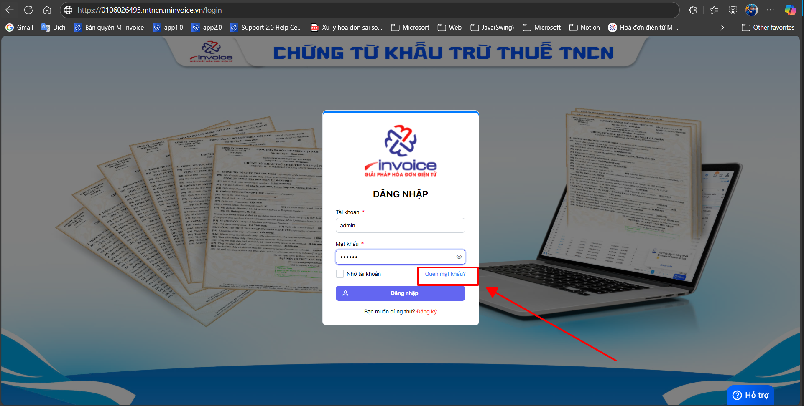
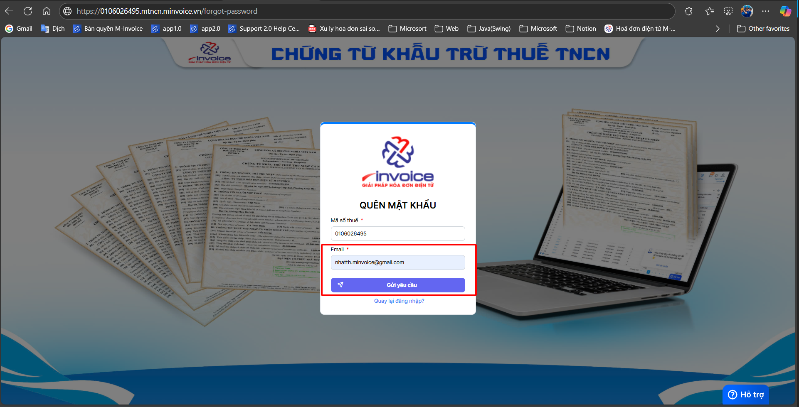

# **Đăng nhập mTNCN**

???+ "Mục đích"

    🔐 Xác thực người dùng trước khi truy cập vào hệ thống, đảm bảo chỉ những người có tài khoản hợp lệ mới được sử dụng phần mềm.

    🛡️ Bảo mật dữ liệu chứng từ thu nhập cá nhân, tránh việc truy cập trái phép, chỉnh sửa hoặc khai thác thông tin không đúng thẩm quyền.

    👤 Phân quyền sử dụng hệ thống, giúp mỗi người dùng chỉ được thao tác trên các chức năng và dữ liệu phù hợp với vai trò được cấp (kế toán, quản trị, người nhập liệu…).

📑 Ghi nhận lịch sử truy cập, phục vụ việc theo dõi, kiểm tra, đối soát và truy vết khi phát sinh sự cố hoặc sai lệch dữ liệu.

## **Hướng dẫn đăng nhập mTNCN**

**Thao tác cài đặt và thực hiện như sau**

### **Bước 1: Truy cập trình duyệt**

???+ note "Quý khách truy cập vào trình duyệt đang dùng"

    ví dụ:

    - Google Chrome
    :fontawesome-brands-chrome:
    - Microsoft Edge
    :fontawesome-brands-edge:
    - Cốc Cốc, ...

**Đường link mà quý khách có thể truy cập:**

1.  Mã_số_thuế.mtncn.minvoice.vn

Mã_số_thuế: là mã số thuế của công ty
**VD: 0106026495.mtncn.minvoice.vn**

### **Bước 2: Điền thông tin tài khoản để đăng nhập**

**Trường hợp quý khách quên mật khẩu thì có thể bấm vào QUÊN MẬT KHẨU để có thể lấy lại bằng email đã đăng ký khi đăng ký phần mềm**

???+ info "Xin chân thành cảm ơn quý khách hàng đã tin dùng sản phẩm của M-Invoice"

    Có bất kỳ vướng mắc nào trong quá trình sử dụng hãy liên hệ với M-Invoice tại mục Hỗ trợ kỹ thuật góc phải bên dưới màn hình hoặc gọi tổng đài kỹ thuật của M-Invoice (1900.955.557 Nhánh 1)

Last updated on <strong>Jun 13, 2025</strong> by <strong>NHATTH</strong>

