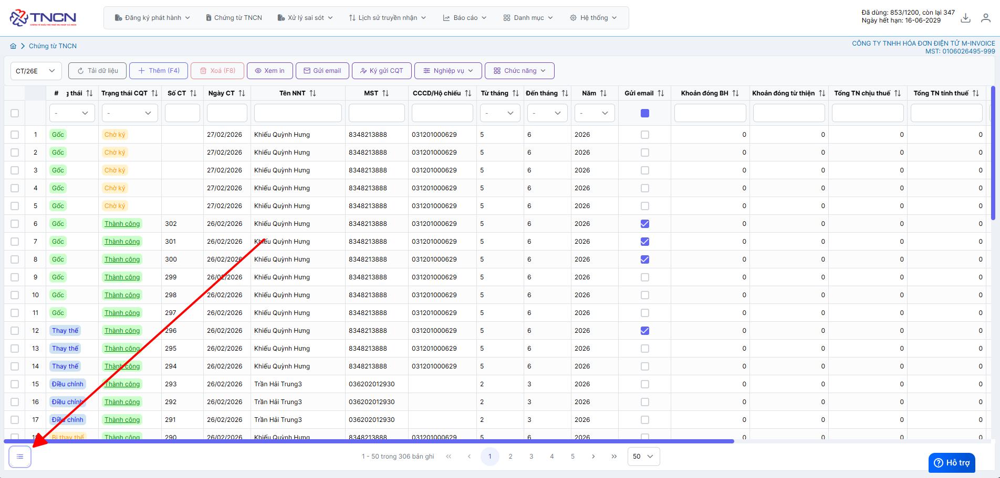
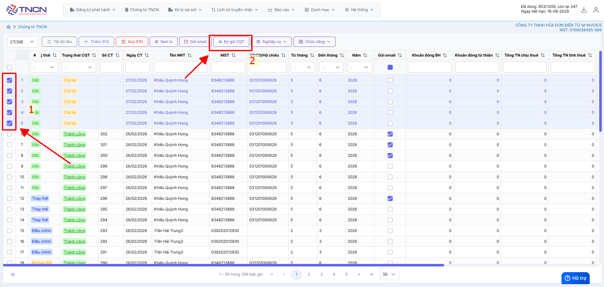

# **Ký Hàng Loạt chứng từ**

## **Ký hàng loạt chứng từ**

???+ Note "Ghi chú"

    Trong quá trình sử dụng chứng từ, người sử dụng đã tạo nhiều chứng từ cho một hoặc nhiều khách hàng. Và trong khoảng thời gian đó có những khách hàng muốn xuất chứng từ cùng lúc. Để tránh trường hợp người sử dụng sẽ phải bấm ký từng chứng từ thì M-invoice xin giới thiệu chức năng ký hàng loạt chứng từ

Hướng dẫn ký và gửi chứng từ hàng loạt

### **Bước 1: Chọn vào chức năng chọn hàng loạt**

### **Bước 2: Chọn các chứng từ cần ký -> Ký gửi CQT**

???+ info "Xin chân thành cảm ơn quý khách hàng đã tin dùng sản phẩm của M-Invoice"

    Có bất kỳ vướng mắc nào trong quá trình sử dụng hãy liên hệ với M-Invoice tại mục Hỗ trợ kỹ thuật góc phải bên dưới màn hình hoặc gọi tổng đài kỹ thuật của M-Invoice (1900.955.557 Nhánh 1)

Last updated on <strong>Jan 19, 2025</strong> by <strong>nhatth</strong>

