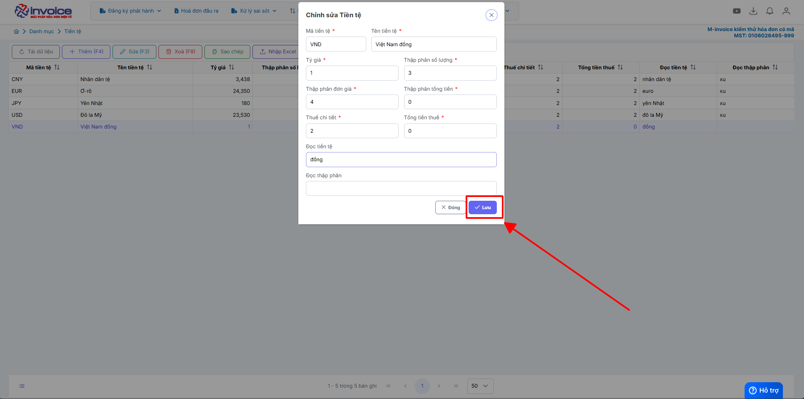
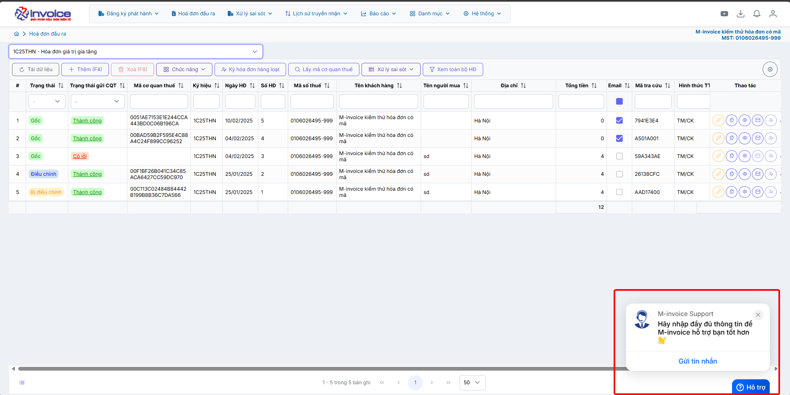

# **HƯỚNG DẪN SỬ DỤNG CHỨC NĂNG ĐĂNG KÝ,ĐĂNG NHẬP**

Để đăng ký tài khoản truy cập link https://hopdong.mecontract.com.vn/dang-ky

???+ Note "Mục đích"

    Doanh nghiệp, công ty hay cơ quan chưa có tài khoản muốn tạo tài khoản để sử dụng dịch vụ.

???+ Danger "Điều kiện sử dụng"

    Phải có MST doanh nghiệp

## **Hướng dẫn điều chỉnh phần số thập phân của phần tiền**

### **Bước 1: Ở màn hình trang chủ bạn truy cập vào phần Danh mục --> tiền tệ**

### **Bước 2: Chọn vào loại tiền bạn muốn sửa và nhấn sửa**

### **Bước 3: Sửa các phần số thập phân đằng sau dấu phẩy, bạn muốn để bao nhiêu số ở phần nào thì sửa lại phần đó**

Sau đó nhấn lưu -> load lại trang -> thử lại

???+ info "Xin chân thành cảm ơn quý khách hàng đã tin dùng sản phẩm của M-Invoice"

    Có bất kỳ vướng mắc nào trong quá trình sử dụng hãy liên hệ với M-Invoice tại mục Hỗ trợ kỹ thuật góc phải bên dưới màn hình hoặc gọi tổng đài kỹ thuật của M-Invoice (1900.955.557 Nhánh 1)

Last updated on <strong>Feb 02, 2026</strong> by <strong>nhatth</strong>

