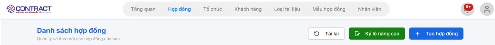
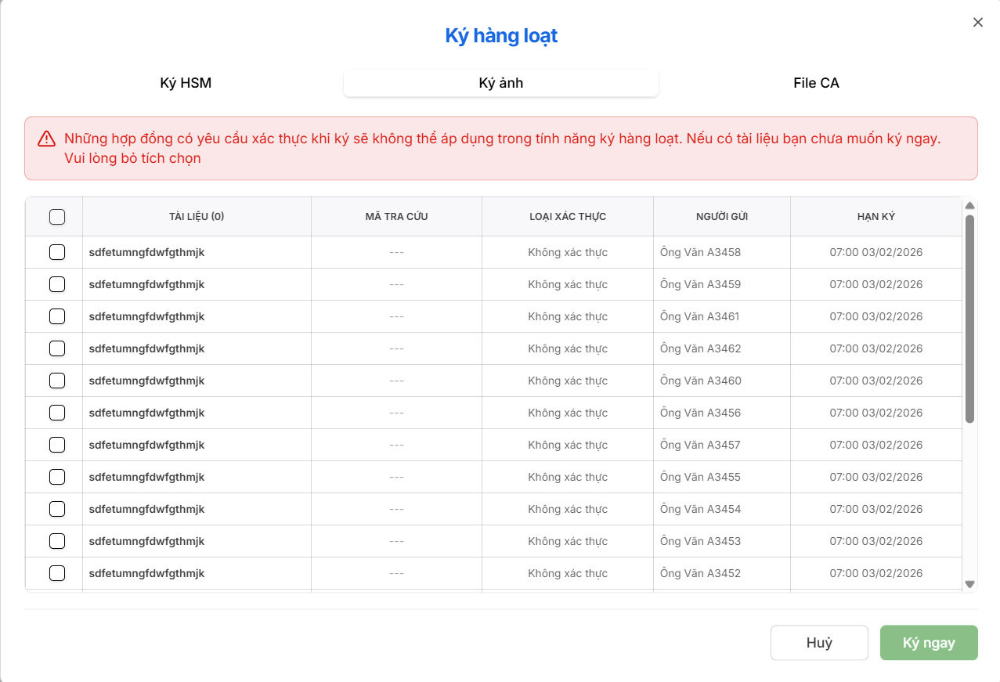

# **HƯỚNG DẪN KÝ HÀNG LOẠT**

### **Bước 1: Ấn nút Ký lô nâng cao**

### **Bước 2: Thực hiện các thao tác sau**

- **Chọn phương thức ký:**  Ký HSM, ký ảnh , File CA
- **Chọn tài liệu:** Tích chọn vào ô vuông ở đầu mỗi dòng tài liệu bạn muốn ký. Bạn có thể tích vào ô trên cùng của cột để chọn tất cả.

### **Bước 3: Nhấn nút ký ngay để hoàn tất**

???+ warning "Lưu ý"
    Những hợp đồng có yêu cầu xác thực khi ký sẽ không thể áp dụng trong tính năng ký hàng loạt. Nếu có tài liệu bạn chưa muốn ký ngay, vui lòng bỏ tích chọn.

???+ info "Xin chân thành cảm ơn quý khách hàng đã tin dùng sản phẩm của M-Invoice"

    Có bất kỳ vướng mắc nào trong quá trình sử dụng hãy liên hệ với M-Invoice tại mục Hỗ trợ kỹ thuật góc phải bên dưới màn hình hoặc gọi tổng đài kỹ thuật của M-Invoice (1900.955.557 Nhánh 1)

Last updated on <strong>Apr 09, 2026</strong> by <strong>MANHDD</strong>
