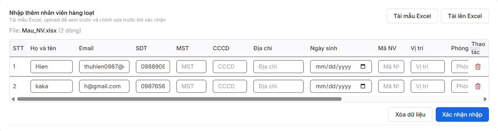
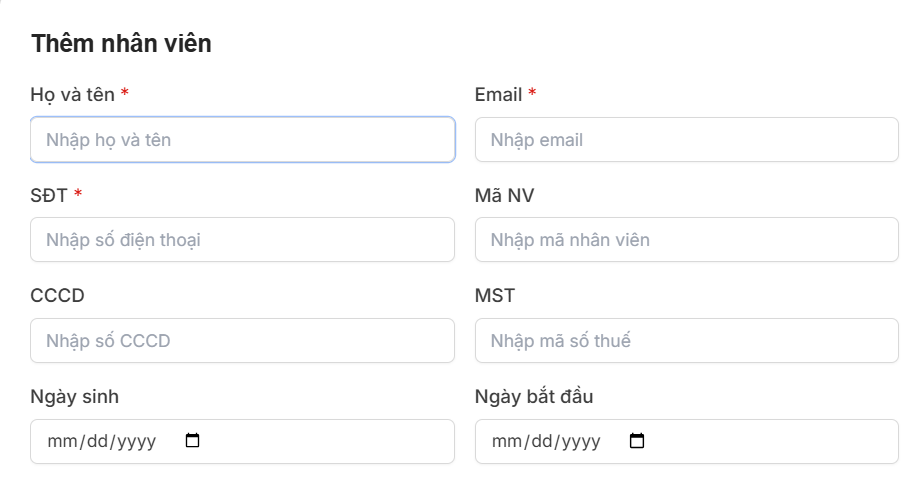

# **QUẢN LÝ NHÂN VIÊN**

### **1. Thêm nhân viên**

Bước 1: Chọn nhân viên để vào trang quản lý nhân viên

Bước 2: Thêm nhân viên thủ công hoặc nhập hàng loạt từ file excel mẫu.

- Thêm hàng loạt từ file excel 

    * Bước 1: Chọn nhập từ excel và tải mẫu excel về.
    

    * Bước 2: Điền thông tin và tải lên excel từ mẫu excel đã tải về
    

    * Bước 3: Nhấn xác nhận nhập để tạo.

- Thêm nhân viên thủ công
    * Bước 1: Nhập thêm thủ công
    

    * Bước 2: Điền các thông tin theo mẫu
    
    

    * Bước 3: Ấn nút thêm, khi thành công sẽ hiện thông tin nhân viên ở trong bảng dữ liệu
    

### **2. Thao tác sửa**

- Bước 1: Ấn nút chỉnh sửa
- Bước 2: Nhập các thông tin cần thay đổi, cập nhật.
- Bước 3: Bấm Lưu

???+ info "Xin chân thành cảm ơn quý khách hàng đã tin dùng sản phẩm của M-Invoice"

    Có bất kỳ vướng mắc nào trong quá trình sử dụng hãy liên hệ với M-Invoice tại mục Hỗ trợ kỹ thuật góc phải bên dưới màn hình hoặc gọi tổng đài kỹ thuật của M-Invoice (1900.955.557 Nhánh 1)

Last updated on <strong>Apr 09, 2026</strong> by <strong>MANHDD</strong>
