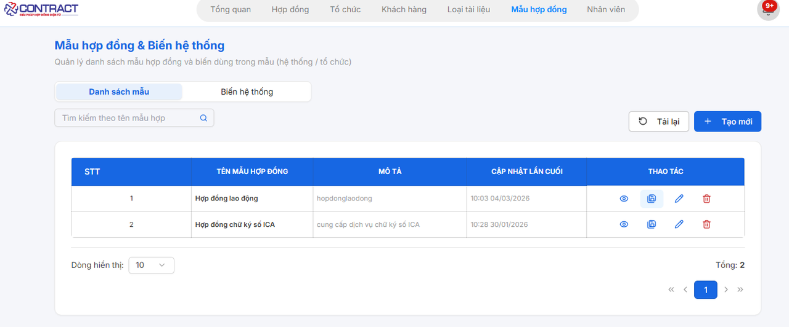
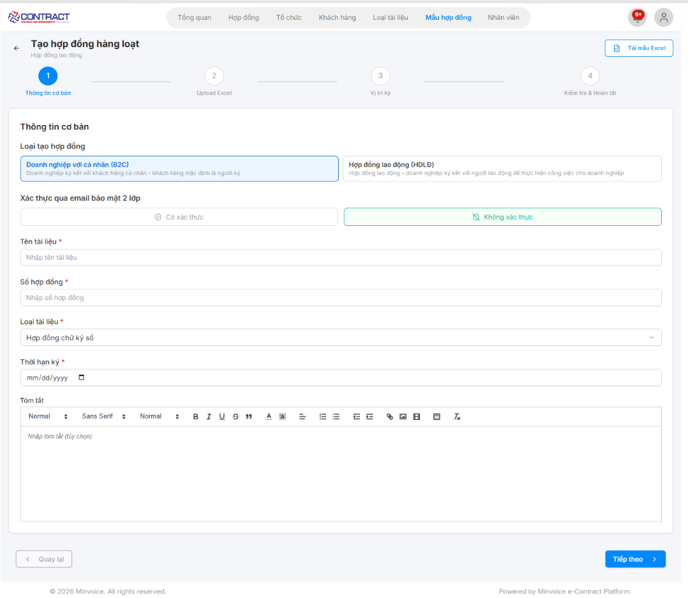
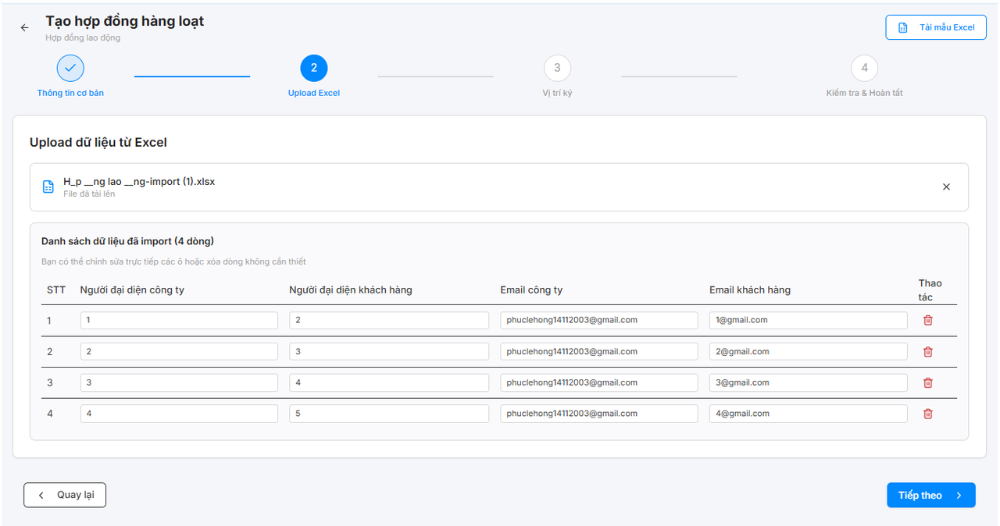
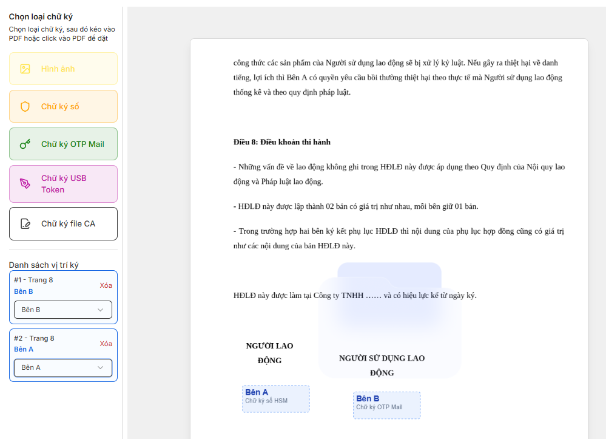
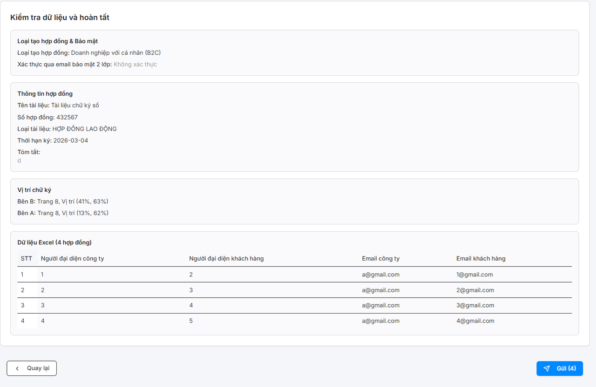

# **HƯỚNG DẪN KÝ HÀNG LOẠT**

### **Bước 1: Chọn icon tạo hàng loạt trong mẫu hợp đồng**

### **Bước 2: Nhập thông tin cơ bản bao gồm: Loại tạo hợp đồng, Tên tài liệu, Số hợp đồng, Loại tài liệu, Thời hạn ký, Tóm tắt. Nhập xong, thao tác nút tiếp theo**

### **Bước 3: Tải mẫu excel rồi upload dữ liệu từ excel xong sẽ hiện bảng danh sách dữ liệu đã import rồi ấn tiếp theo**

### **Bước 4: Kéo thả vị trí ký trên mẫu hợp đồng**

- Người dùng chọn loại chữ ký, sau đó kéo vào PDF hoặc click vào PDF để đặt 

- Sau khi chọn xong các bên thì ấn nút tiếp theo

### **Bước 5: Kiểm tra dữ liệu và hoàn tất rồi ấn nút gửi**

???+ info "Xin chân thành cảm ơn quý khách hàng đã tin dùng sản phẩm của M-Invoice"

    Có bất kỳ vướng mắc nào trong quá trình sử dụng hãy liên hệ với M-Invoice tại mục Hỗ trợ kỹ thuật góc phải bên dưới màn hình hoặc gọi tổng đài kỹ thuật của M-Invoice (1900.955.557 Nhánh 1)

Last updated on <strong>Apr 09, 2026</strong> by <strong>MANHDD</strong>

