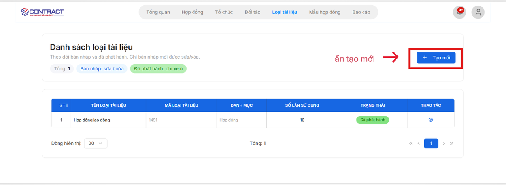
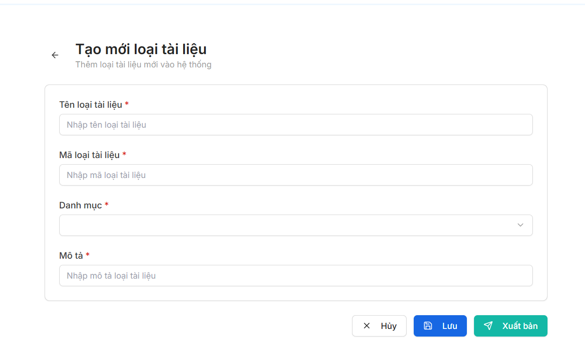

# **HƯỚNG DẪN THÊM LOẠI TÀI LIỆU**

???+ Note "Mục đích"
    Chức năng này cho phép người dùng thiết lập các danh mục loại tài liệu để phân loại và quản lý các văn bản trong hệ thống.

### **Bước 1: Truy cập màn hình Danh sách loại tài liệu**
- Tại thanh menu chính, chọn mục Loại tài liệu.

- Hệ thống hiển thị bảng thống kê các loại tài liệu hiện có, bao gồm các thông tin: Tên loại tài liệu, Mã, Danh mục, Số lần sử dụng và Trạng thái (Bản nháp hoặc Đã phát hành).
- Nhấn nút **[+ Tạo mới]** ở góc phải màn hình để bắt đầu thêm loại tài liệu mới.

### **Bước 2: Khai báo thông tin loại tài liệu**

Tại giao diện **Tạo mới loại tài liệu**, bạn cần nhập đầy đủ các trường thông tin có đánh dấu sao đỏ (*):

1. **Tên loại tài liệu:** Nhập tên hiển thị của loại tài liệu (Ví dụ: Hợp đồng mua bán, Phụ lục hợp đồng...).
2. **Mã loại tài liệu:** Nhập mã định danh cho loại tài liệu này (Ví dụ: HDMB, PLHD).
3. **Danh mục:** Chọn nhóm danh mục lớn mà tài liệu này thuộc về từ danh sách là hợp đồng,chứng từ
4. **Mô tả:** Nhập tóm tắt nội dung hoặc mục đích sử dụng của loại tài liệu này để người dùng khác dễ dàng nhận biết.

### **Bước 3: Lưu hoặc Xuất bản**

Sau khi hoàn tất nhập liệu, người dùng có các lựa chọn sau ở cuối trang:

- Hủy: Loại bỏ các thông tin vừa nhập và quay lại màn hình danh sách.

- Lưu: Lưu loại tài liệu dưới dạng Bản nháp. Ở trạng thái này, bạn vẫn có thể sửa hoặc xóa thông tin.

- Xuất bản: Chuyển loại tài liệu sang trạng thái Đã phát hành. Sau khi xuất bản, loại tài liệu này sẽ sẵn sàng để áp dụng khi tạo mới các hợp đồng/văn bản trong hệ thống.

???+ warning "Lưu ý"
    Chỉ những loại tài liệu ở trạng thái "Bản nháp" mới có quyền Chỉnh sửa hoặc Xóa. Đối với loại tài liệu "Đã phát hành", hệ thống chỉ hỗ trợ quyền xem để đảm bảo tính nhất quán của dữ liệu đã sử dụng.

???+ info "Xin chân thành cảm ơn quý khách hàng đã tin dùng sản phẩm của M-Invoice"

    Có bất kỳ vướng mắc nào trong quá trình sử dụng hãy liên hệ với M-Invoice tại mục Hỗ trợ kỹ thuật góc phải bên dưới màn hình hoặc gọi tổng đài kỹ thuật của M-Invoice (1900.955.557 Nhánh 1)

Last updated on <strong>Apr 09, 2026</strong> by <strong>MANHDD</strong>
