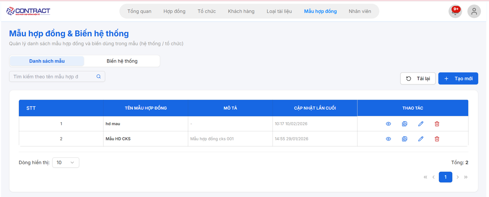
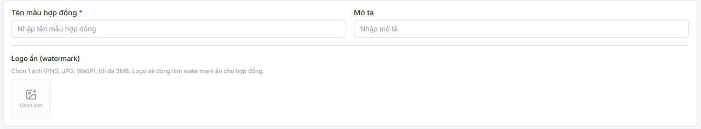
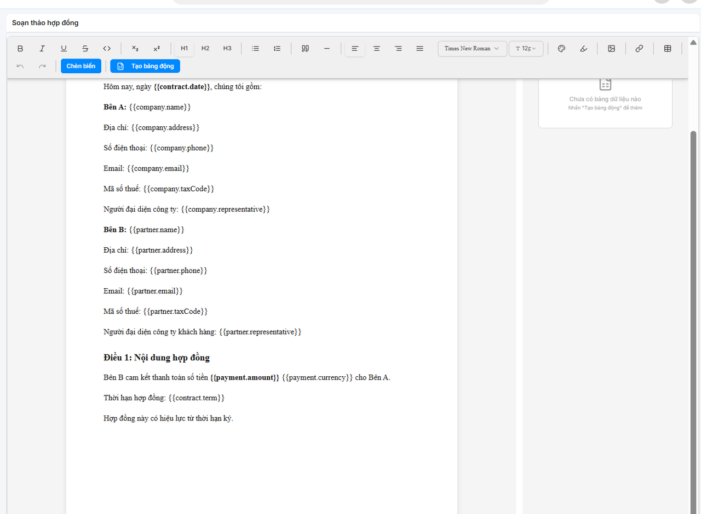
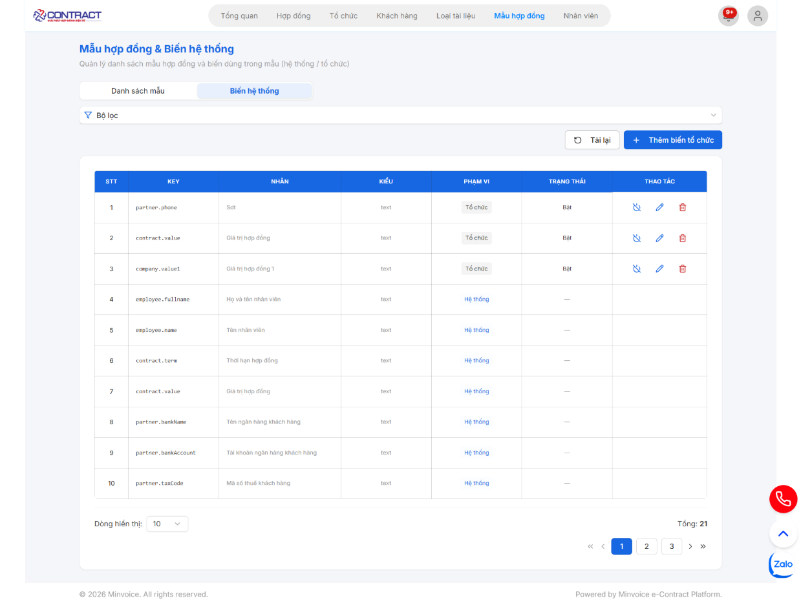
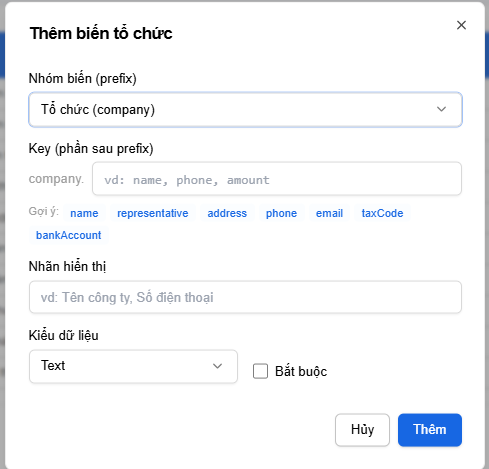

# **TÀI LIỆU THÊM MẪU HỢP ĐỒNG & BIẾN HỆ THỐNG**

???+ Note "Mục đích"
    Chức năng này cho phép người dùng khởi tạo các khung mẫu hợp đồng chuẩn của doanh nghiệp, thiết lập các biến dữ liệu tự động để tái sử dụng nhanh chóng cho các lần ký kết sau.

## **1. Thêm mẫu hợp đồng**

### **Bước 1: Truy cập Danh sách mẫu hợp đồng**

- Trên thanh điều hướng chính, nhấn chọn mục **Mẫu hợp đồng**.

- Tại màn hình danh sách, bạn có thể theo dõi các mẫu đã tạo với các thông tin: Tên mẫu hợp đồng, Mô tả, Thời gian cập nhật lần cuối và các thao tác (Xem, Tạo hàng loạt, Sửa, Xóa).
- Nhấn nút **[+ Tạo mới]** ở góc phải màn hình để bắt đầu.

### **Bước 2: Thiết lập thông tin chung**

- Tại giao diện Tạo mới mẫu hợp đồng, người dùng thực hiện nhập các thông tin cơ bản:

 * Tên mẫu hợp đồng (*): Nhập tên định danh cho mẫu (Ví dụ: Hợp đồng dịch vụ, Hợp đồng thuê nhà...).
 * Mô tả: Nhập nội dung mô tả ngắn gọn về mục đích hoặc đối tượng áp dụng của mẫu này.
 * Logo ẩn: Chọn 1 ảnh (PNG, JPG, WebP) tối đa 3 MB, logo sẽ dùng làm watermark ẩn cho hợp đồng.

### **Bước 3: Soạn thảo nội dung và Chèn biến dữ liệu**

Hệ thống cung cấp bộ công cụ soạn thảo trực quan để bạn thiết kế nội dung văn bản:

- **Soạn thảo văn bản:** Bạn có thể nhập nội dung trực tiếp, căn chỉnh định dạng (in đậm, in nghiêng, căn lề, chọn font chữ...) tương tự như Microsoft Word hoặc copy trực tiếp từ Word và dán vào.

- Chèn biến dữ liệu (Smart Tags): Các biến được đặt trong dấu ngoặc nhọn `{{ }}` sẽ tự động lấy thông tin từ hệ thống hoặc thông tin đối tác khi bạn tạo hợp đồng thật.

    *  Ví dụ: `{{company.name}}` cho tên công ty, `{{partner.address}}` cho địa chỉ đối tác, `{{payment.amount}}` cho số tiền thanh toán.

- **Chức năng Chèn biến:** Nhấn nút **[Chèn biến]** trên thanh công cụ để lựa chọn các trường dữ liệu có sẵn từ hệ thống.

- **Tạo bảng động:** Sử dụng nút **[Tạo bảng động]** để thêm các bảng danh mục sản phẩm hoặc dịch vụ có thể thay đổi số dòng tùy theo dữ liệu thực tế. 

### **Bước 4: Lưu mẫu hợp đồng**

- Sau khi hoàn tất nội dung soạn thảo, hãy kiểm tra lại bố cục và các vị trí đặt biến.
- Nhấn nút **[Lưu mẫu hợp đồng]** ở góc trên bên phải để lưu lại vào hệ thống.
- Mẫu sau khi lưu sẽ xuất hiện tại màn hình danh sách và sẵn sàng để sử dụng tại bước "Tạo tài liệu".

???+ Tip "Mẹo nhỏ"
    Bạn có thể sao chép nội dung từ file Word có sẵn và dán vào trình soạn thảo, sau đó thực hiện thay thế các thông tin cố định bằng các Biến dữ liệu tương ứng để hoàn thiện mẫu nhanh nhất.

## **2. Thêm biến hệ thống**

### **Bước 1: Truy cập danh sách Biến hệ thống**

Tại giao diện quản lý mẫu hợp đồng, bạn thực hiện các thao tác sau:

1. Chọn tab **Biến hệ thống** trên thanh điều hướng phụ.
2. Tại đây, bạn sẽ thấy danh sách các biến đang có (như `contract.term`, `payment.amount`, v.v.).
3. Nhấn vào nút xanh **+ Thêm biến tổ chức** ở góc trên bên phải bảng dữ liệu.

### **Bước 2: Thiết lập thông tin biến mới**
Sau khi nhấn nút thêm, một bảng thông báo (popup) sẽ hiện ra. Bạn cần điền các thông tin sau:

#### **2.1 Nhóm biến (prefix)**
- Thao tác: Chọn nhóm biến phù hợp từ danh sách thả xuống.
- Ví dụ: Chọn Tổ chức `(company)` để tạo các biến liên quan đến thông tin công ty.

#### **2.2 Key (phần sau prefix)**
- Thao tác: Nhập mã định danh cho biến (viết liền, không dấu, thường là tiếng Anh).
    *  Gợi ý: Bạn có thể chọn nhanh các gợi ý bên dưới như: `name`, `representative`, `address`, `taxCode`,...
- Kết quả: Biến sẽ có định dạng `company.[key_bạn_nhập]`.

#### **2.3 Nhãn hiển thị**
- **Thao tác**: Nhập tên tiếng Việt của biến để dễ nhận diện khi soạn thảo hợp đồng.
- **Ví dụ**: "Tên công ty", "Số điện thoại công ty".

#### **2.4 Kiểu dữ liệu & Ràng buộc**
- **Kiểu dữ liệu:** Chọn định dạng dữ liệu (Text, Date, Number, Email...).
- **Bắt buộc:** Tích vào ô này nếu bạn muốn người dùng bắt buộc phải nhập thông tin này khi tạo hợp đồng.

### **Bước 3: Hoàn tất**
1. Kiểm tra lại toàn bộ thông tin đã nhập.
2. Nhấn nút **Thêm** (màu xanh) để lưu biến vào hệ thống.
3. Nhấn **Hủy** nếu bạn muốn đóng cửa sổ mà không lưu thay đổi.

???+ warning "Lưu ý"
    - Sau khi thêm thành công, biến mới sẽ xuất hiện trong danh sách ở **Bước 1** với phạm vi là "Tổ chức". Bạn có thể sử dụng "Key" này để chèn vào các mẫu văn bản.
    - Bạn có thể tắt trạng thái hoạt động của biến nếu không sử dụng tại nút tắt ở cột thao tác trong bảng dữ liệu 

???+ info "Xin chân thành cảm ơn quý khách hàng đã tin dùng sản phẩm của M-Invoice"

    Có bất kỳ vướng mắc nào trong quá trình sử dụng hãy liên hệ với M-Invoice tại mục Hỗ trợ kỹ thuật góc phải bên dưới màn hình hoặc gọi tổng đài kỹ thuật của M-Invoice (1900.955.557 Nhánh 1)

Last updated on <strong>Apr 09, 2026</strong> by <strong>MANHDD</strong>
