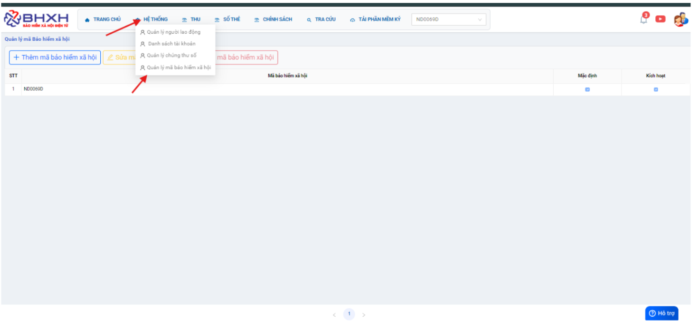

# **BHXH VN trả về lỗi “SE003: Thông tin mã số thuế/mã đơn vị không chính xác”**

## **1. Ngừng dịch vụ báo lỗi SE003**

???+ Bug "Nguyên nhân"

    Do lỗi của hệ thống BHXH VN

**Hướng xử lý:**

Trường hợp mã đơn vị 7 ký tự thì làm như dưới:

Kiểm tra lại thông tin MÃ ĐV TRONG PHẦN HỆ THỐNG 

Kiểm tra với BHXH quản lý xem thông tin đơn vị trên hệ thống của họ đúng chưa?, họ đã add thông tin đơn vị này lên phần mềm TNSH chưa?

Nếu xác nhận thông tin đã chính xác rồi, BHXH quản lý đã add thông tin đơn vị vào TNSH rồi thì liên hệ BHXH quản lý hỗ trợ ngừng dịch vụ cho, sau đó thực hiện đăng ký lại từ phần mềm MBHXH.

**Trường hợp 1:** Đăng ký thành công thì sẽ có mail gửi mã kích hoạt về.

**Trường hợp 2:** Đăng ký vẫn báo lỗi thì Bộ phận CSKH gửi mail cho BHXH Việt Nam với đầy đủ thông tin:

- Đăng ký dịch vụ báo lỗi gì?

- Ngừng dịch vụ báo “Mã số thuế /mã đơn vị không chính xác”

- Thông tin đơn vị (MST, mã đơn vị, tên đơn vị, CQQL)

- Trường hợp mã đơn vị 9 ký tự thì làm như mục 20.2

## **2. Gửi hồ sơ báo lỗi SE003**

Trường hợp đơn vị có mã đơn vị là 9 ký tự, ví dụ: 400007172, 400004918, 400062340, 400061891, … Thì báo đơn vị liên hệ Bảo hiểm quản lý xin cấp lại mã đơn vị 7 ký tự. Sau đó, mBHXH  thực hiện cấp mới mã đơn vị 7 ký tự trên hệ thống đấu nối BCCS cho đơn vị.

???+ info "Xin chân thành cảm ơn quý khách hàng đã tin dùng sản phẩm của M-Invoice"

    Có bất kỳ vướng mắc nào trong quá trình sử dụng hãy liên hệ với M-Invoice tại mục Hỗ trợ kỹ thuật góc phải bên dưới màn hình hoặc gọi tổng đài kỹ thuật của M-Invoice (1900.955.557 Nhánh 2)

Last updated on <strong>Mar 18, 2026</strong> by <strong>NHATTH</strong>
