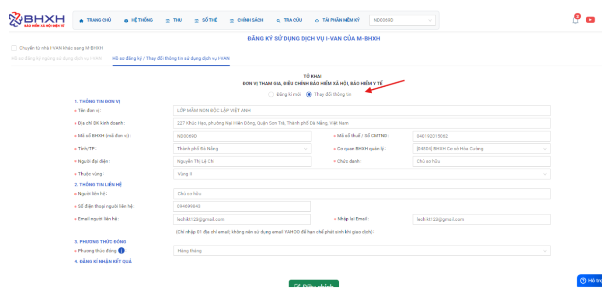
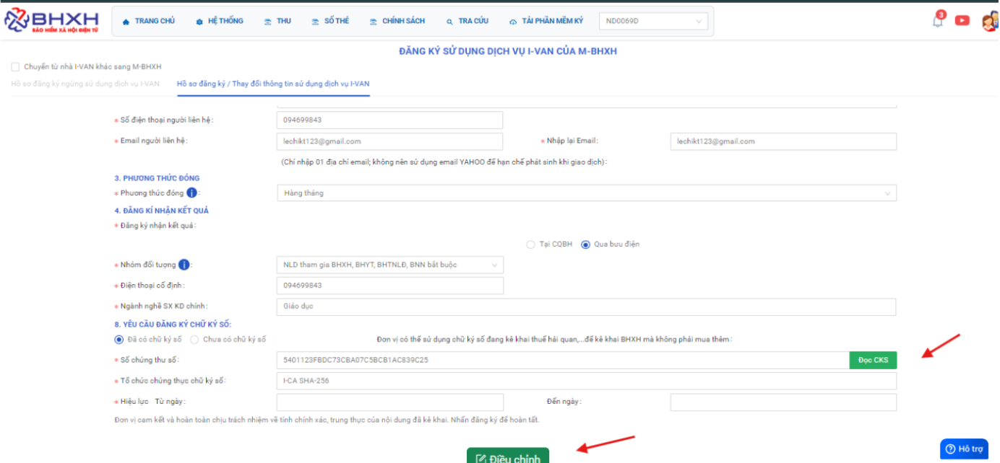

# **Gửi tờ khai BHXH VN trả về lỗi “Thông tin chữ ký số của đơn vị không đúng với thông tin đã đăng ký”**

???+ Bug "Nguyên nhân"

    Lỗi hệ thống của BHXH VN

### **Bước 1: Hồ sơ đăng ký / Thay đổi thông tin sử dụng dịch vụ I-VAN / Chọn thay đổi thông tin và đọc chữ ký số mới.**

### **Bước 2: Đọc chữ ký số mới**

### **Bước 3: Sau đó ký số và gửi lại hồ sơ. Và  kiểm tra email BHXH VN trả về**

???+ info "Xin chân thành cảm ơn quý khách hàng đã tin dùng sản phẩm của M-Invoice"

    Có bất kỳ vướng mắc nào trong quá trình sử dụng hãy liên hệ với M-Invoice tại mục Hỗ trợ kỹ thuật góc phải bên dưới màn hình hoặc gọi tổng đài kỹ thuật của M-Invoice (1900.955.557 Nhánh 2)

Last updated on <strong>Mar 18, 2026</strong> by <strong>NHATTH</strong>
