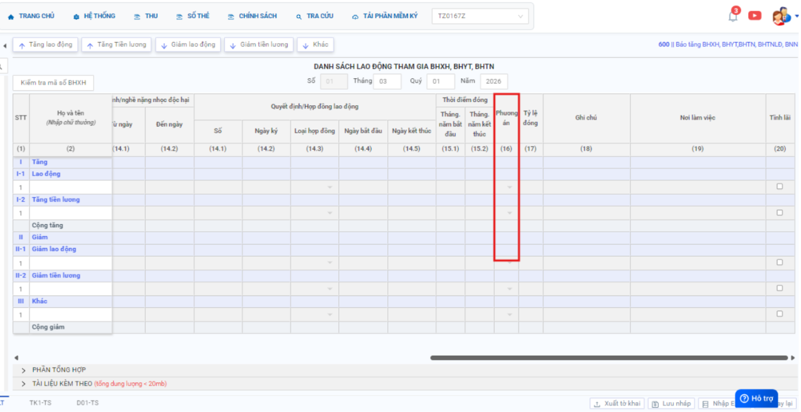

# **Gửi hồ sơ BHXH VN trả về lỗi “Cấu trúc XML file tờ khai chưa đúng với file D03-TS.xsd,...”**

???+ Bug "Mô tải lỗi"

    Gửi hồ sơ BHXH VN trả về lỗi “Cấu trúc XML file tờ khai chưa đúng với file D03-TS.xsd : Line: 24, Position: 15 “The ‘PA’ element is invalid – The value ‘ON’ is invalid according to its datatype ‘String’ – The Enumeration constraint failed.

    Nguyên nhân:

    Do cột “Phương Án” trên tờ khai đang để sai dữ liệu

### **Bước 1: Vào lại hồ sơ đã kê khai >> tìm đến cột “Phương án” >> sau đó chọn lại dữ liệu cột này >> ghi lại dữ liệu thành công.**

### **Bước 2: Sau đó xuất lại tờ khai >> thực hiện ký số và gửi lại tờ khai**

### **Bước 3: Kiểm tra email xác nhận của BHXH Vn trả về**

???+ info "Xin chân thành cảm ơn quý khách hàng đã tin dùng sản phẩm của M-Invoice"

    Có bất kỳ vướng mắc nào trong quá trình sử dụng hãy liên hệ với M-Invoice tại mục Hỗ trợ kỹ thuật góc phải bên dưới màn hình hoặc gọi tổng đài kỹ thuật của M-Invoice (1900.955.557 Nhánh 2)

Last updated on <strong>Mar 18, 2026</strong> by <strong>NHATTH</strong>

