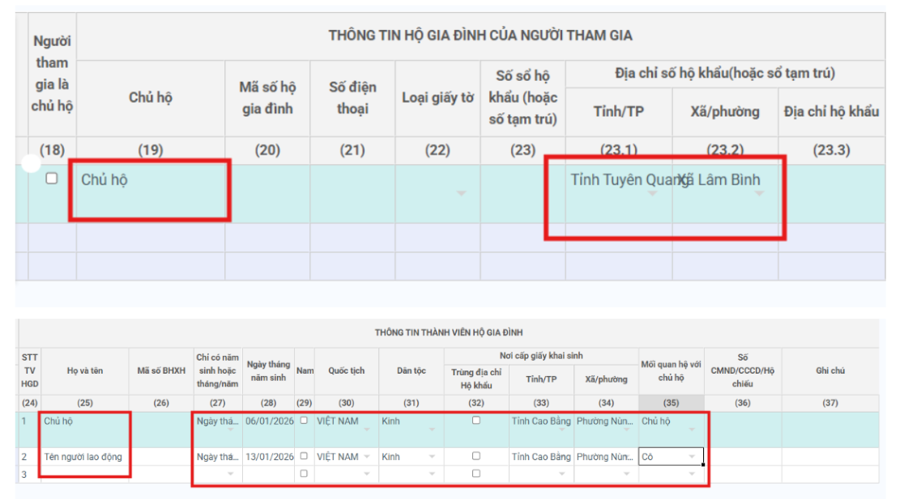

# **BHXH VN trả về lỗi “File https://gddt.baohiemxahoi.gov.vn/XMLSchema/TK1-TS/TK1-TS.xsd : Line: 40, Position: 9 “The element ‘PhuLuc’, ...**

???+ Bug "Mô tải lỗi"

    File https://gddt.baohiemxahoi.gov.vn/XMLSchema/TK1-TS/TK1-TS.xsd : Line: 40, Position: 9 “The element ‘PhuLuc’ has incomplete content. List of possible elements expected: ‘DSThanhVien’

    Nguyên nhân:

    Do chưa nhập danh sách thành viên trong phụ lục

### **Bước 1: Vào màn hình nhập tờ khai bổ sung thêm thành viên trong phụ lục**

### **Bước 2: Kết xuất tờ khai > thực hiện ký số và gửi lại**

???+ info "Xin chân thành cảm ơn quý khách hàng đã tin dùng sản phẩm của M-Invoice"

    Có bất kỳ vướng mắc nào trong quá trình sử dụng hãy liên hệ với M-Invoice tại mục Hỗ trợ kỹ thuật góc phải bên dưới màn hình hoặc gọi tổng đài kỹ thuật của M-Invoice (1900.955.557 Nhánh 2)

Last updated on <strong>Mar 18, 2026</strong> by <strong>NHATTH</strong>

