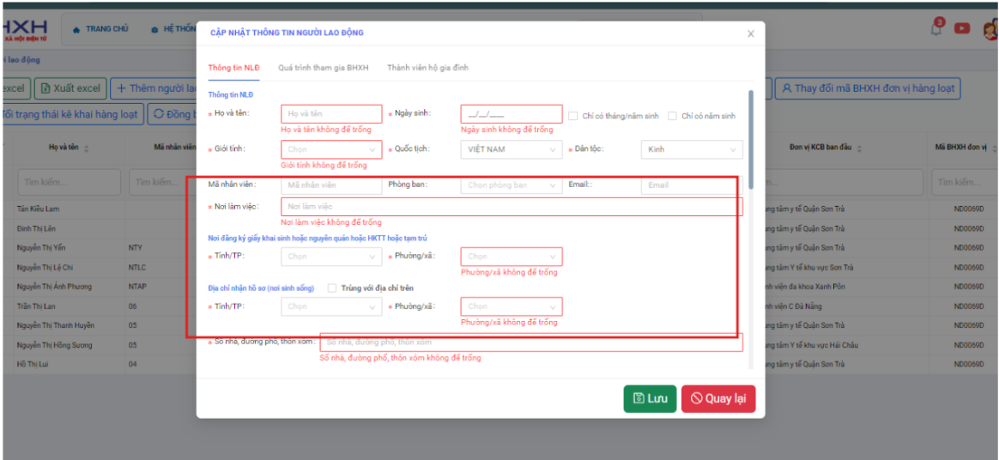

# **BHXH VN trả về lỗi sai “ mã tỉnh/ huyện/xã/ bệnh viện” khai sinh hoặc địa chỉ.**

???+ Bug "Nguyên nhân"

    Do dữ liệu thông tin phần “tỉnh/huyện/xã/ bệnh viện” khai sinh hoặc địa chỉ nhận hồ sơ trên tờ khai đang nhập sai dữ liệu do lấy dữ liệu từ HSNS là dữ liệu cũ sang.

### **Bước 1: Vào lại phần QLLĐ  >> tìm đến các cột Tỉnh/huyện/xã  khai sinh, tỉnh /huyện/xã nhận hồ sơ, bênh viện >> sau đó chọn lại dữ liệu >> lưu lại**

### **Bước 2: Thực hiện TẠO LẠI HỒ SƠ  >> ký số và gửi lại**

???+ info "Xin chân thành cảm ơn quý khách hàng đã tin dùng sản phẩm của M-Invoice"

    Có bất kỳ vướng mắc nào trong quá trình sử dụng hãy liên hệ với M-Invoice tại mục Hỗ trợ kỹ thuật góc phải bên dưới màn hình hoặc gọi tổng đài kỹ thuật của M-Invoice (1900.955.557 Nhánh 2)

Last updated on <strong>Mar 18, 2026</strong> by <strong>NHATTH</strong>
