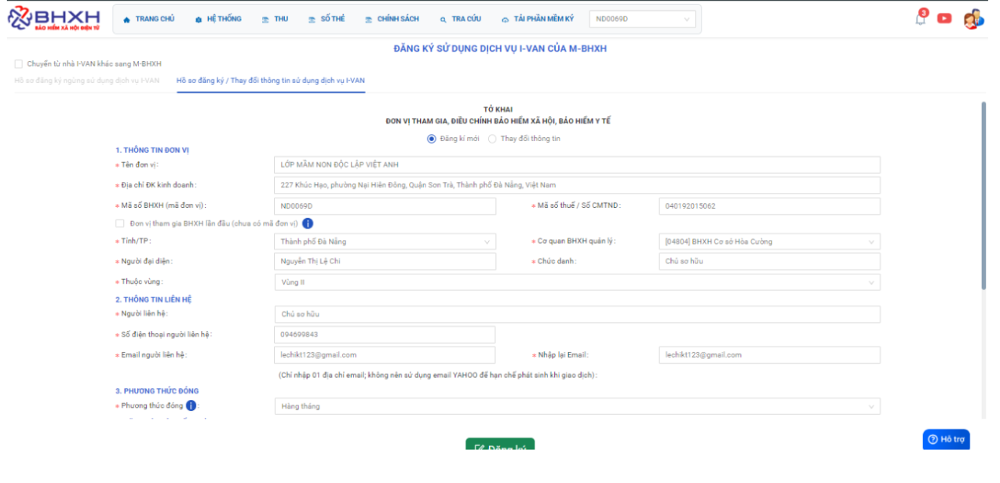

# **BHXH VN trả về lỗi “SE004 – Mã cơ quan bảo hiểm không khớp với cơ quan bảo hiểm quản lý đơn vị”**

???+ Bug "Nguyên nhân 1"

    Do thông tin của đơn vị gồm **“Mã số thuế” + “Mã đơn vị”** chưa được cán bộ BHXH quản lý bên dưới add vào phần mềm TNHS của họ nên khách hàng không đăng ký dịch vụ được

    Hướng khắc phục: báo khách hàng báo với BHXH quản lý thêm  thông tin về **“Mã số thuế+ Mã đơn vị”** của khách hàng vào phần mềm TNHS của họ >> sau đó vào lại phần mềm vBHXH thực hiện các bước sau: Làm theo giống bước đăng ký ivan

???+ Bug "Nguyên nhân 2"

    Cơ quan BHXH đã thêm thông tin doanh nghiệp vào phần mềm TNHS. nhưng trên phần mềm BHXH không có Mã cơ quan Quản lý BHXH bị trống.
    
???+ info "Xin chân thành cảm ơn quý khách hàng đã tin dùng sản phẩm của M-Invoice"

    Có bất kỳ vướng mắc nào trong quá trình sử dụng hãy liên hệ với M-Invoice tại mục Hỗ trợ kỹ thuật góc phải bên dưới màn hình hoặc gọi tổng đài kỹ thuật của M-Invoice (1900.955.557 Nhánh 2)

Last updated on <strong>Mar 18, 2026</strong> by <strong>NHATTH</strong>

