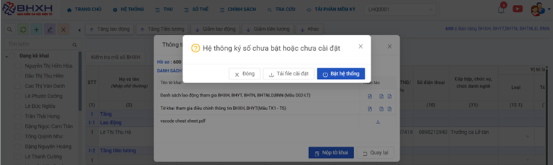
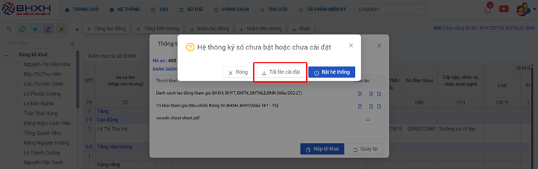
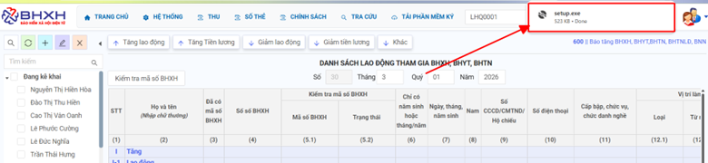
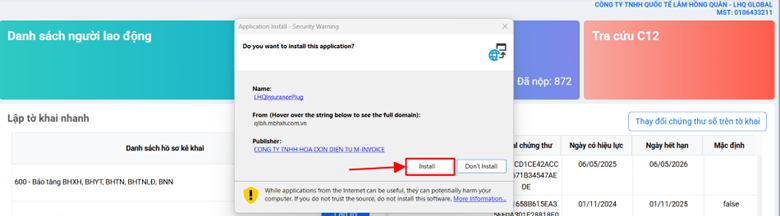
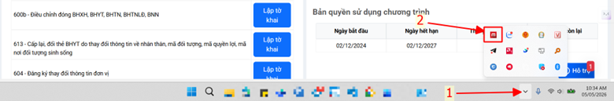
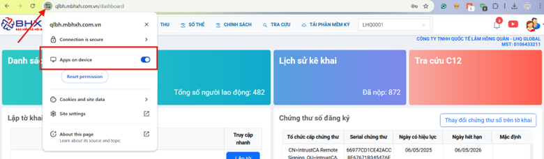

# **Hướng dẫn cài plugin**

<<<<<<< HEAD

=======
>>>>>>> b1000da92955a103468faf86ed655b8c12a1d933
## **Hướng dẫn cài plugin**

### Bước 1: Kiểm tra plugin đã được tải và cài đặt trên máy hay chưa 

Khi hiện lỗi chưa tải plugin

### Bước 2: Ấn tải file cài đặt

### Bước 3: Sau khi tải xong, mở file vừa tải để cài đặt

### Bước 4: kiểm tra lại xem plugin đã được cài chưa. Nếu chưa anh chị mở lại file vừa tải và chạy lên

### Anh chị mở trình duyệt và kiểm tra quyền truy cập mạng cục bộ

<<<<<<< HEAD
=======

!!! info "Xin chân thành cảm ơn Quý khách hàng đã tin dùng sản phẩm của M-Invoice"

    Có bất kỳ vướng mắc nào trong quá trình sử dụng hãy liên hệ với M-Invoice tại mục Hỗ trợ kỹ thuật góc phải bên dưới màn hình hoặc gọi tổng đài kỹ thuật của M-Invoice (1900.955.557 Nhánh 2)

Last updated on <strong>May 05, 2026</strong> by <strong>MANHDD</strong>

>>>>>>> b1000da92955a103468faf86ed655b8c12a1d933
