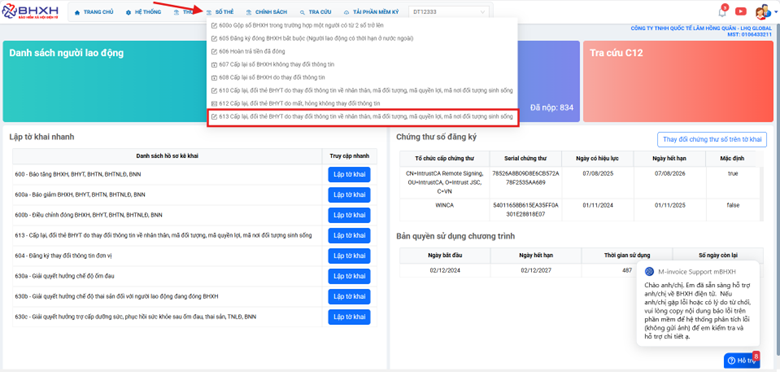
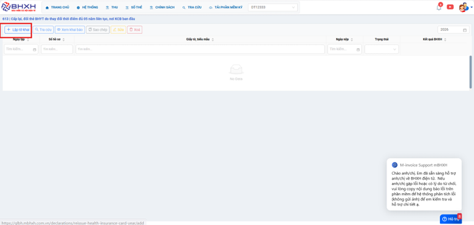
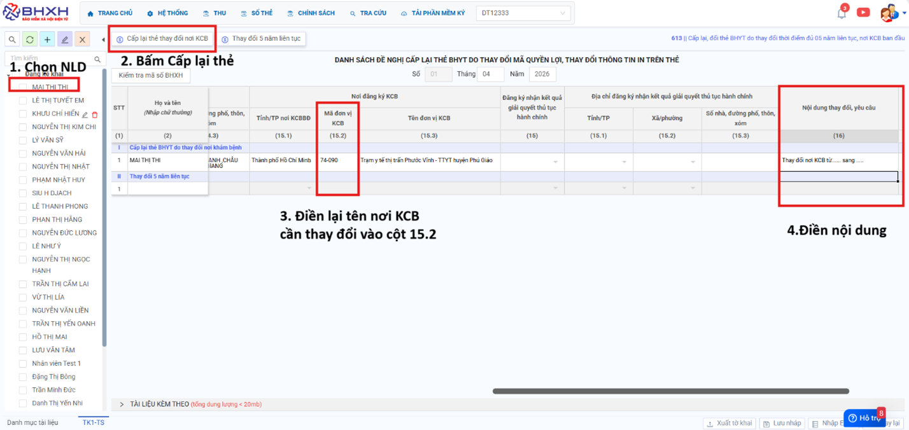

# **Hồ sơ 613 - Cấp lại đổi thẻ BHYT do thay đổi thông tin**

## **Hướng dẫn hồ sơ 613 - Cấp lại, đổi thẻ BHYT do thay đổi thông tin về nhân thân, mã đối tượng, mã quyền lợi, mã nơi đối tượng sinh sống**

### Bước 1: Anh/ Chị bấm vào Sổ thẻ -> 613 - Cấp lại, đổi thẻ BHYT do thay đổi thông tin về nhân thân, mã đối tượng, mã quyền lợi, mã nơi đối tượng sinh sống

### Bước 2: Bấm Lập tờ khai

### Bước 3: Tích chọn NLD ->Bấm Cấp lại thẻ thay đổi nơi KCB -> Điền lại tên nơi KCB cần thay đổi vào cột 15.2 -> Điền nội dung thay đổi, yêu cầu: Thay đổi nơi KCB từ …. sang ….

!!! info "Xin chân thành cảm ơn Quý khách hàng đã tin dùng sản phẩm của M-Invoice"

    Có bất kỳ vướng mắc nào trong quá trình sử dụng hãy liên hệ với M-Invoice tại mục Hỗ trợ kỹ thuật góc phải bên dưới màn hình hoặc gọi tổng đài kỹ thuật của M-Invoice (1900.955.557 Nhánh 2)

Last updated on <strong>Apr 14, 2026</strong> by <strong>MANHDD</strong>

