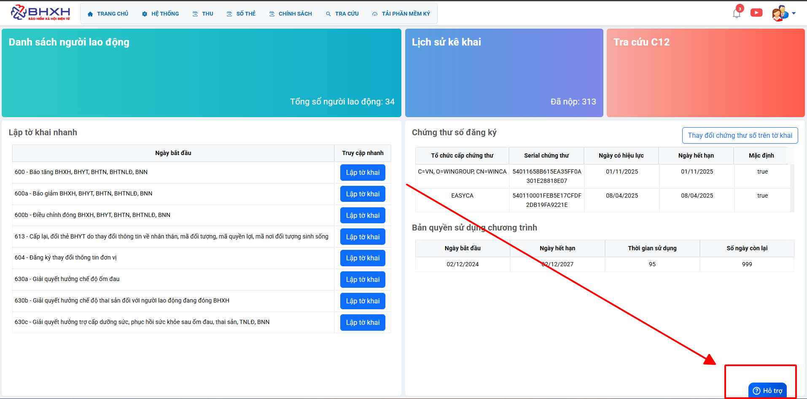

# **Thay đổi cập nhật chữ ký số trên BHXH-Minvoice**

???+ Note "Mục đích"

    Bài viết hướng dẫn quy trình thay đổi cập nhật chữ ký số trên BHXH-Minvoice 

    Áp dụng cho các trường thay thay đổi cks mới, mua mới, gia hạn, cấp bù

## I. **Các bước thực hiện**

### **Bước 1: Tải phầm mềm ký số nều máy anh chị chưa cài**

### **Bước 2: Chọn mục đăng ký ivan**

### **Bước 3: Bấm vào mục thay đổi thông tin và kiểm tra các thông tin bên dưới**

### **Bước 4: Bấm đọc cks và chọn cks cần thay đổi cập nhập xong bấm điều chỉnh để hoàn tất**

???+ info "Xin chân thành cảm ơn quý khách hàng đã tin dùng sản phẩm của M-Invoice"

    Có bất kỳ vướng mắc nào trong quá trình sử dụng hãy liên hệ với M-Invoice tại mục Hỗ trợ kỹ thuật góc phải bên dưới màn hình hoặc gọi tổng đài kỹ thuật của M-Invoice (1900.955.557 Nhánh 2)

Last updated on <strong>Feb 26, 2026</strong> by <strong>NHATTH</strong>

