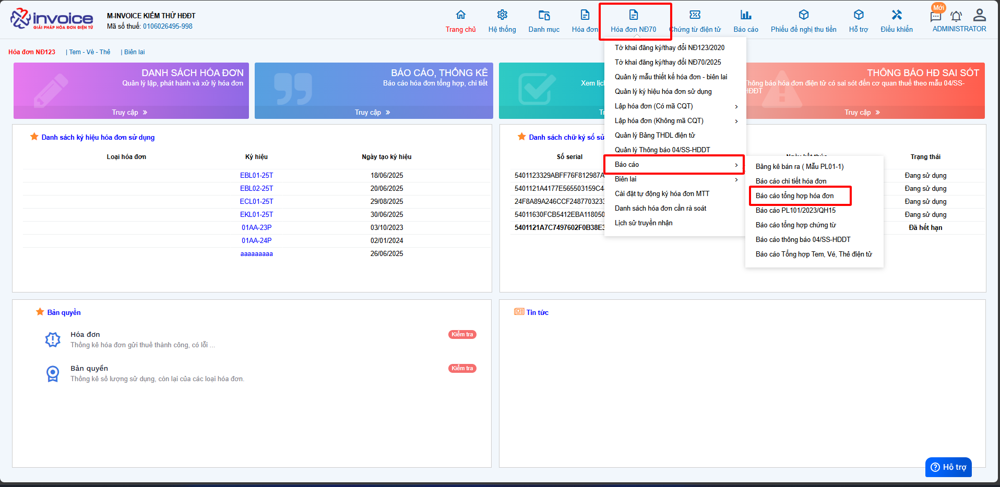
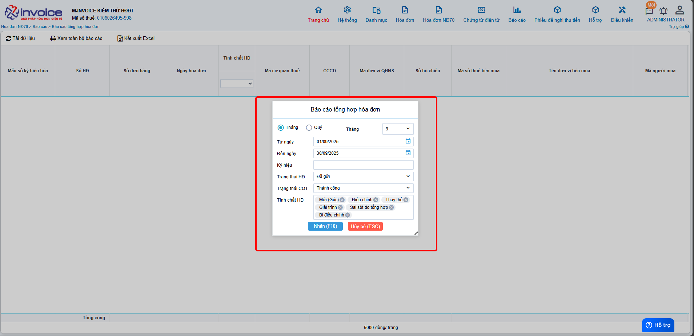
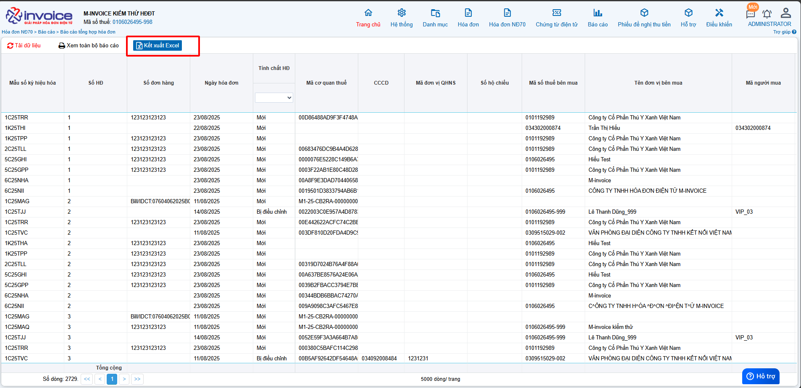

# **Báo cáo tổng hợp hoá đơn theo HĐ70**

## **Hướng dẫn xem và tải báo cáo tổng hợp hóa đơn HĐ70**

### **Bước 1: Truy cập vào phần Hóa đơn HĐ70 >> Báo cáo >> Báo cáo tổng hợp hóa đơn**

### **Bước 2: Chọn các điều kiện để lọc báo cáo**

### **Bước 3 : Kết xuất báo cáo**

!!! info "Xin chân thành cảm ơn Quý khách hàng đã tin dùng sản phẩm của M-Invoice"

    Có bất kỳ vướng mắc nào trong quá trình sử dụng hãy liên hệ với M-Invoice tại mục Hỗ trợ kỹ thuật góc phải bên dưới màn hình hoặc gọi tổng đài kỹ thuật của M-Invoice (1900.955.557 Nhánh 1)

Last updated on <strong>Sep 18, 2025</strong> by <strong>nhatth</strong>

