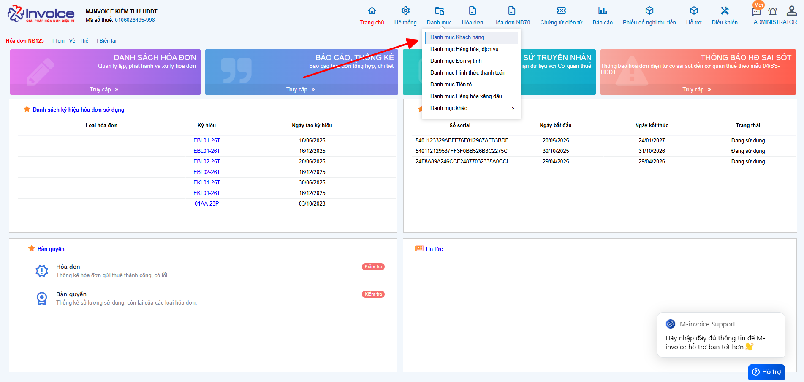
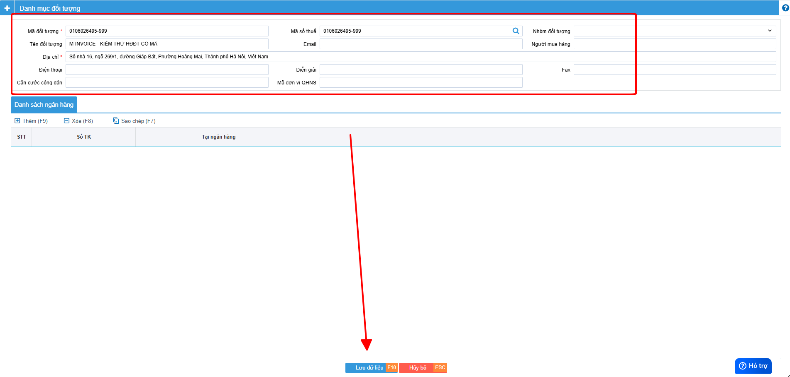
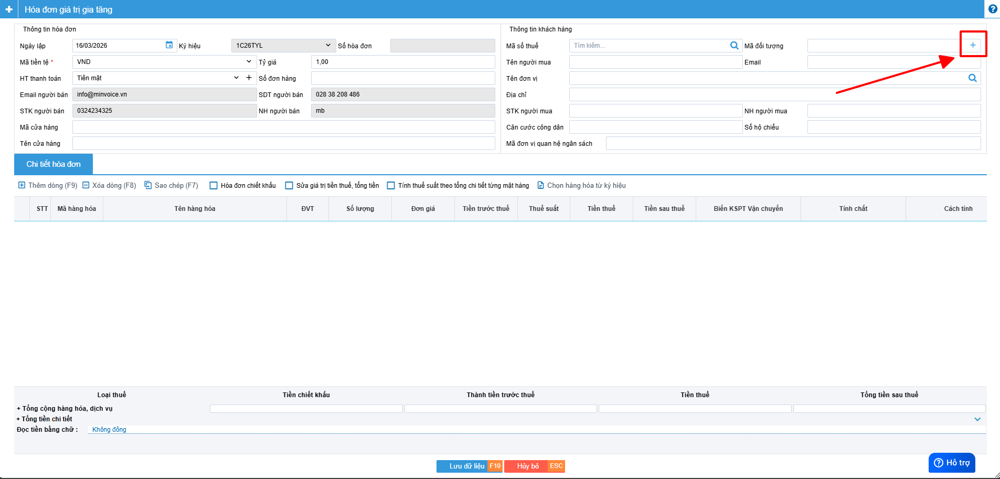
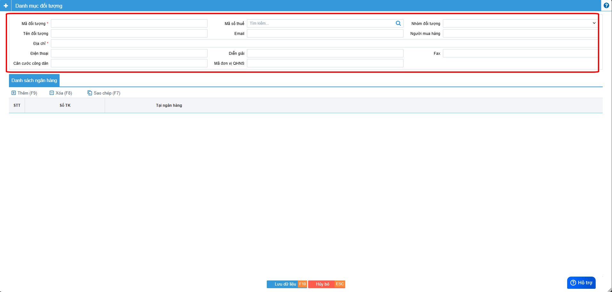
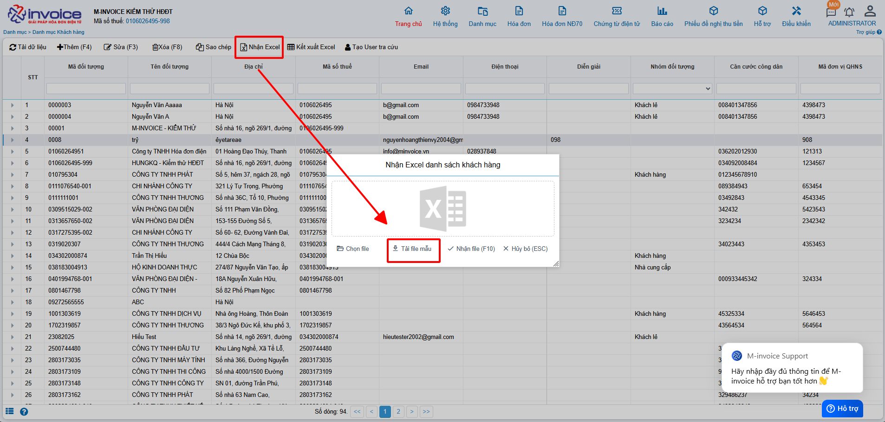
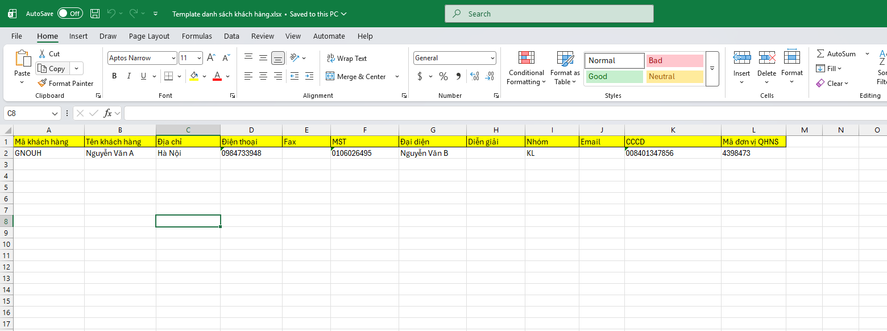
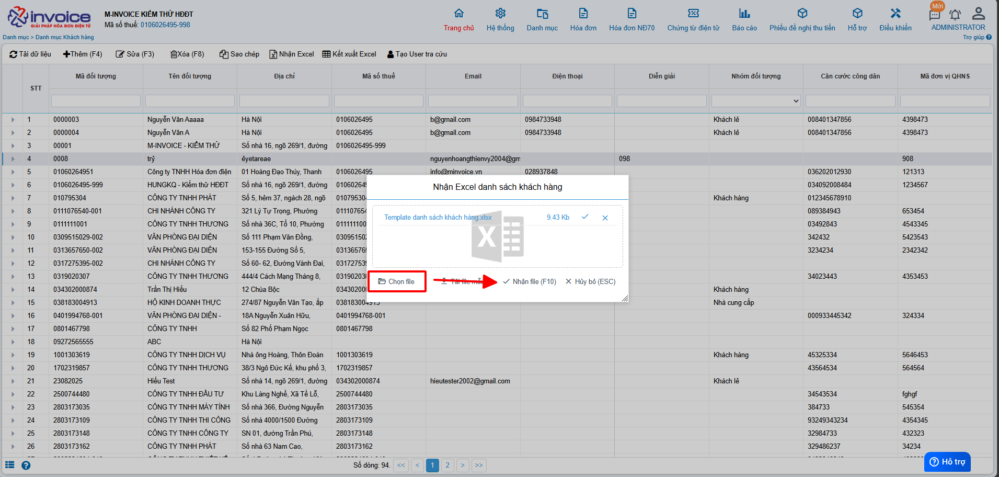
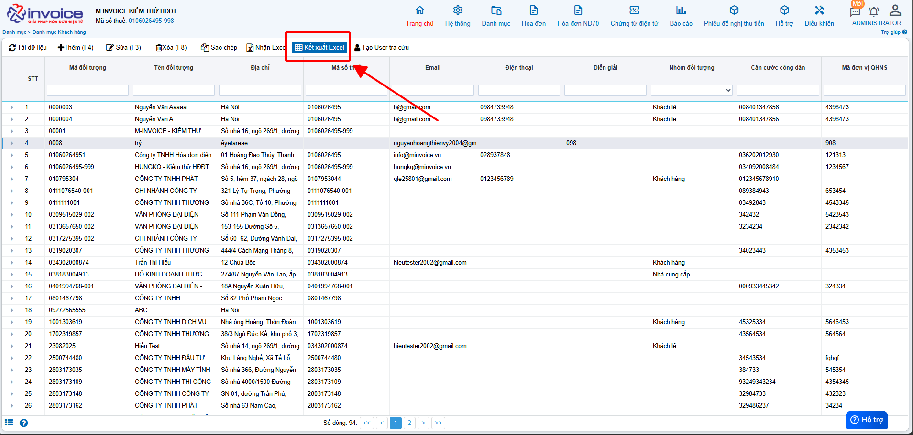

# **Danh mục khách hàng**

## **Thêm danh mục khách hàng**

Sử dụng giảm bớt thao tác điền thông tin khách hàng

???+ Note "Mục đích"

    Lưu trữ thông tin khách hàng: Tên đơn vị/cá nhân, MST, địa chỉ, email… dùng lại nhiều lần.

    Xuất hóa đơn nhanh & chính xác: Chọn khách hàng từ danh mục, tránh nhập sai MST hoặc tên.

    Đồng bộ dữ liệu: Thông tin khách hàng thống nhất trên tất cả hóa đơn.

---

### Cách 1: Nhập thủ công từ Danh mục - Khách hàng

**Trên giao diện trang chủ truy cập Danh mục --> Khách hàng**

Bạn nhấn nút **Thêm(F4)** để bắt đầu thêm Khách hàng.
Nhập đầy đủ thông tin như **Mã đối tượng, mã số thuế, Tên đơn vị, Địa chỉ ....**
Khi nhập xong bạn nhấn **Lưu** để lưu mã đối tượng khách hàng này vào.

Như vậy bạn đã tạo 1 mã khách hàng thành công trên hệ thống.

---

### Cách 2: Nhập thủ công khi lập hóa đơn

Ở Danh sách hóa đơn (Hóa đơn NĐ70) chọn tạo hóa đơn **Thêm (F4)** để bắt đầu tạo hóa đơn.

Bạn nhấn nút dấu cộng ở hàng mã đối tượng để bắt đầu thêm Khách hàng.

Nhập đầy đủ thông tin như **Mã khách hàng, mã số thuế, Tên đơn vị, Địa chỉ ....**
Khi nhập xong bạn nhấn **Lưu** để lưu mã khách hàng này vào.

Như vậy bạn đã tạo 1 mã khách hàng thành công trên hệ thống.

---

### Cách 3: Nhập từ file Excel

**Trên giao diện trang chủ truy cập Danh mục --> Khách hàng**

Trên giao diện Danh mục khách hàng bạn chọn **Nhận Excel**, sau đó nhấn **Tải file mẫu**.

Nhập đầy đủ thông tin bạn muốn tải lên vào file mẫu sau đó lưu lại *(Những mục có dấu * là bắt buộc)*.

Quay trở lại phần mềm nhấn **Chọn file** để chọn file vừa lưu, sau đó nhấn **Nhận File**.

Như vậy là bạn đã tải file Excel lên thành công.

---

### Kết xuất Excel danh mục khách hàng

**Mục đích:** Tải Excel danh mục khách hàng về để lưu trữ hoặc phân tích.

---

???+ info "Xin chân thành cảm ơn quý khách hàng đã tin dùng sản phẩm của M-Invoice"

    Có bất kỳ vướng mắc nào trong quá trình sử dụng hãy liên hệ với M-Invoice tại mục Hỗ trợ kỹ thuật góc phải bên dưới màn hình hoặc gọi tổng đài kỹ thuật của M-Invoice **(1900.955.557 Nhánh 1)**

Last updated on <strong>Mar 16, 2026</strong> by <strong>NHATTH</strong>
