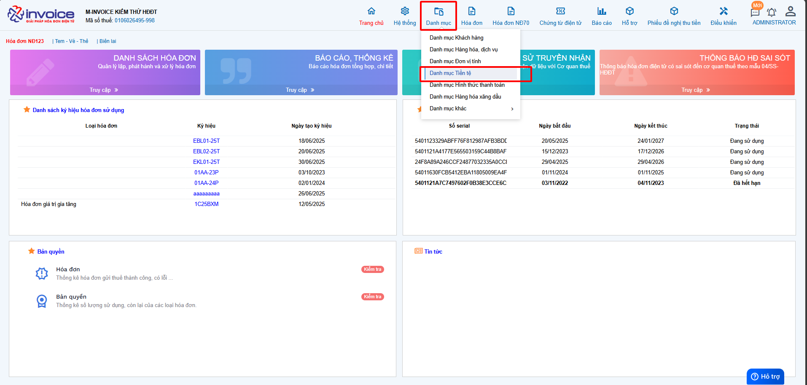
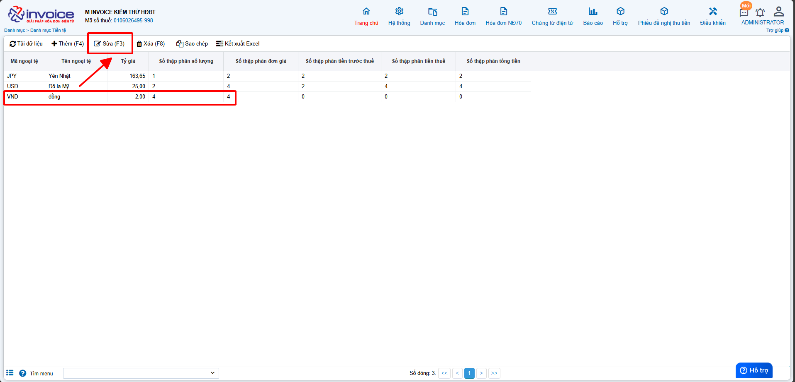
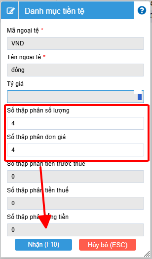
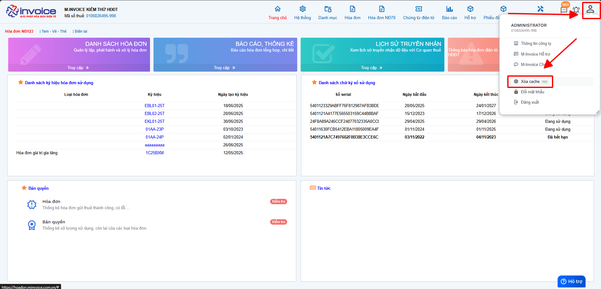

# **Chỉnh sửa thập phân ở số lượng, đơn giá**

???+ Note "Mục đích"

    Trong quá trình sử dụng phần mềm hóa đơn điện tử M-invoice, NSD sẽ muốn có thêm phần số thập phân sau dấu phẩy ở các trường
    thông tin như **số lượng**, **đơn giá**, ... để khi tính tổng tiền có thể ra được số tiền phù hợp với yêu cầu của khách hàng.
    M-invoice xin giới thiệu với khách hàng và người sử dụng tính năng điều chỉnh phần số thập phân trên phần mềm

## **Hướng dẫn điều chỉnh phần số thập phân của phần tiền**

### **Bước 1: Ở màn hình trang chủ bạn truy cập vào phần Danh mục --> tiền tệ**

### **Bước 2: Chọn vào loại tiền bạn muốn sửa và nhấn sửa**

### **Bước 3: Sửa các phần số thập phân đằng sau dấu phẩy, bạn muốn để bao nhiêu số ở phần nào thì sửa lại phần đó**

### **Bước 4: Xóa cache để khi lập sẽ ra thập phân vừa chỉnh**

???+ info "Xin chân thành cảm ơn quý khách hàng đã tin dùng sản phẩm của M-Invoice"

    Có bất kỳ vướng mắc nào trong quá trình sử dụng hãy liên hệ với M-Invoice tại mục Hỗ trợ kỹ thuật góc phải bên dưới màn hình hoặc gọi tổng đài kỹ thuật của M-Invoice (1900.955.557 Nhánh 1)

Last updated on <strong>Aug 21, 2025</strong> by <strong>NHATTH</strong>

