# **Thêm sửa xoá, sao chép hoá đơn**

???+ Note "Nội dung"

    #### Giải thích về chức năng Thêm – Sửa – Xóa – Sao chép hóa đơn

    Trong quá trình sử dụng **phần mềm hóa đơn điện tử**, người dùng thường xuyên phải thao tác với các hóa đơn để phục vụ hoạt động kinh doanh và quản trị. Các chức năng như **Thêm**, **Sửa**, **Xóa**, và **Sao chép hóa đơn** là những nghiệp vụ cơ bản nhưng rất quan trọng, hỗ trợ người dùng xử lý linh hoạt và chính xác dữ liệu hóa đơn.

    **✅ Chức năng và ý nghĩa**

    **➕ Thêm hóa đơn**
    Cho phép người dùng **lập mới một hóa đơn** để phát hành cho khách hàng. Đây là bước đầu tiên trong quy trình xuất hóa đơn và cần đảm bảo **tính chính xác** của các thông tin như:
    - Mã số thuế
    - Tên hàng hóa/dịch vụ
    - Thuế suất
    - Thành tiền, v.v.

    **✏️ Sửa hóa đơn**
    Áp dụng trong trường hợp **hóa đơn chưa phát hành hoặc chưa ký số**. Người dùng có thể chỉnh sửa lại các thông tin sai sót như:
    - Nội dung hàng hóa
    - Số lượng
    - Đơn giá , ...
    > ⚠️ Lưu ý: Sau khi hóa đơn đã được ký điện tử và gửi lên cơ quan thuế, không thể chỉnh sửa mà cần thực hiện điều chỉnh hoặc thay thế theo quy định.

    **🗑️ Xóa hóa đơn**
    Cho phép người dùng **xóa bỏ hóa đơn** chưa ký hoặc chưa phát hành nếu phát hiện có lỗi nghiêm trọng. Việc xóa cần:
    - Tuân thủ quy trình nghiệp vụ nội bộ
    - Đảm bảo không ảnh hưởng đến dữ liệu báo cáo, sổ sách kế toán
    > ⚠️ Lưu ý: Sau khi hóa đơn đã được ký điện tử và gửi lên cơ quan thuế, không thể xóa mà cần thực hiện điều chỉnh hoặc thay thế theo quy định.

    **📋 Sao chép hóa đơn**
    Hỗ trợ **tạo nhanh một hóa đơn mới** dựa trên nội dung của hóa đơn cũ đã lập. Tính năng này giúp:
    - Tiết kiệm thời gian nhập liệu
    - Tránh bỏ sót thông tin khi lập nhiều hóa đơn có nội dung tương tự

    **🎯 Lợi ích khi sử dụng đúng các chức năng này**

    - **Tăng hiệu suất làm việc**
    - **Đảm bảo tính chính xác và hợp lệ** của hóa đơn
    - **Tuân thủ đúng quy định pháp luật** về hóa đơn điện tử

    ---

=== "Thêm hóa đơn"

    ## **Hướng dẫn lập và phát hành hóa đơn**

    ???+ Note "Ghi chú"

        Khi sử dụng phần mềm hóa đơn, NSD sẽ cần lập và phát hành hóa đơn. M-invoice sẽ giới thiệu với NSD tính năng lập và phát hành hóa đơn trên hệ thống

    
Hướng dẫn lập và phát hành hóa đơn
 

    **Bước 1: Truy cập vào phần lập hoá đơn**

    Truy cập vào trang hóa đơn điện tử M-invoice chọn phần **Hóa đơn NĐ70** chọn loại hóa đơn mà DN đang sử dụng tương ứng

    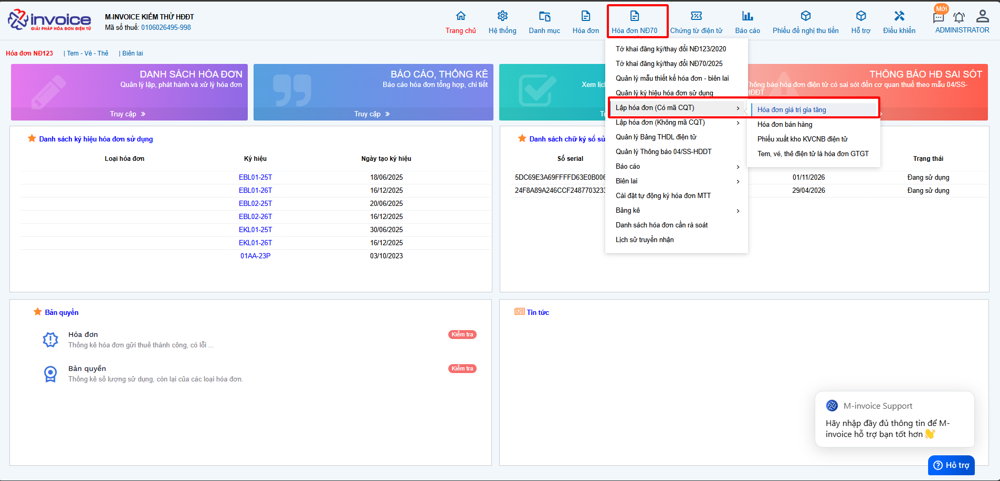

    Chọn ký hiệu hóa đơn quý khách đang muốn sử dụng

    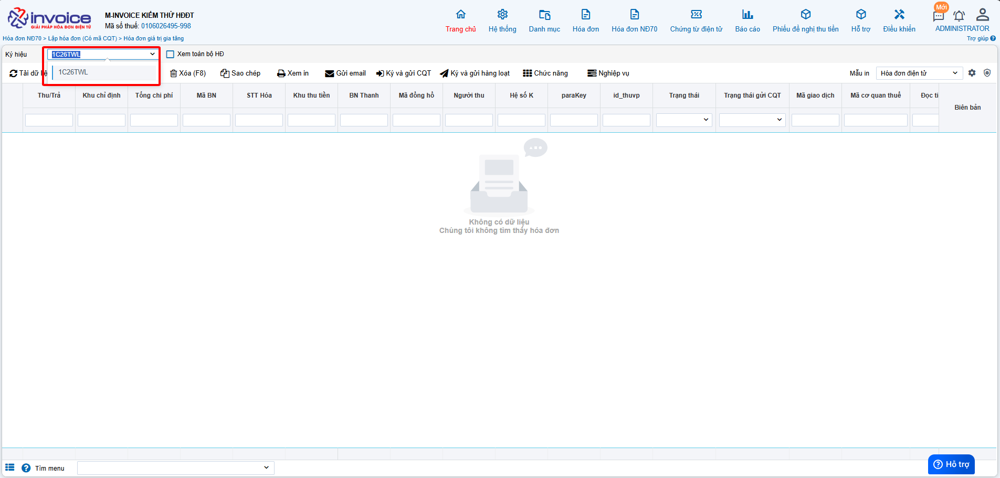

    **Bước 2: Nhập chi tiết hoá đơn**

    Ở trên giao diện chọn **Thêm (F4)**

    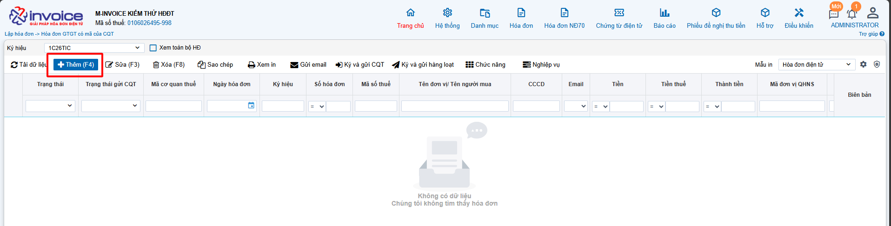

    Phần giao diện lập hóa đơn sẽ có giao diện như sau.

    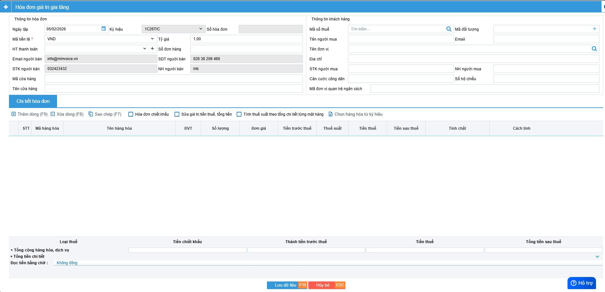

    **Phần 1**: Phần đầu phiếu hóa đơn bao gồm các thông tin

    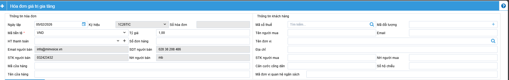

    ???+ note "Phần thông tin chung"

        + **Ký hiệu**: Do quý khách đã chọn lúc đầu

        + **Ngày hóa đơn** : Ngày xuất của hóa đơn (Có thể sửa lại nếu hình thức là sinh số trước và hóa đơn chưa ký)

        + **Đơn vị tiền tệ** : nếu xuất tiền Việt chon VND còn nếu xuất ngoại tệ chọn phần ngoại tệ tương ứng

        + **Tỷ giá** : tiền Việt để tỷ giá là 1, còn ngoại tệ để tỷ giá tương ứng

        + **HT thanh toán** : Chọn hình thức thanh toàn phù hợp

    ???+ note "Thông tin bên bán"

        Quý khách có thể sửa được mặc định của những thông tin này ở phần
        Hệ thông --> Quản lý doanh nghiệp >> Thông tin doanh nghiệp

    ???+ note "Thông tin người mua"

        + **Mã số thuế** : Quý khách nhập mst của người mua sai đó nhấn tìm kiếm để hệ thống trả ra toàn bộ thông tin khách hàng (Cần kiểm tra lại thông tin)

        + **Tên đơn vị** : Tên công ty mua hàng

        + **Tên người mua** : Tên người mua hàng

        + **Địa chỉ** : Địa chỉ người mua

        + **Email** : Email của người mua

        + **Số tài khoản, số điện thoại, Tên ngân hàng ..... Vvvvv**

    ???+ note "Chi tiết hoá đơn"

        Nhấn **Thêm dòng** để thêm 1 dòng hàng hóa mới
        Sau đó quý khách điền đầu đủ thông tin như **Tên hàng, Số lượng, Đơn giá, %VAT**

        Sau đó nhấn **Lưu dữ liệu** để lưu thông tin hóa đơn vào

    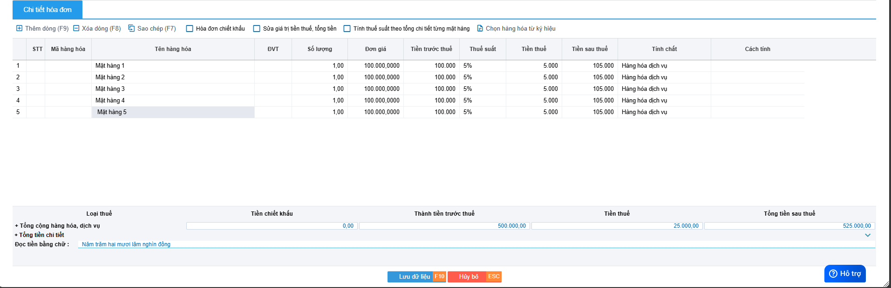

    **Bước 3: KÝ GỬI CƠ QUAN THUẾ VÀ GỬI MAIL CHO KHÁCH HÀNG**

    Quý khách chọn phần **Ký và gửi cơ quan thuế** để ký hóa đơn và gửi hóa đơn lên thuế để được cấp mã

    **Trình tự ký gửi**: Chờ ký > Đã gửi (Màu xanh)

    **Chờ ký**: dạng hóa đơn nháp chưa gửi lên thuế

    **Đã gửi (màu xanh)**: đã gửi lên CQT thànhh công

    **Đã gửi (màu đỏ)**: đã gửi lên CQT và chưa nhận được phản hồi hoặc có lỗi (Anh/Chị bấm vào chữ **Đã gửi** để xem lỗi chi tiết)

    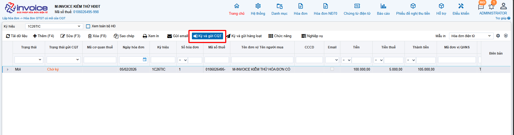

    Để gửi mail cho khách hàng quý khách chọn vào phần **Gửi mail hóa đơn**

    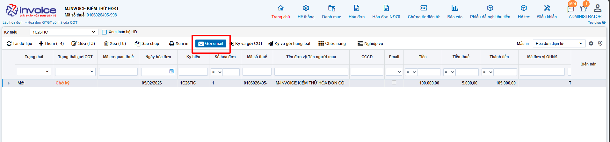

    Để sửa lại hóa đơn (Chỉ có thể sửa được hóa đơn chưa ký gửi) chọn và phần **Chỉnh sửa**, và để **xem in** lại quý khách chọn vào phần Xem in hóa đơn

    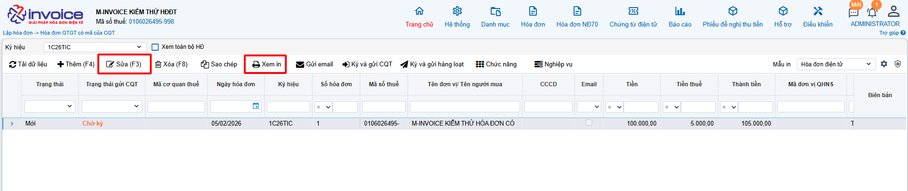

    Như vậy quý khách đã phát hành thành công hóa đơn

=== "Sửa hóa đơn"

    ## **Hướng dẫn sửa hóa đơn Chờ ký**

    ???+ Note "Ghi chú"

        Trong quá trình sử dụng phần mềm hóa đơn điện tử M-invoice, NSD nhiều lúc sẽ tạo sai thông tin của hóa đơn nháp và NSD sẽ muốn sửa lại sao cho đúng với yêu cầu bên phía đối tác. M-invoice xin giới thiệu với khách hàng và người sử dụng tính năng sửa hóa đơn nháp trên phần mềm

    **Bước 1: Tại màn hình danh sách hóa đơn, chọn hóa đơn chờ ký muốn sửa**

    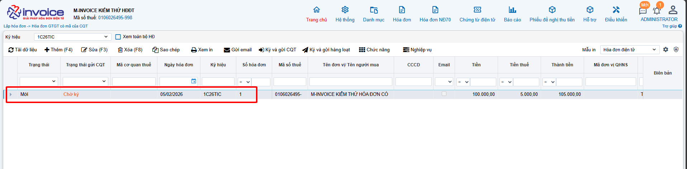

    **Bước 2: Click button "Sửa"**

    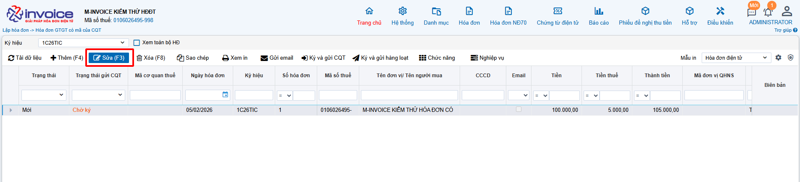

    **Bước 3: Sửa nội dung hóa đơn và click "Lưu" để lưu lại thông tin**

    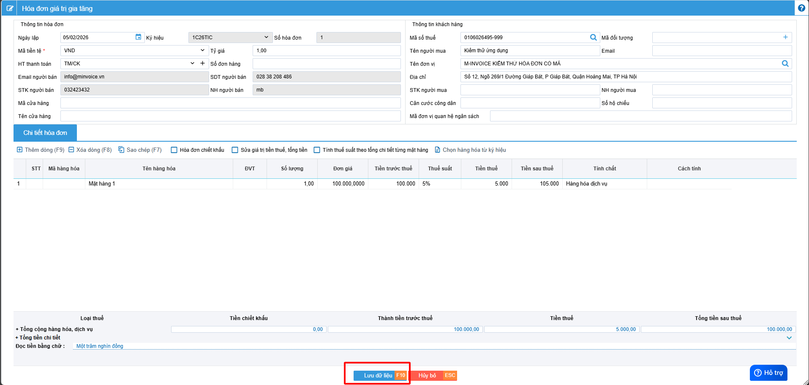

=== "Xoá hóa đơn"

    ## **Hướng dẫn xóa hóa đơn chờ ký**

    ???+ Note "Ghi chú"

        Trong quá trình sử dụng phần mềm hóa đơn điện tử M-invoice, NSD nhiều lúc sẽ tạo nhầm hoặc sai thông tin của hóa đơn nháp và NSD sẽ muốn xóa đi và lập lại tờ hóa đơn mới. M-invoice xin giới thiệu với khách hàng và người sử dụng tính năng xóa hóa đơn nháp trên phần mềm

    ???+ Note "Ghi chú"

        Hóa đơn điện tử M-Invoice cho phép Người sử dụng lập hóa đơn nháp ở trạng thái Chờ ký. Tuy nhiên, Hóa đơn điện tử M-Invoice có 2 hình thức sinh số hóa đơn nên Quý khách hết sức lưu ý khi lựa chọn các hình thức sinh số:

        1. **Hình thức sinh số hóa đơn và ngày hóa đơn ngay sau khi lập hóa đơn (Chưa ký)**. Hình thức này là bản nháp hóa đơn có đầy đủ nội dung. Tuy nhiên, nếu muốn xóa hóa đơn Chờ ký, người sử dụng phải xóa lần lượt từ hóa đơn có số to đến số nhỏ.
        2. **Hình thức sinh số hóa đơn và ngày hóa đơn khi ký (phát hành) hóa đơn**. Hình thức này khi lập hóa đơn có trạng thái hóa đơn là Chờ ký thì chưa có ngày (hoặc có thì là ngày tạo không phải ngày lập hóa đơn) và chưa có số hóa đơn. Số hóa đơn và Ngày hóa đơn được lập xác định khi ký hóa đơn và ngày ký hóa đơn là ngày lập của hóa đơn. Hình thức này cho Phép xóa hóa đơn ở bất kỳ đâu và không cần phải xóa lần lượt.

    **Bước 1: Tại màn hình danh sách hóa đơn, chọn hóa đơn Chờ ký muốn xóa**

    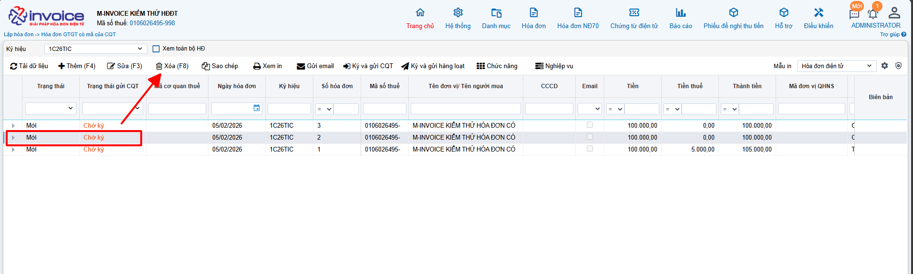

    
Đối với hình thức Sinh số sau, NSD sẽ không xóa được các hóa đơn ở giữa như hình vẽ.

    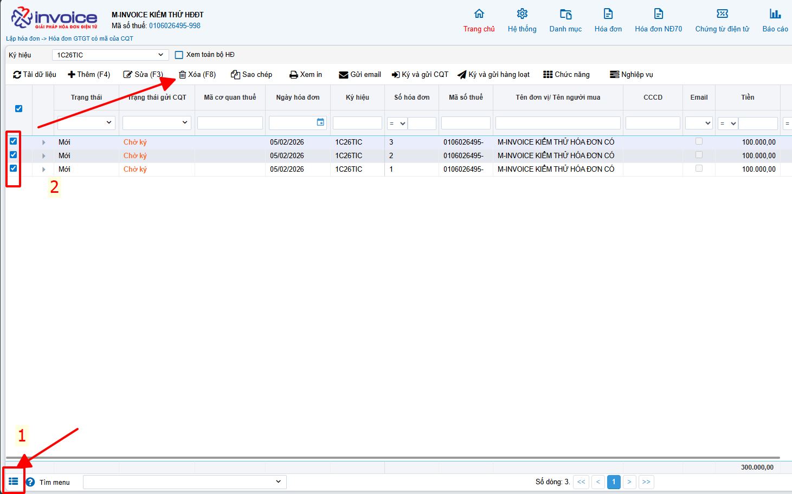

    
Thường hợp muốn xoá nhiều

    **Bước 2: Click button "Xóa (F8)" hoặc nhấn phím chức năng F8.**

    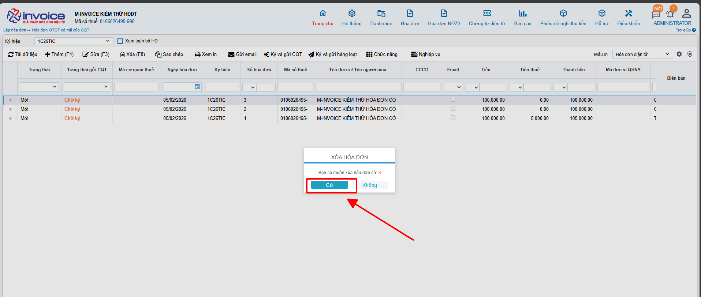

    **Bước 3: Click "Xóa" để xác nhận xóa hóa đơn.**

    Trên đây là hướng dẫn để Người sử dụng có thể xóa hóa đơn đã tạo ra có trạng thái **Chờ Ký**.

=== "Sao chép hóa đơn"

    ## **Hướng dẫn sao chép hóa đơn**

    ???+ Note "Ghi chú"

        Trong quá trình sử dụng hóa đơn điện tử, người dùng có những hóa đơn trùng nhau về mặt hàng hoặc thông tin của khách hàng. Sau đây, M-Invoice cho phép người sử dụng có thể tạo nhanh 1 hóa đơn mới từ 1 hóa đơn cũ có nội dung tương tự bằng chức năng Sao chép (Copy) 1 hóa đơn có sẵn.

    **Bước 1: Chọn hóa đơn muốn dùng làm mẫu**

    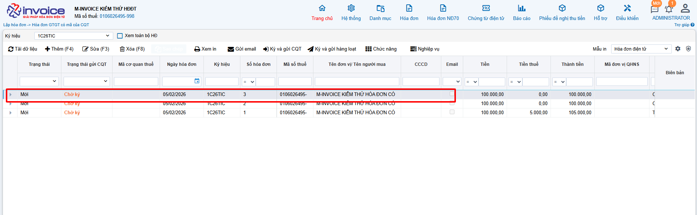

    **Bước 2: Click button "Sao chép"**

    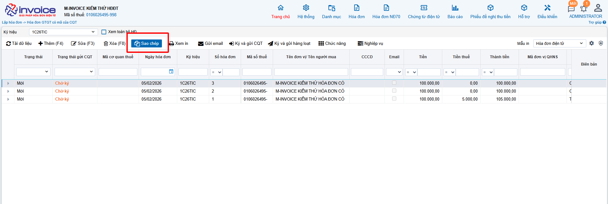

    **Bước 3: Kiểm tra và chỉnh sửa nội dung hóa đơn được tạo ra**

    ???+ Note "Ghi chú"

        Sau khi click vào chức năng Sao chép, chương trình sẽ hiện ra 1 hóa đơn mới ở trạng thái sẵn sàng có thể chỉnh sửa lại tùy ý nội dung mà đã được lấy từ hóa đơn mà Quý khách vừa chọn để sao chép.

        Do hóa đơn mới tạo ra vẫn đăn gở trạng thái là Sửa nên Quý khách hàng hoàn toàn có thể sửa lại nội dung cho phù hợp.

    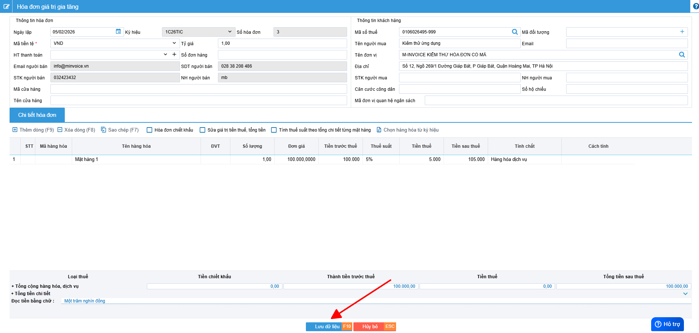

    **Bước 4: Click "Lưu" để xác nhận lưu hóa đơn, "Đóng" để thoát trình tạo mới hóa đơn**

???+ info "Xin chân thành cảm ơn quý khách hàng đã tin dùng sản phẩm của M-Invoice"

    Có bất kỳ vướng mắc nào trong quá trình sử dụng hãy liên hệ với M-Invoice tại mục Hỗ trợ kỹ thuật góc phải bên dưới màn hình hoặc gọi tổng đài kỹ thuật của M-Invoice (1900.955.557 Nhánh 1)

Last updated on <strong>Feb 05, 2025</strong> by <strong>NHATTH</strong>

