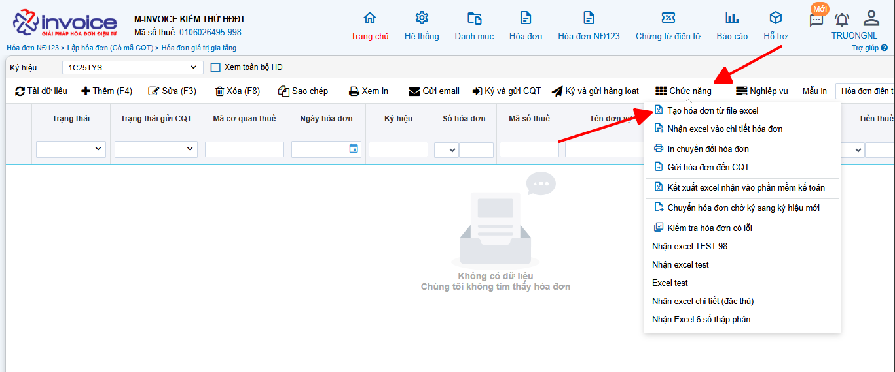
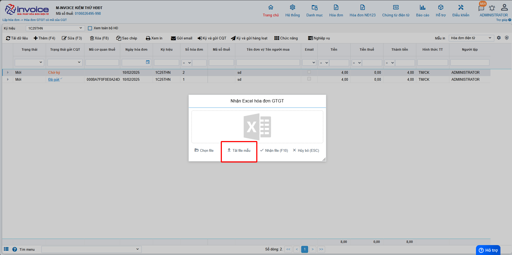
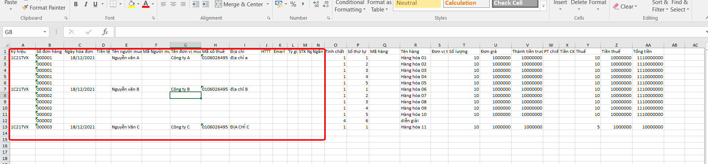
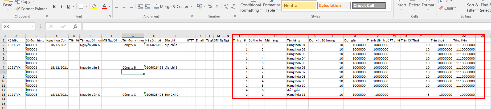
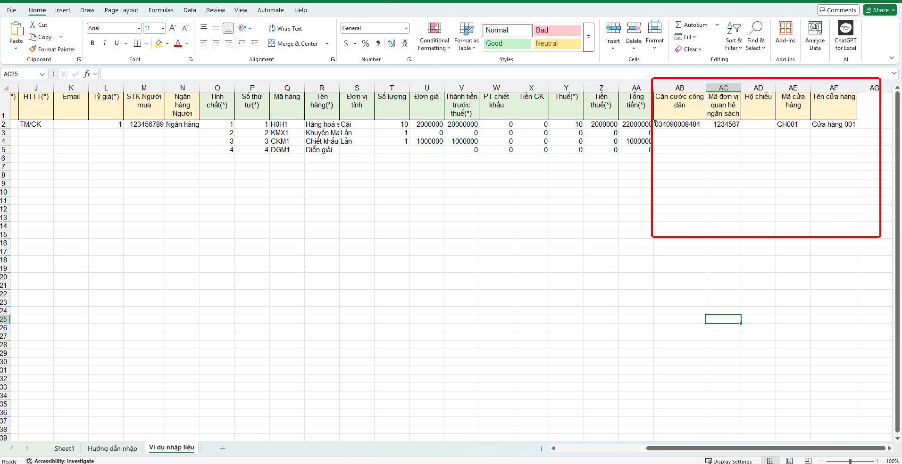

# **HƯỚNG DẪN NHẬN EXCEL HÀNG LOẠT HÓA ĐƠN 78**

<!-- [^1]:
    In 2016, Material for MkDocs started out as a simple theme for MkDocs, but
    over the course of several years, it's now much more than that – with the
    many built-in plugins, settings, and countless customization abilities,
    Material for MkDocs is now one of the simplest and most powerful frameworks
    for creating documentation for your project.

[MkDocs]: https://www.mkdocs.org
[pip]: #with-pip
[docker]: #with-docker -->

### **Bước 1: NSD click vào chức năng chọn Tạo hóa đơn từ file excel**



### **Bước 2: NSD Tải file mẫu excel để nhập thông tin**



### **Bước 3 : NSD Điền đầy đủ thông tin khách hàng tại excel**



!!! warning "Lưu ý"

    - **Ký hiệu:** NSD nhập đúng ký hiệu đang sử dụng và nhập như hình ảnh.
    - **Số đơn hàng:** NSD nhập 00000n.
    Nếu NSD muốn dòng hàng trên Excel vào chung 1 tờ hóa đơn thì NSD nhập chung 1 số đơn hàng tại các dòng đó.
    Nếu NSD muốn nhận nhiều hóa đơn thì NSD nhập số đơn hàng khác nhau tại mỗi dòng.
    - **Ngày hóa đơn:** NSD để đúng định dạng `dd/MM/yyyy`.
    Nếu nhập sai sẽ báo lỗi và không nhận được.

### **Bước 4: Điền đầy đủ thông tin tại chi tiết**



???+ Warning "Lưu ý"

    + Tính chất: NSD bắt buộc phải Nhập tính chất của dòng hàng.

    Với 1 là Hàng hóa dịch vụ, 2 là Khuyến Mại, 3 là Chiết khấu thương mại, 4 là Ghi chú, diễn giải.

    Bắt buộc phải nhập

    + Số thứ tự: NSD nhập số thứ tự tương ứng với dòng hàng để tránh khi nhận bị nhảy dòng không đúng

    + Phần trăm thuế: NSD nhập đúng phần trăm thuế là 5,10,7, -1 tương  với không chịu thuế và -2 tương ứng với không kê khai



???+ Warning "NĐ70"

    Theo nghị định 70 sẽ có thông tin của các trường mới như căn cước công dân, mã đơn vị quan hệ ngân sách, hộ chiếu, mã cửa hàng và tên cửa hàng

    Anh chị có thể điền vào đằng sau của các thông tin khác của hóa đơn như hình ảnh trên

!!! info "Xin chân thành cảm ơn Quý khách hàng đã tin dùng sản phẩm của M-Invoice"

    Có bất kỳ vướng mắc nào trong quá trình sử dụng hãy liên hệ với M-Invoice tại mục Hỗ trợ kỹ thuật góc phải bên dưới màn hình hoặc gọi tổng đài kỹ thuật của M-Invoice (1900.955.557 Nhánh 1)


<!-- === "Latest"

    ``` sh
    pip install mkdocs-material
    ```

=== "9.x"

    ``` sh
    pip install mkdocs-material=="9.*" # (1)!
    ```

    1.  Material for MkDocs uses [semantic versioning][^2], which is why it's a
        good idea to limit upgrades to the current major version.

        This will make sure that you don't accidentally [upgrade to the next
        major version], which may include breaking changes that silently corrupt
        your site. Additionally, you can use `pip freeze` to create a lockfile,
        so builds are reproducible at all times:

        ```
        pip freeze > requirements.txt
        ```

        Now, the lockfile can be used for installation:

        ```
        pip install -r requirements.txt
        ```

[^2]:
    Note that improvements of existing features are sometimes released as
    patch releases, like for example improved rendering of content tabs, as
    they're not considered to be new features.

This will automatically install compatible versions of all dependencies:
[MkDocs], [Markdown], [Pygments] and [Python Markdown Extensions]. Material for
MkDocs always strives to support the latest versions, so there's no need to
install those packages separately.

---

:fontawesome-brands-youtube:{ style="color: #EE0F0F" }
**[How to set up Material for MkDocs]** by @james-willett – :octicons-clock-24:
27m – Learn how to create and host a documentation site using Material for
MkDocs on GitHub Pages in a step-by-step guide.

[How to set up Material for MkDocs]: https://www.youtube.com/watch?v=xlABhbnNrfI

---

!!! tip

    If you don't have prior experience with Python, we recommend reading
    [Using Python's pip to Manage Your Projects' Dependencies], which is a
    really good introduction on the mechanics of Python package management and
    helps you troubleshoot if you run into errors.

[Python package]: https://pypi.org/project/mkdocs-material/
[virtual environment]: https://realpython.com/what-is-pip/#using-pip-in-a-python-virtual-environment
[semantic versioning]: https://semver.org/
[upgrade to the next major version]: upgrade.md
[Markdown]: https://python-markdown.github.io/
[Pygments]: https://pygments.org/
[Python Markdown Extensions]: https://facelessuser.github.io/pymdown-extensions/
[Using Python's pip to Manage Your Projects' Dependencies]: https://realpython.com/what-is-pip/

### **with docker**

The official [Docker image] is a great way to get up and running in a few
minutes, as it comes with all dependencies pre-installed. Open up a terminal
and pull the image with:

=== "Latest"

    ```
    docker pull squidfunk/mkdocs-material
    ```

=== "9.x"

    ```
    docker pull squidfunk/mkdocs-material:9
    ```

The `mkdocs` executable is provided as an entry point and `serve` is the
default command. If you're not familiar with Docker don't worry, we have you
covered in the following sections.

The following plugins are bundled with the Docker image:

- [mkdocs-minify-plugin]
- [mkdocs-redirects]

  [Docker image]: https://hub.docker.com/r/squidfunk/mkdocs-material/
  [mkdocs-minify-plugin]: https://github.com/byrnereese/mkdocs-minify-plugin
  [mkdocs-redirects]: https://github.com/datarobot/mkdocs-redirects

??? question "How to add plugins to the Docker image?"

    Material for MkDocs only bundles selected plugins in order to keep the size
    of the official image small. If the plugin you want to use is not included,
    you can add them easily:

    === "Material for MkDocs"

        Create a `Dockerfile` and extend the official image:

        ``` Dockerfile title="Dockerfile"
        FROM squidfunk/mkdocs-material
        RUN pip install mkdocs-macros-plugin
        RUN pip install mkdocs-glightbox
        ```

    === "Insiders"

        Clone or fork the Insiders repository, and create a file called
        `user-requirements.txt` in the root of the repository. Then, add the
        plugins that should be installed to the file, e.g.:

        ``` txt title="user-requirements.txt"
        mkdocs-macros-plugin
        mkdocs-glightbox
        ```

    Next, build the image with the following command:

    ```
    docker build -t squidfunk/mkdocs-material .
    ```

    The new image will have additional packages installed and can be used
    exactly like the official image.

### **with git**

Material for MkDocs can be directly used from [GitHub] by cloning the
repository into a subfolder of your project root which might be useful if you
want to use the very latest version:

```
git clone https://github.com/squidfunk/mkdocs-material.git
```

Next, install the theme and its dependencies with:

```
pip install -e mkdocs-material
```

[GitHub]: https://github.com/squidfunk/mkdocs-material -->

<div class="last-updated">Last updated on <strong>Jun 5, 2025</strong> by <strong>nhatth</strong></div>
