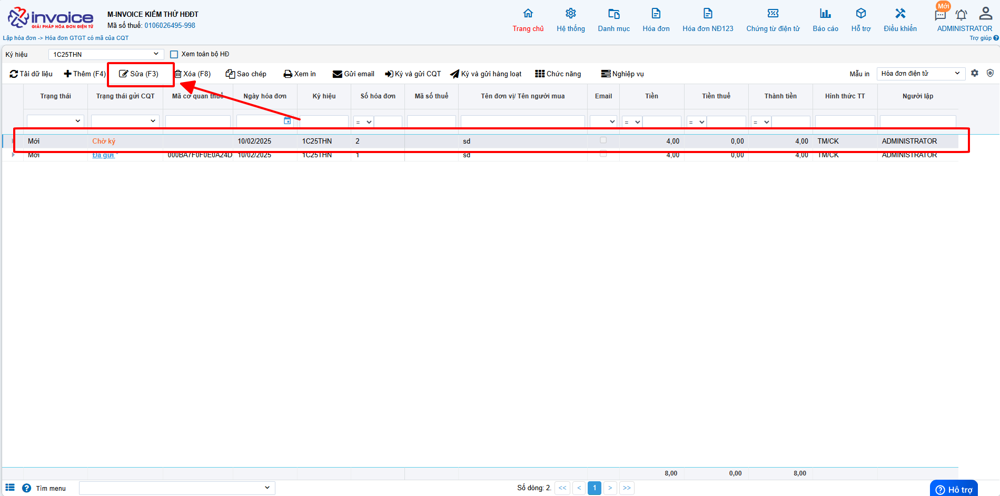
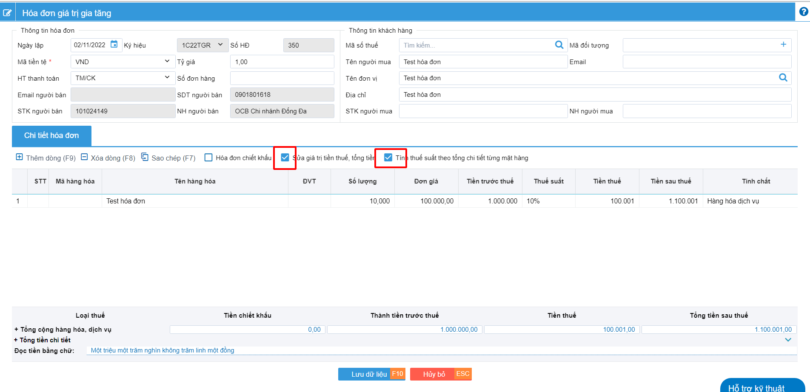
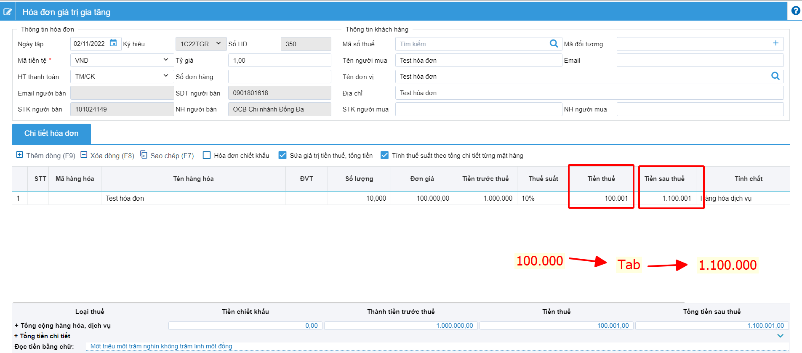
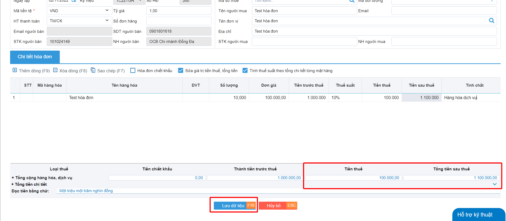

# **Sửa tay tiền thuế và tổng tiền**

## **Hướng dẫn sửa tay tiền thuế và tổng tiền khi bị lẻ**

<!-- ### with pip <small>recommended</small> { #with-pip data-toc-label="with pip" } -->

Chắc hẳn các bạn đã gặp những trường hợp khi lập hóa đơn, khi phần tổng tiền sau thuế và tiền thuế bị lẻ ra 1 đồng. Trong bài viết này tôi sẽ hướng dẫn các bạn sửa tay lại cho chẵn

???+ Warning "Lưu ý"

    Chỉ sửa được những hóa đơn ở trạng thái chờ ký, Những hóa đơn đã ký rồi thì không thế chỉnh sửa được,
    chỉ có thể làm các nghiệp vụ hóa đơn như xóa bỏ, thay thế hoặc điều chỉnh

### **Bước 1: Chọn hóa đơn cần sửa, nhấn vào chi tiết hóa đơn hay nút sửa (F3)**

### **Bước 2: Nhân tích chọn vào 2 ô, "Sửa giá trị tiền thuế, tổng tiền" và "Tính thuế suất theo tổng chi tiết từng mặt hàng"**

### **Bước 3 : Nhập phần tiền thuế bạn mong muốn sau đó ấn phím TAB và nhập phần tổng tiền sau thuế**

### **Bước 4: Kiểm tra xem phần tiền đã đúng hay chưa sau đó nhấn lưu**

!!! info "Xin chân thành cảm ơn Quý khách hàng đã tin dùng sản phẩm của M-Invoice"

    Có bất kỳ vướng mắc nào trong quá trình sử dụng hãy liên hệ với M-Invoice tại mục Hỗ trợ kỹ thuật góc phải bên dưới màn hình hoặc gọi tổng đài kỹ thuật của M-Invoice (1900.955.557 Nhánh 1)

Last updated on <strong>Jun 5, 2025</strong> by <strong>nhatth</strong>

