# **Xuất Hóa đơn chiết khấu thương mại theo Nghị định 70/2025/NĐ-CP**

???+ Note "Căn cứ"

    **Căn cứ Khoản 13, Điều 1, Nghị định 70/2025/NĐ-CP:** Trường hợp việc chiết khấu thương mại căn cứ vào số lượng, doanh số hàng hoá, dịch vụ thì được lập hóa đơn điều chỉnh kèm theo bảng kê các số hóa đơn cần điều chỉnh, số tiền, thuế điều chỉnh. Bảng kê được lưu tại đơn vị và xuất trình khi cơ quan thuế hoặc cơ quan nhà nước có thẩm quyền yêu cầu. Căn cứ vào hóa đơn điều chỉnh, bên bán và bên mua kê khai điều chỉnh doanh thu mua, bán, thuế đầu ra, đầu vào tại kỳ lập hóa đơn điều chỉnh.

    ???+ Tip "Thao tác tạo hóa đơn chiết khấu thương mại gồm 2 bước sau:"

        Bước 1: Lập bảng kê chứa danh sách hóa đơn thỏa mãn chương trình Chiết khấu

        Bước 2: Tạo hóa đơn Điều chỉnh gắn với Số bảng kê, Ngày bảng kê đã lập

        (Tính chất dòng hàng là Hàng hóa dịch vụ, Tổng tiền là số dương)

## **Hướng dẫn xuất Hóa đơn chiết khấu thương mại theo Nghị định 70/2025/NĐ-CP**

**Hướng dẫn video**

<iframe style="width: 50rem; height: 480px" src="https://www.youtube.com/embed/a3IRXG5nffg?si=puwYedFRF3ke24J5" title="YouTube video player" frameborder="0" allow="accelerometer; autoplay; clipboard-write; encrypted-media; gyroscope; picture-in-picture; web-share" referrerpolicy="strict-origin-when-cross-origin" allowfullscreen></iframe>

**Hướng dẫn ảnh trực tiếp trên phần mềm**

### **Bước 1: Truy cập vào danh sách hóa đơn -> Thêm HĐ chiết khấu**

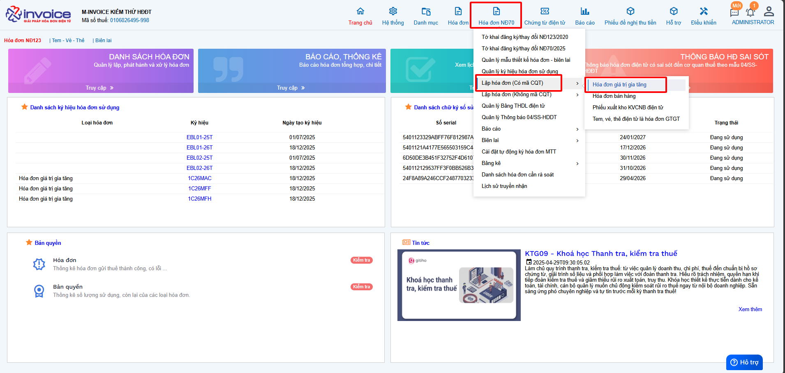

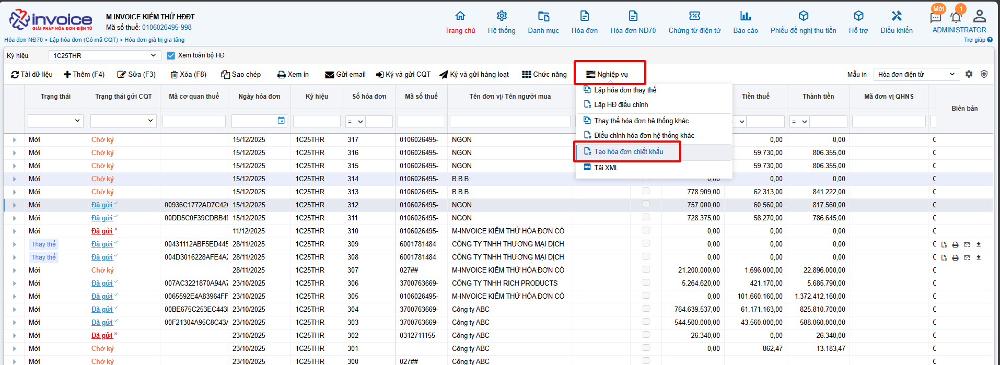

**Tại đây phần mềm sẽ hướng dẫn cách để xuất hóa đơn CK theo chuẩn khoản 13, Điều 1, Nghị định 70/2025/NĐ-CP**

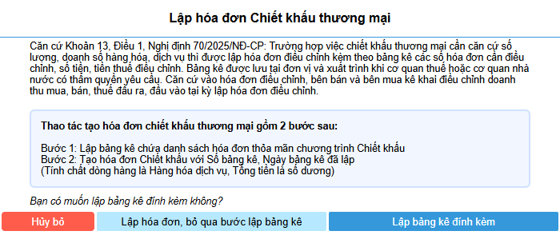

1. Anh chị bấm chọn **Lập bảng kê đính kèm**

2. Trường hợp Anh/Chị lập đã lập bảng kê trước đó hoặc anh chị đính kèm bảng kê bên ngoài --> Anh chị chọn **Lập hóa đơn, bỏ qua bước lập bảng kê**

### **Bước 2: Chọn Lập bảng kê đính kèm**

Bấm **Thêm hóa đơn**

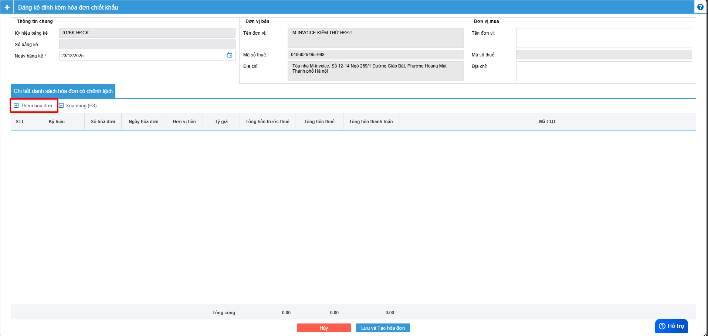

Chọn hóa đơn **từ ngày** **đến ngày**, **điền MST của đơn vị** mà bán hàng ra

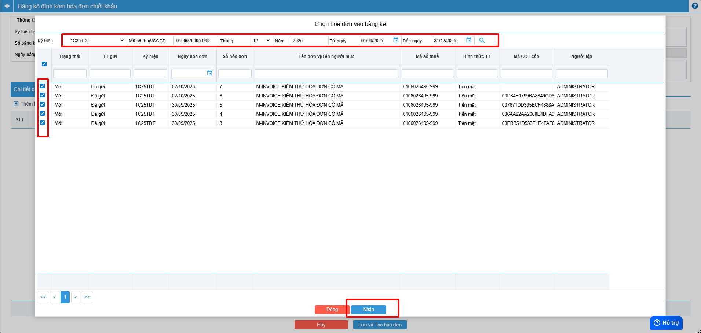

Nhấn **Lưu và tạo hóa đơn**

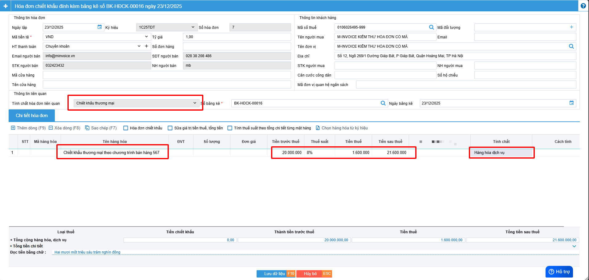

1. Anh/Chị điền tên chiết khấu thương mại vào tên hàng

2. Điền số điền chiêt khấu (ví dụ ở ảnh trên là 21.600.000)

3. Tính chất là **Hàng hóa dịch vụ**, số tiền phải dương theo NĐ70

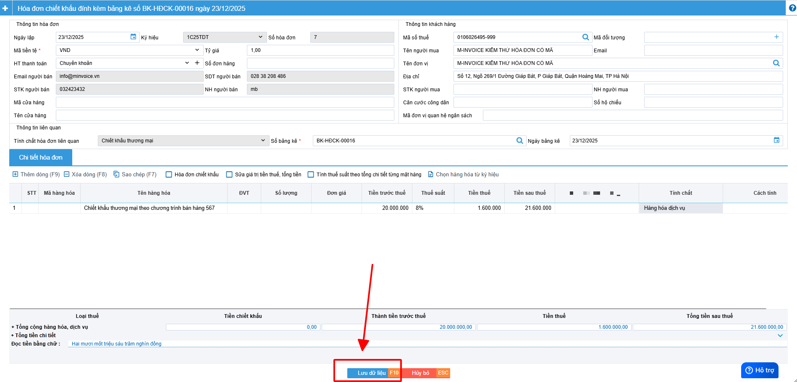

Anh/Chị kiểm tra lại thông tin và bấm **lưu (nháp)** hoặc **lưu và ký (gửi CQT)**

**Sau khi lưu ở ngoài màn hình danh sách sẽ có chữ chiết khấu ở hóa đơn vừa tạo**

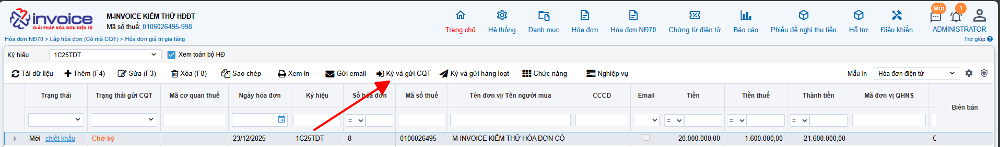

--> Sau khi kiểm tra xong anh chị có thể ký gửi lên CQT

### **Bước 3: Kiểm tra bảng kê chiết khấu đã lập**

Truy cập phân hệ **Hóa đơn NĐ70** -> **Bảng kê** -> **BK hóa đơn chiết khấu thương mại**

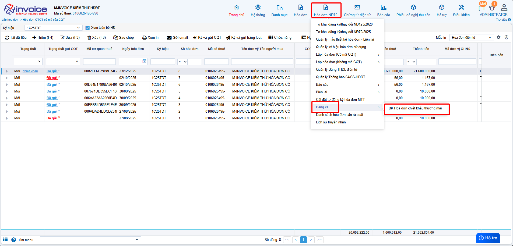

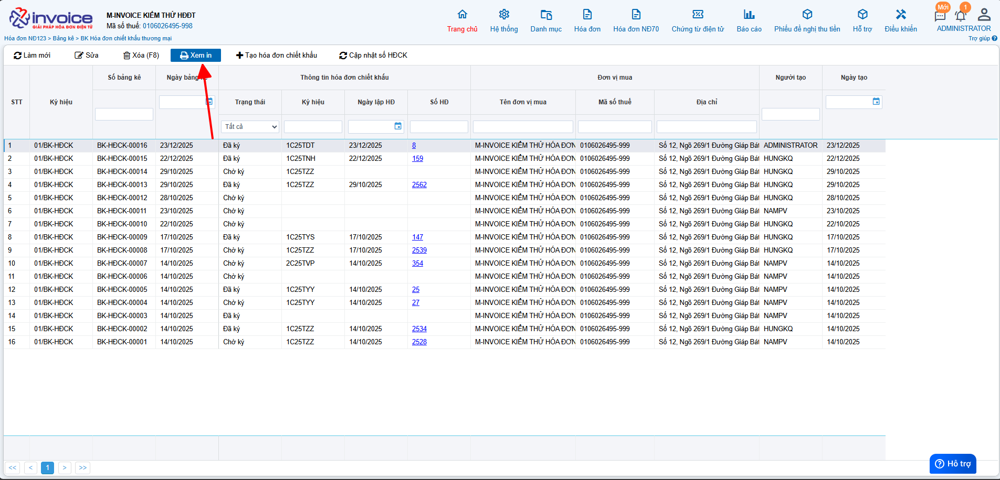

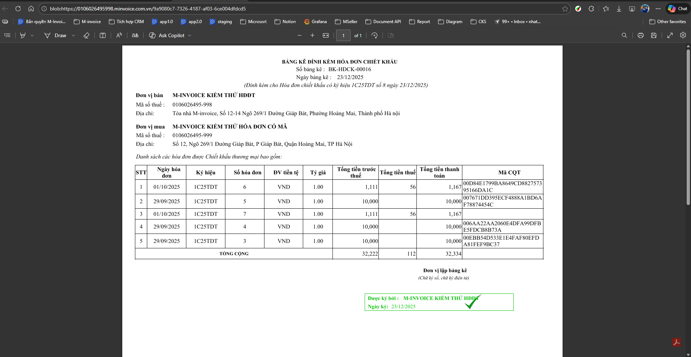

Anh chị chon **xem in** để in và lưu trữ để phục vụ cho công tác kiểm tra sau này

???+ info "Xin chân thành cảm ơn quý khách hàng đã tin dùng sản phẩm của M-Invoice"

    Có bất kỳ vướng mắc nào trong quá trình sử dụng hãy liên hệ với M-Invoice tại mục Hỗ trợ kỹ thuật góc phải bên dưới màn hình hoặc gọi tổng đài kỹ thuật của M-Invoice (1900.955.557 Nhánh 1)

Last updated on <strong>Dec 22, 2025</strong> by <strong>NHATTH</strong>

