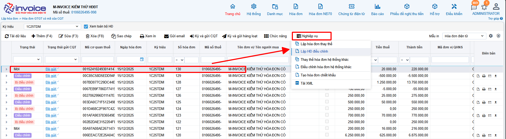
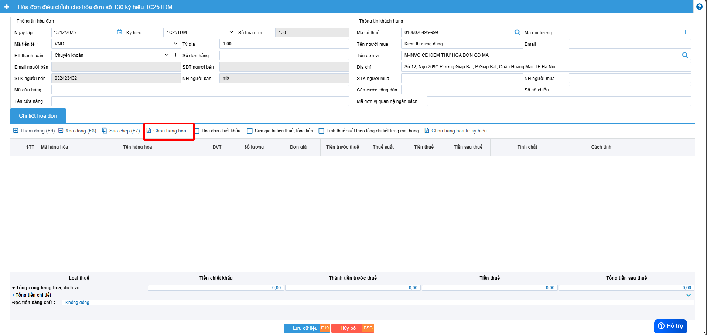
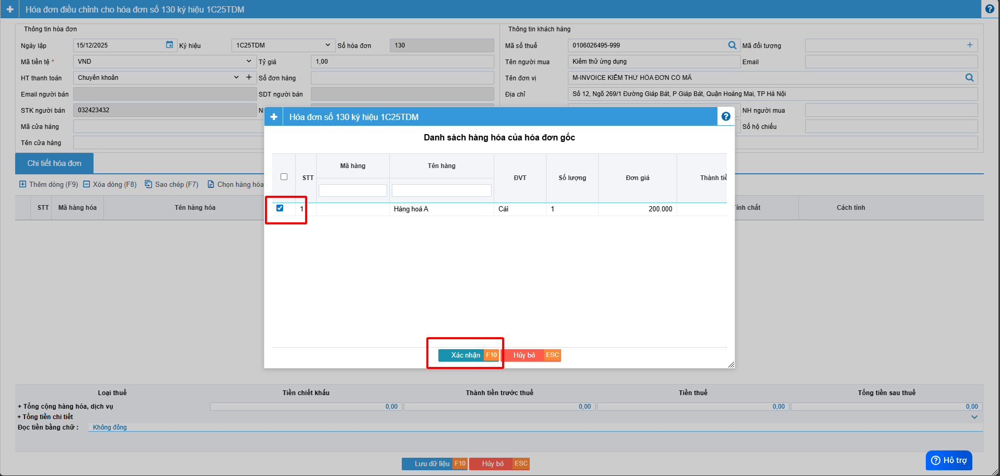
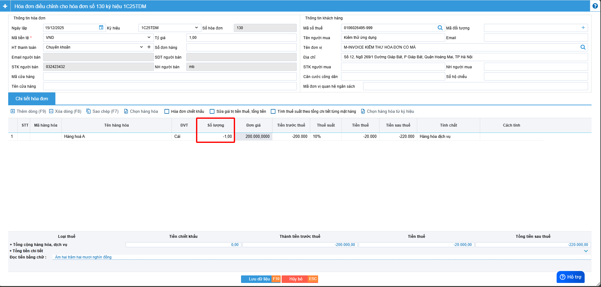
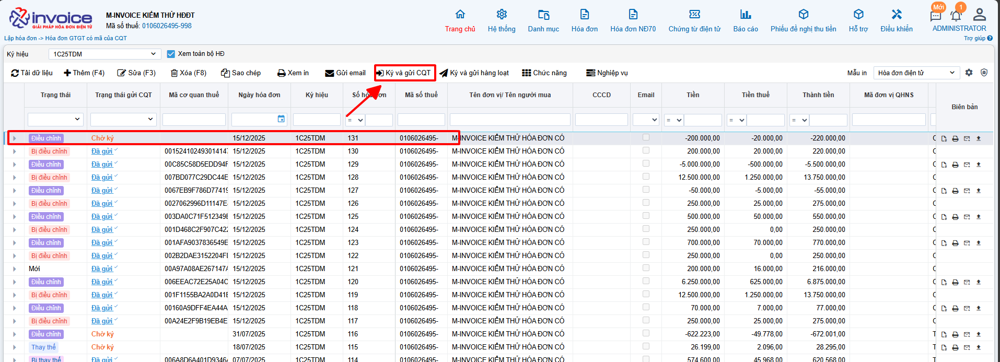
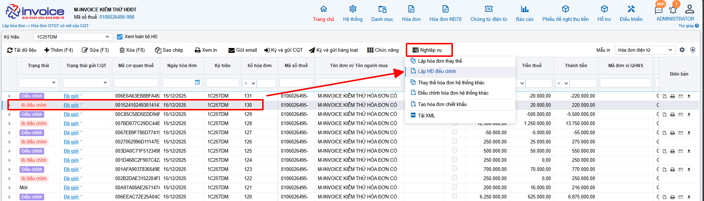
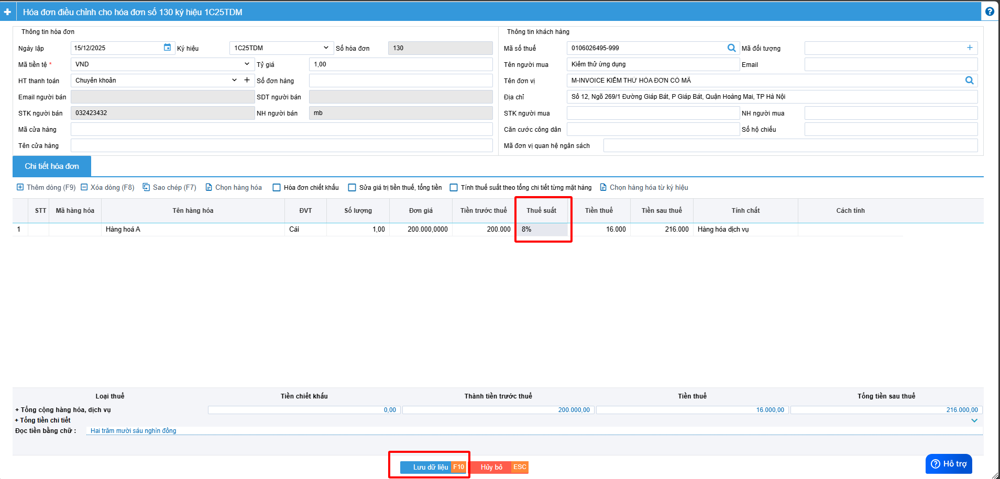

---
hide:
  - toc
tags:
  - invoice1
---

# **Cách viết thông tin trên hóa đơn điều chỉnh giảm thuế suất**

???+ Warning "Lưu ý"

    Cách ghi thông tin dưới đây không có trong quy định của CQT, đơn vị tham khảo ý kiến CQT trước khi thực hiện.

**Bước 1: Chọn hóa đơn cần điều chỉnh --> Nghiệp vụ --> Điều chỉnh**

**Anh chị có thể chọn lại hàng hóa cũ đỡ mất công nhập lại**

**Bước 2: Ghi âm hoàn toàn dòng sai thuế suất**

**Anh chị bấm lưu hóa đơn và ký hóa đơn này**

**Bước 3: Làm 1 hóa đơn điều chỉnh tiếp và điền đúng giá trị và thuế suất đúng**

**Anh chị bấm lưu hóa đơn và ký hóa đơn này và gửi cho khách hàng**

==> <strong style="color: red;">Như vậy để giảm thuế suất thì cần làm 2 lần, 1 lần đầu tiền để âm giá trị về 0, lần 2 điền lại gái trị và thuế suất đúng (như 1 hóa đơn mới)</strong>

???+ Note "Bắt buộc"

    Theo Nghị định 70/2025/NĐ-CP, việc lập Biên bản là bắt buộc trong các trường hợp làm nghiệp vụ điêu chỉnh/thay thế.

    Anh/Chị lập biên bản sau khi điều chỉnh theo hướng dẫn lập biên bản [tại đây.](../lap-bien-ban-hoa-don#attribute-lists){ data-preview }

Xem thêm các trường hợp khác [tại đây.](../dieu-chinh#attribute-lists){ data-preview }

???+ info "Xin chân thành cảm ơn quý khách hàng đã tin dùng sản phẩm của M-Invoice"

    Có bất kỳ vướng mắc nào trong quá trình sử dụng hãy liên hệ với M-Invoice tại mục Hỗ trợ kỹ thuật góc phải bên dưới màn hình hoặc gọi tổng đài kỹ thuật của M-Invoice (1900.955.557 Nhánh 1)

Last updated on <strong>Dec 15, 2025</strong> by <strong>nhatth</strong>

