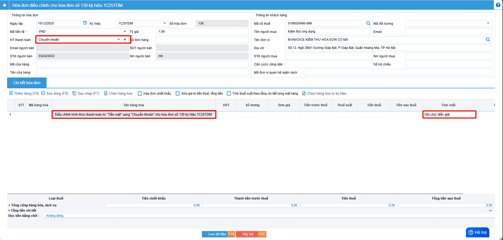
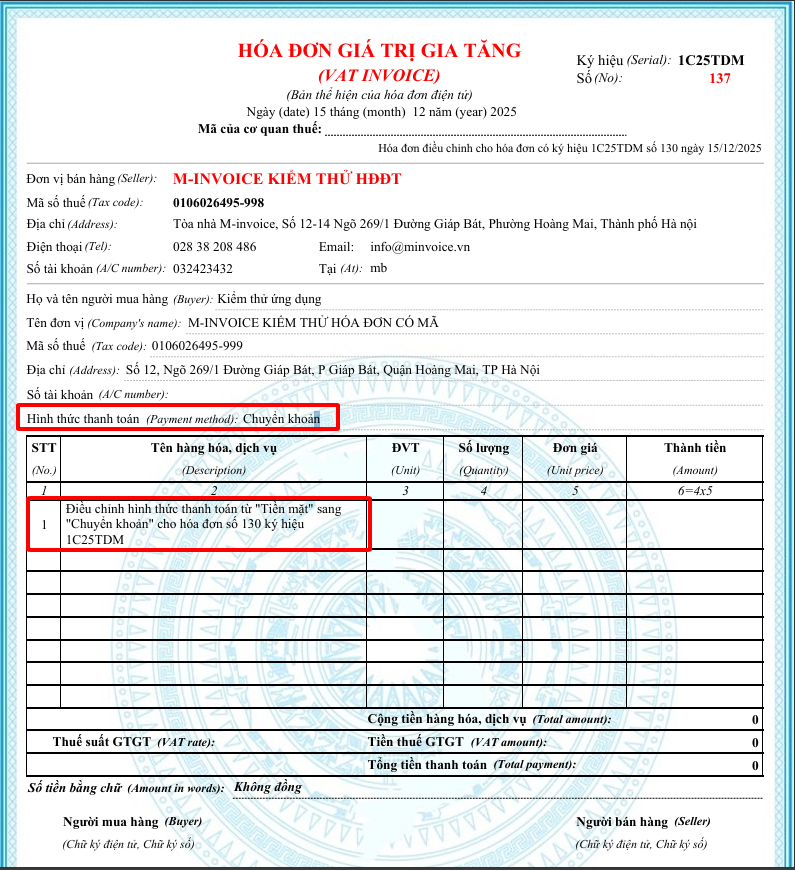

---
hide:
  - toc
---

# **Cách viết thông tin trên hóa đơn điều chỉnh hình thức thanh toán**

???+ Warning "Lưu ý"

    Cách ghi thông tin dưới đây không có trong quy định của CQT, đơn vị tham khảo ý kiến CQT trước khi thực hiện.

Xem video hướng dẫn (đang cập nhật):

- Hóa đơn gốc ghi sai hình thức thanh toán. Hình thức thanh toán ghi sai là "Tiền mặt", HTTT đúng: "Chuyển khoản".

=> Lập hóa đơn điều chỉnh hình thức thanh toán:

- Chọn hóa đơn cần **điều chỉnh** -> **Nghiệp vụ** -> **Lập HĐ điều chỉnh**
  

- Chọn đúng HTTT đúng là **Chuyển khoản**
- Chọn **Tính chất** là **Ghi chú/diễn giải.**
- Sau đó nhập nội dung điều chỉnh vào tên hàng hóa.

Hóa đơn điều chinh hình thức thanh toán hiển thị thông tin điều chỉnh tương ứng.

???+ Note "Bắt buộc"

    Theo Nghị định 70/2025/NĐ-CP, việc lập Biên bản là bắt buộc trong các trường hợp làm nghiệp vụ điêu chỉnh/thay thế.

    Anh/Chị lập biên bản sau khi điều chỉnh theo hướng dẫn lập biên bản [tại đây.](../lap-bien-ban-hoa-don#attribute-lists){ data-preview }

Xem thêm các trường hợp khác [tại đây.](../dieu-chinh#attribute-lists){ data-preview }

???+ info "Xin chân thành cảm ơn quý khách hàng đã tin dùng sản phẩm của M-Invoice"

    Có bất kỳ vướng mắc nào trong quá trình sử dụng hãy liên hệ với M-Invoice tại mục Hỗ trợ kỹ thuật góc phải bên dưới màn hình hoặc gọi tổng đài kỹ thuật của M-Invoice (1900.955.557 Nhánh 1)

Last updated on <strong>Dec 15, 2025</strong> by <strong>nhatth</strong>

