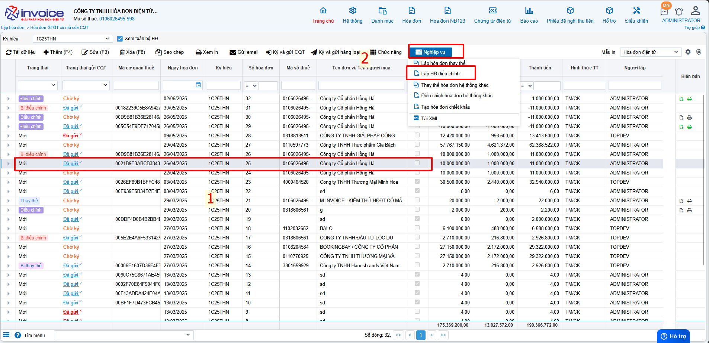
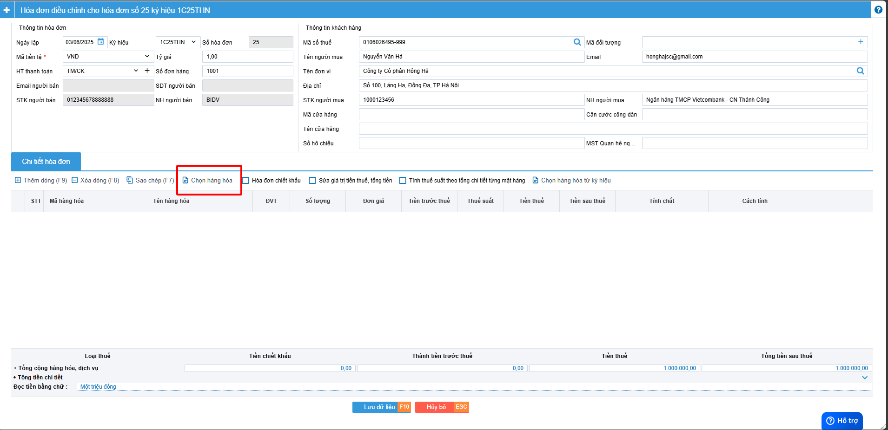
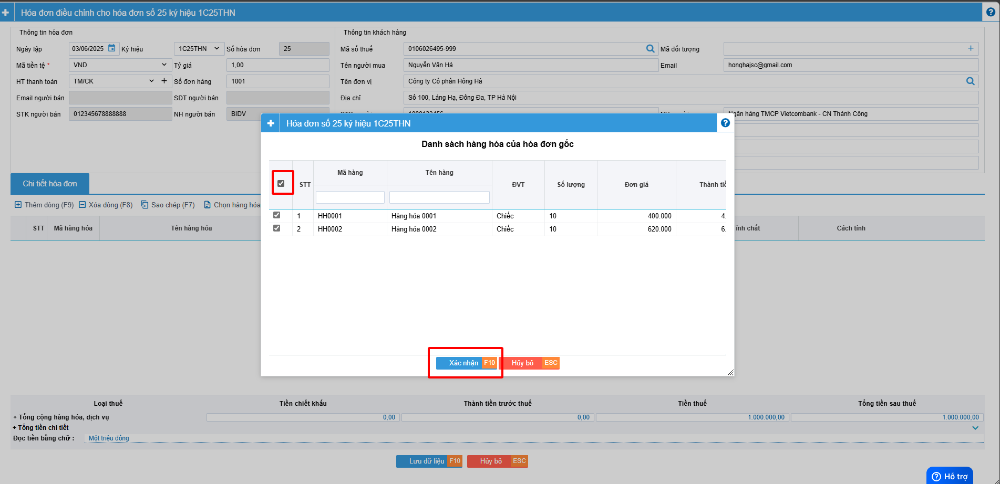
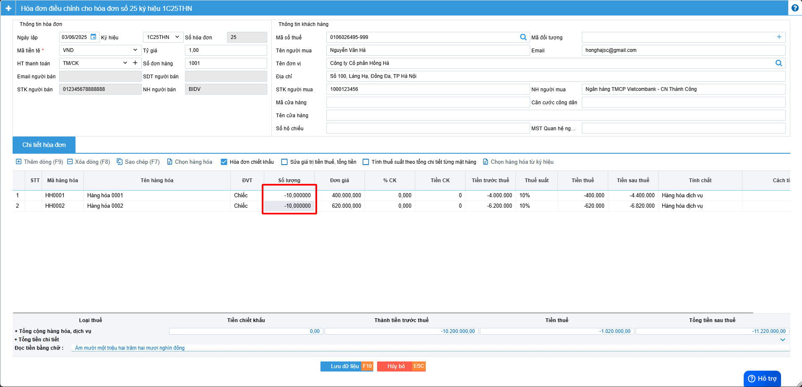
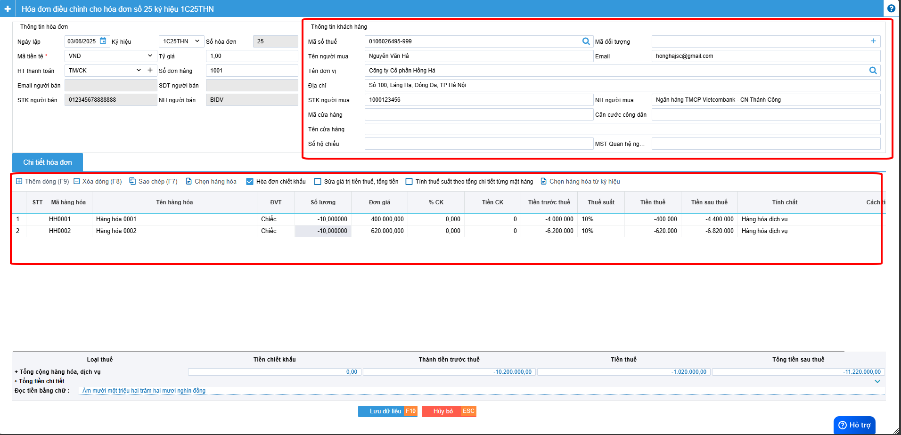
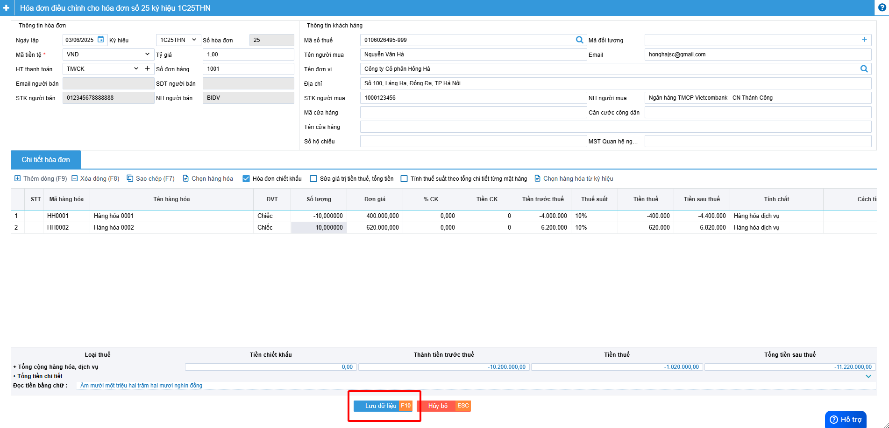

# **Điều chỉnh hoá đơn về 0**

???+ Note "Ghi chú"

    📘 **CĂN CỨ TẠI NGHỊ ĐỊNH 70/2025/NĐ-CP**, SỬA ĐỔI **NGHỊ ĐỊNH 123/2020/NĐ-CP**, QUY ĐỊNH VỀ VIỆC LẬP **HÓA ĐƠN, CHỨNG TỪ** NHƯ SAU:

    ---

    🧾 **Khi người bán phát hiện hóa đơn điện tử đã lập sai** *(bao gồm:)*

    – Hóa đơn điện tử **đã được cấp mã của cơ quan thuế**;

    – Hóa đơn điện tử **không có mã nhưng đã gửi dữ liệu đến cơ quan thuế**;

    → Thì xử lý theo các trường hợp:

    ---

    1. Sai sót nhỏ – **Không làm thay đổi nội dung nghĩa vụ thuế:**

    ✅ **Sai tên người mua**
    → Không cần lập lại hóa đơn.
    → Gửi **Mẫu 04/SS-HĐĐT** cho **Cơ quan thuế** và **thông báo cho bên mua**.

    ✅ **Sai địa chỉ người mua**
    → Không cần lập lại hóa đơn.
    → Gửi **Mẫu 04/SS-HĐĐT** cho **Cơ quan thuế** và **thông báo cho bên mua**.

    ✅ **Sai cả tên và địa chỉ nhưng đúng mã số thuế**
    → Không cần lập lại hóa đơn.
    → Gửi **Mẫu 04/SS-HĐĐT** cho **Cơ quan thuế** và **thông báo cho bên mua**.

    🖱️ **Click vào đây để xem hướng dẫn lập thông báo 04/SS:**
    📄 [Thông báo 04/SS](lap-04ss.md#attribute-lists){ data-preview }

    ---

    ⚠️ 2. Sai sót lớn – **Làm thay đổi nghĩa vụ thuế hoặc thông tin trọng yếu:**

    ❌ **Sai mã số thuế người mua**
    → Phải lập **hóa đơn thay thế**, kèm **biên bản thỏa thuận giữa hai bên**.

    ❌ **Sai thuế suất, số tiền, tiền thuế, đơn giá, thành tiền**
    → Phải lập **hóa đơn điều chỉnh** hoặc **hóa đơn thay thế**, kèm **biên bản thỏa thuận**.

    ❌ **Sai mặt hàng, quy cách, số lượng, đơn vị tính**
    → Phải lập **hóa đơn điều chỉnh** hoặc **hóa đơn thay thế**, kèm **biên bản thỏa thuận**.

    ❌ **Sai mã hàng hóa, mã vạch, thông tin kỹ thuật**
    → Phải lập **hóa đơn điều chỉnh** hoặc **hóa đơn thay thế**, kèm **biên bản thỏa thuận**.

    🖱️ **Click vào đây để xem hướng dẫn điều chỉnh:**
    📄 [Điều chỉnh hóa đơn](dieu-chinh.md#attribute-lists){ data-preview }

    🖱️ **Click vào đây để xem hướng dẫn thay thế:**
    📄 [Thay thế hóa đơn](thay-the.md#attribute-lists){ data-preview }

    ---

    🛑 **GHI NHỚ TỪ 01/06/2025**:

    🚫 **Bỏ nghiệp vụ "Hủy hóa đơn".**

    📌 **Trường hợp hóa đơn đã phát hành nhưng giao dịch bị hủy bỏ, hay bị sai thông tin cần hủy bỏ để lập hóa đơn mới**

    - 📝 **Anh chị làm điều chỉnh giảm về 0 (tương đương hủy) theo hướng dẫn dưới đây ⬇️**

    ---

## **Hướng dẫn điều chỉnh hoá đơn về không giá trị**

???+ Note "Ghi chú"

    Trong quá trình phát hành hóa đơn không tránh khỏi những sai sót sau đây:

    1. Giao dịch bị huỷ hoặc không phát sinh
    2. Xuất hóa đơn nhầm khách hàng
    3. Hóa đơn lập sai toàn bộ thông tin
    4. Bên mua từ chối nhận hóa đơn
    5. Xuất hóa đơn nhiều lần cho cùng một giao dịch
    6. Đơn hàng bị trả lại toàn bộ

???+ Warning "Lưu ý"

    Nếu đã lựa chọn nghiệp vụ điều chỉnh thì không được thay thế hoá đơn

**Thao tác cài đặt và thực hiện như sau**

### **Bước 1: Chọn hóa đơn cần điều chỉnh -> Nghiệp vụ --> Điều chỉnh**

### **Bước 2 : Bấm chọn hàng hóa để chọn lại hàng hóa của hóa đơn bị điều chỉnh**

### **Bước 3 : Điền âm số lượng hóa đơn**

### **Bước 4 : Kiểm tra các thông tin của hóa đơn -> LƯU**

Kiểm tra các thông tin hóa đơn nếu đúng thì bấm lưu

### **Bước 4 : Kiểm tra các thông tin của hóa đơn -> LƯU**

## Hướng dẫn lập biên bản sau khi điều chỉnh giảm hóa đơn về 0

???+ Note "Căn cứ"

    Theo Nghị định 70/2025/NĐ-CP, việc lập Biên bản là bắt buộc trong các trường hợp làm nghiệp vụ điêu chỉnh/thay thế.

    Người sử dụng có thể sử dụng thao tác này để lập biên bản khi làm nghiệp vụ thay thế hay điều chỉnh hóa đơn

!!! warning "Lưu ý"

    Chỉ lập được khi hóa đơn ở trạng thái thay thế hoặc điều chỉnh

### **Bước 1: Chọn hóa đơn vừa được làm thay thế hoặc điều chỉnh**

### **Bước 2: Kiểm tra thông tin người bán, người mua, điền lý do thay thế hoặc lý do điều chỉnh**

### **Bước 3 : Lưu hoặc ký biên bản thay thế, điều chỉnh**

Bâm lưu hoặc lưu và ký

???+ Danger "Lưu ý"

    Để ký được biên bản máy tính phải được cài đặt plugin ký số, nếu đã cài đặt thì bỏ qua bước này

    🖱️ **Click vào đây để cài đặt:**
    📄 [Hướng dẫn tải plugin](../huong-dan/cai-dat-plugin.md#attribute-lists){ data-preview }

**Anh chị chọn chữ ký số đúng và chọn OK**

**Biên bản sau khi được ký thành công**

### **Bước 4 : Xem và in biên bản**

Bấm nút in ở trình duyệt hoặc bấm ctrl + P để in hoặc chọn SAVE để tải về gửi cho khách hàng hoặc lưu trữ

### **Bước 5 : Sau khi gửi cho khách hàng ký anh chị có thể up mẫu biên bản 2 bên đã ký lên phần mềm**

**Chọn hình ảnh theo hướng dẫn trên --> chọn file cần up load --> Bấm nhận**

**Như vậy anh chị đã upload lên thành công**

???+ info "Xin chân thành cảm ơn quý khách hàng đã tin dùng sản phẩm của M-Invoice"

    Có bất kỳ vướng mắc nào trong quá trình sử dụng hãy liên hệ với M-Invoice tại mục Hỗ trợ kỹ thuật góc phải bên dưới màn hình hoặc gọi tổng đài kỹ thuật của M-Invoice (1900.955.557 Nhánh 1)

Last updated on <strong>Jun 17, 2025</strong> by <strong>nhatth</strong>

