# **Điều chỉnh / Thay thế hóa đơn ở năm cũ VD: hóa đơn bị sai ở năm 2025**

???+ Note "Ghi chú"

    Khi sang năm mới (VD: 2026) anh chị muốn điều chỉnh hoặc thay thế hóa đơn ở ký hiệu năm cũ (VD: 2025)

    Hướng dẫn này sẽ hướng dẫn Anh/Chị điều chỉnh / thay thế hóa đơn ở năm cũ được xuất trên M-invoice.

    Trường hợp hóa đơn cũ của anh chị được xuất bên nhà cung cấp khác vui lòng làm theo hướng dẫn sau  [Hướng dẫn](dieu-chinh-va-thay-the-tren-he-thong-khac.md#attribute-lists){ data-preview }

???+ Tip "Điều kiện"

    Đã tạo ký hiệu năm mới (năm 2026)

    Trường hợp anh chị chưa tạo có thể làm theo hướng dẫn sau [Hướng dẫn tạo ký hiệu theo năm tài chính](../huong-dan/cap-nhat-ky-hieu.md#attribute-lists){ data-preview }

### **Bước 1: Truy cập vào hóa đơn NĐ70 -> chọn và loại hóa đơn mà Anh/Chị đang sử dụng -> Chọn ký hiệu 2025**

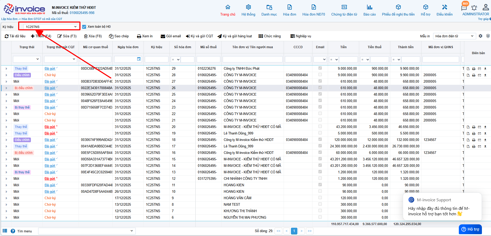

### **Bước 2: Tìm đến hóa đơn sai sót -> Chọn nghiệp vụ -> Chọn Điều chỉnh hoặc Thay thế theo nhu cầu của Doanh nghiệp**

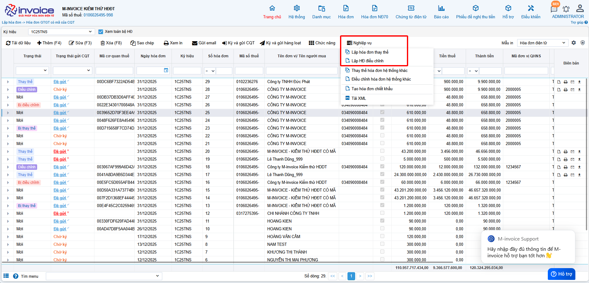

Lưu ý: Ở chỗ ký hiệu chọn sang ký hiệu mới 2026   Bước quan trọng bắt buộc phải làm - nếu không sẽ báo lỗi sau "Có lỗi xảy ra Mẫu số ký hiệu không hơp lệ với năm tài chính"

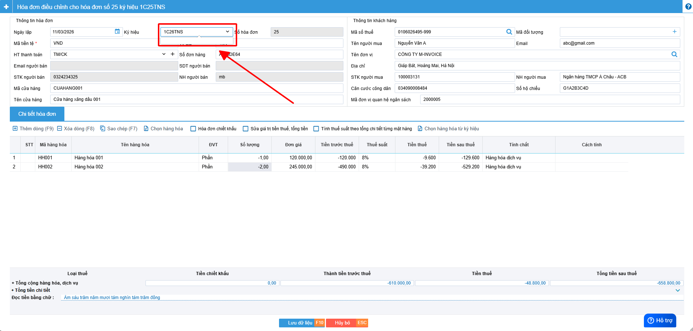

### **Bước 3: Sau đó Anh/Chị làm hóa đơn Điều chỉnh hoặc Thay thế cho đúng**

Xem thêm các hướng dẫn điều chỉnh [Các trường hợp điều chỉnh hóa đơn](../xu-ly-sai-sot/dieu-chinh.md#attribute-lists){ data-preview }

Xem thêm hướng dẫn thay thế [Hướng dẫn thay thế](../xu-ly-sai-sot/thay-the.md#attribute-lists){ data-preview }

## Hướng dẫn lập biên bản hoá đơn điều chỉnh / thay thế

???+ Note "Căn cứ"

    Theo Nghị định 70/2025/NĐ-CP, việc lập Biên bản là bắt buộc trong các trường hợp làm nghiệp vụ điêu chỉnh/thay thế.

    Người sử dụng có thể sử dụng thao tác này để lập biên bản khi làm nghiệp vụ thay thế hay điều chỉnh hóa đơn

!!! warning "Lưu ý"

    Chỉ lập được khi hóa đơn ở trạng thái thay thế hoặc điều chỉnh

### **Bước 1: Chọn hóa đơn vừa được làm thay thế hoặc điều chỉnh**

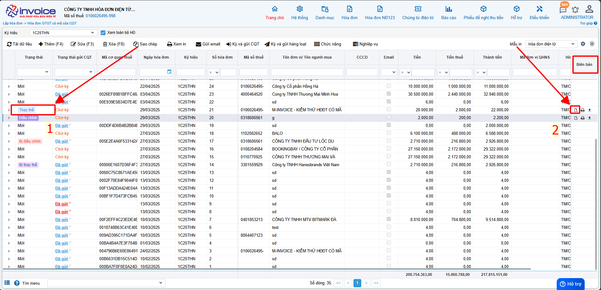

### **Bước 2: Kiểm tra thông tin người bán, người mua, điền lý do thay thế hoặc lý do điều chỉnh**

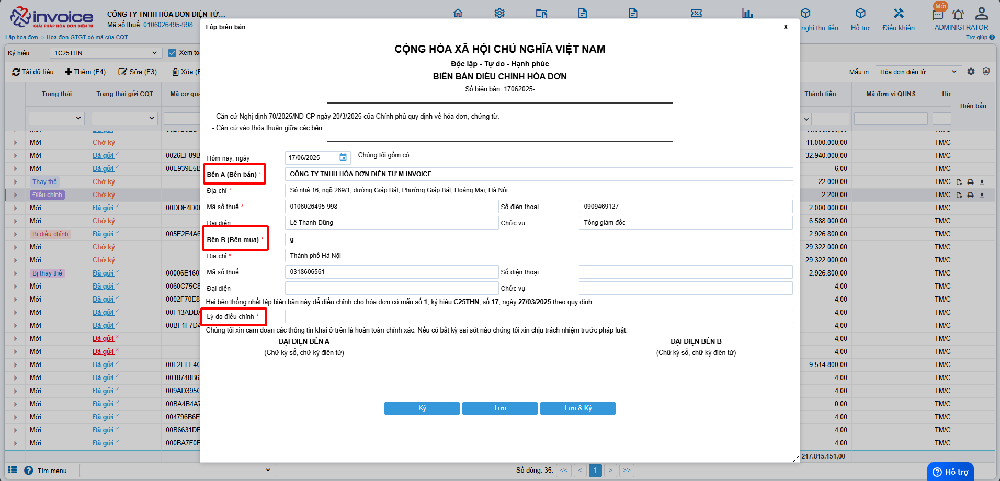

### **Bước 3 : Lưu hoặc ký biên bản thay thế, điều chỉnh**

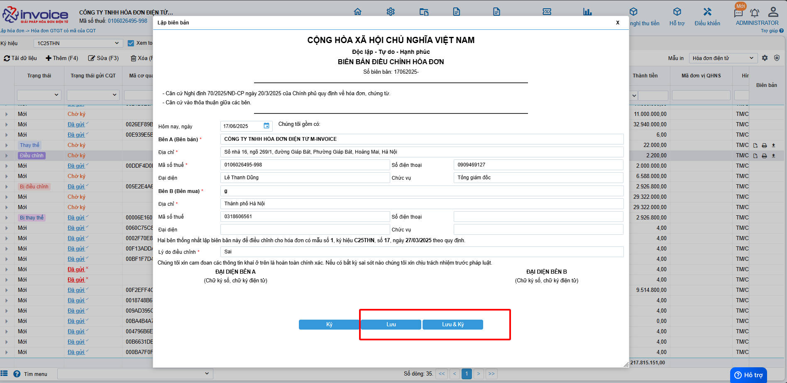

Bâm lưu hoặc lưu và ký

???+ Danger "Lưu ý"

    Để ký được biên bản máy tính phải được cài đặt plugin ký số, nếu đã cài đặt thì bỏ qua bước này

    🖱️ **Click vào đây để cài đặt:**
    📄 [Hướng dẫn tải plugin](../huong-dan/cai-dat-plugin.md#attribute-lists){ data-preview }

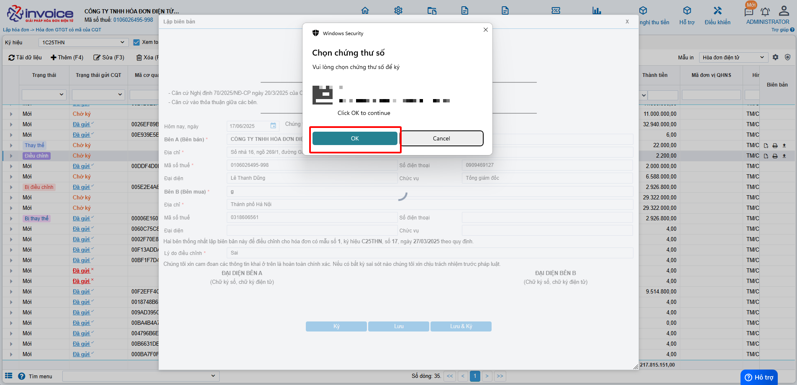

**Anh chị chọn chữ ký số đúng và chọn OK**

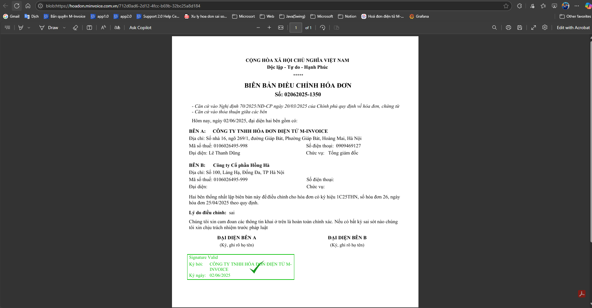

**Biên bản sau khi được ký thành công**

### **Bước 4 : Xem và in biên bản**

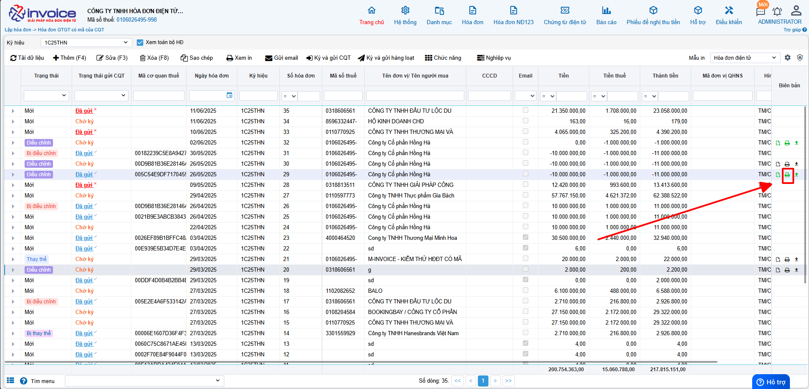

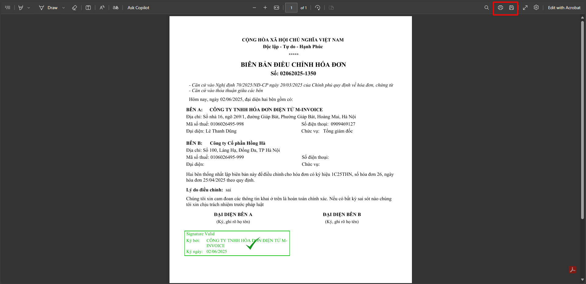

Bấm nút in ở trình duyệt hoặc bấm ctrl + P để in hoặc chọn SAVE để tải về gửi cho khách hàng hoặc lưu trữ

### **Bước 5 : Sau khi gửi cho khách hàng ký anh chị có thể up mẫu biên bản 2 bên đã ký lên phần mềm**

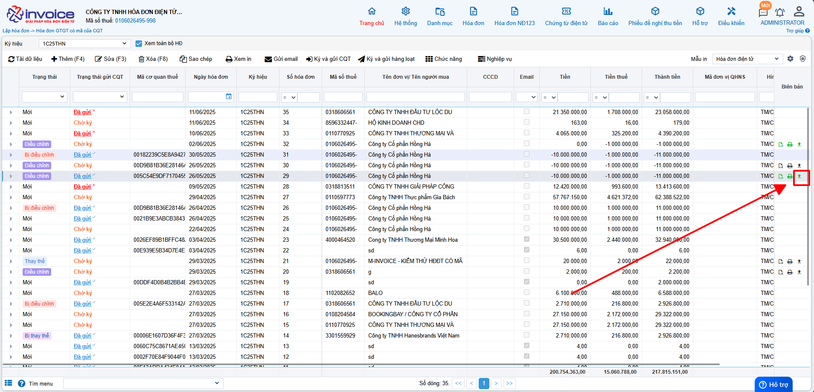

**Chọn hình ảnh theo hướng dẫn trên --> chọn file cần up load --> Bấm nhận**

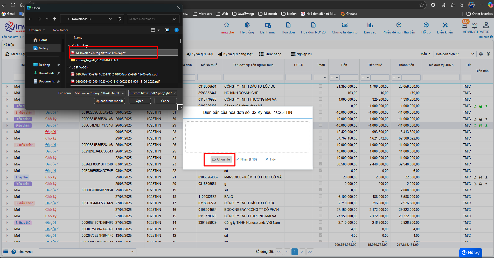

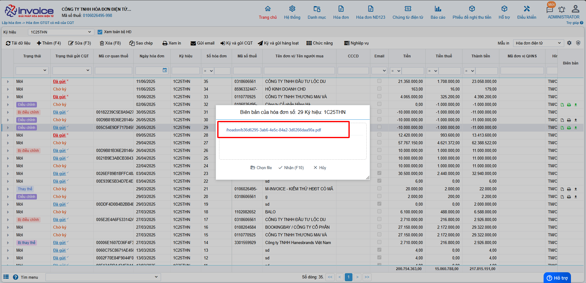

**Như vậy anh chị đã upload lên thành công**

## Gửi mail cho người mua để người mua ký biên bản

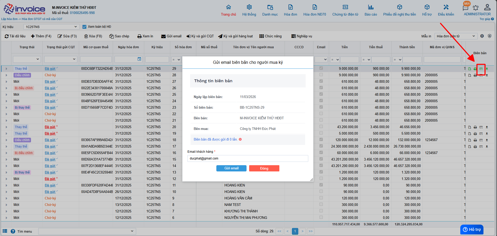

???+ info "Xin chân thành cảm ơn quý khách hàng đã tin dùng sản phẩm của M-Invoice"

    Có bất kỳ vướng mắc nào trong quá trình sử dụng hãy liên hệ với M-Invoice tại mục Hỗ trợ kỹ thuật góc phải bên dưới màn hình hoặc gọi tổng đài kỹ thuật của M-Invoice (1900.955.557 Nhánh 1)

Last updated on <strong>Mar 11, 2026</strong> by <strong>NHATTH</strong>

