# **ĐIỀU CHỈNH/THAY THẾ NHIỀU HÓA ĐƠN**

???+ Note "Mục đích"

    📘 **Căn cứ Điểm b.2, Khoản 1, Điều 10 Thông tư 91/2026/TT-BTC:**

    Trường hợp trong tháng người bán đã lập sai cùng thông tin về người mua, tên hàng, đơn giá, số lượng, thuế suất trên nhiều hóa đơn của cùng một người mua hàng trong cùng tháng, thì người bán được lập một hóa đơn điều chỉnh hoặc thay thế cho nhiều hóa đơn điện tử đã lập sai trong cùng tháng và đính kèm bảng kê các hóa đơn điện tử đã lập sai theo Mẫu số 01/BK-ĐCTT.

    Thao tác tạo hóa đơn Điều chỉnh gồm 2 bước sau:

    - **Bước 1:** Lập bảng kê chứa danh sách chi tiết hóa đơn sai sót cần điều chỉnh
    - **Bước 2:** Tạo hóa đơn Điều chỉnh với Số bảng kê, Ngày bảng kê đã lập

## **Hướng dẫn điều chỉnh/thay thế nhiều hóa đơn có sai sót có đính kèm bảng kê**

???+ Warning "Lưu ý"

    
    CQT chỉ cho phép làm điều chỉnh/ thay thế cho hóa đơn **Có mã, Không mã**. **Hóa đơn máy tính tiền không dùng được chức năng này**

    Chỉ chọn hóa đơn trong cùng 1 tháng lên bảng kê. Nếu khác tháng thì tách thành 2 hóa đơn

    Chỉ lập được bảng kê điều chỉnh thay thế cho đơn vị mua có Mã số thuế. **Khách không có mã số thuế, khách lẻ không sử dụng được**

    Khi tạo bảng kê mà chưa tạo hóa đơn gắn với bảng kê thì vẫn sửa được bảng kê

    Khi tạo bảng kê và đã gán vào hóa đơn, nếu cần sửa bảng kê thì vui lòng xóa hóa đơn tạo lại

### **Bước 1: Xác định ký hiệu tạo hóa đơn**
Người dùng thao tác nghiệp vụ trên ký hiệu nào thì sẽ tạo hóa đơn điều chỉnh/thay thế đính kèm bảng kê tại ký hiệu đó

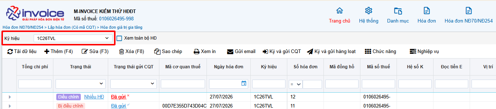

Với trường hợp **Lập hóa đơn**, đã có bảng kê trước đó rồi, hệ thống sẽ mở giao diện **Lập hóa đơn điều chỉnh/thay thế đính kèm bảng kê**, người dùng cần hoàn thiện:

1. Thông tin khách hàng
2. Thông tin liên quan đến bảng kê (hệ thống cho phép tìm kiếm bảng kê liên quan),
3. Chi tiết dòng hàng hóa

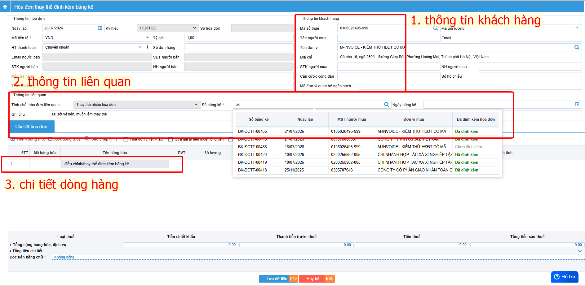

### **Bước 2: Chức năng Điều chỉnh/Thay thế nhiều hóa đơn**
Người dùng chọn **Nghiệp vụ => Điều chỉnh/Thay thế nhiều hóa đơn**, lúc đó hệ thống hiển thị thông báo **Lập hóa đơn/Lập bảng kê**

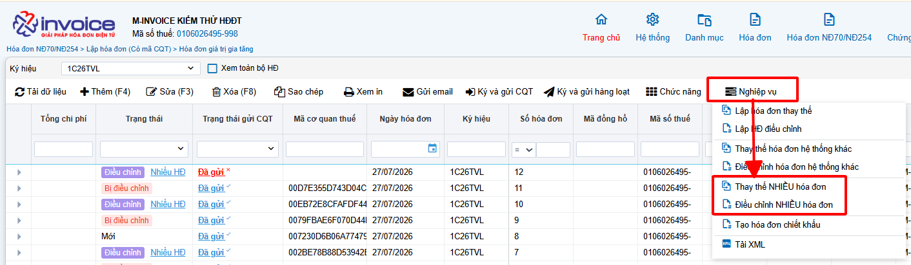

???+ Note
    - **Làm điều chỉnh** khi: **sai sót không trọng yếu** như tăng/giảm giá trị hàng hóa không làm thay đổi bản chất của hàng hóa,.. của cùng một người mua trong cùng một tháng

    - **Làm thay thế** khi: **sai sót nghiêm trọng** liên quan đến mã số thuế tên hàng hóa, thuế suất,.. của cùng một người mua trong cùng một tháng

=== "Người dùng chưa có bảng kê"
    ### **Bước 3: Lập bảng kê**
    Trường hợp chưa có bảng kê, người dùng chọn **Lập bảng kê**, hệ thống hiển thị giao diện Lập bảng kê

    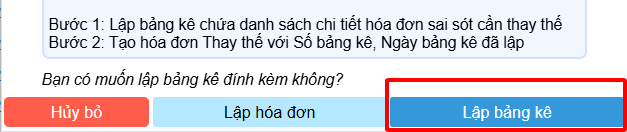

    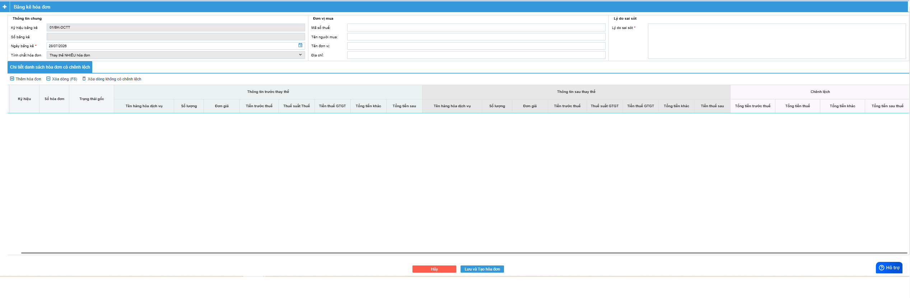

    Người dùng chọn **Thêm hóa đơn**, sau đó chọn **ký hiệu, MST/CCCD (nếu có)**, ngày lập hóa đơn để lọc được danh sách hóa đơn bị sai sót

    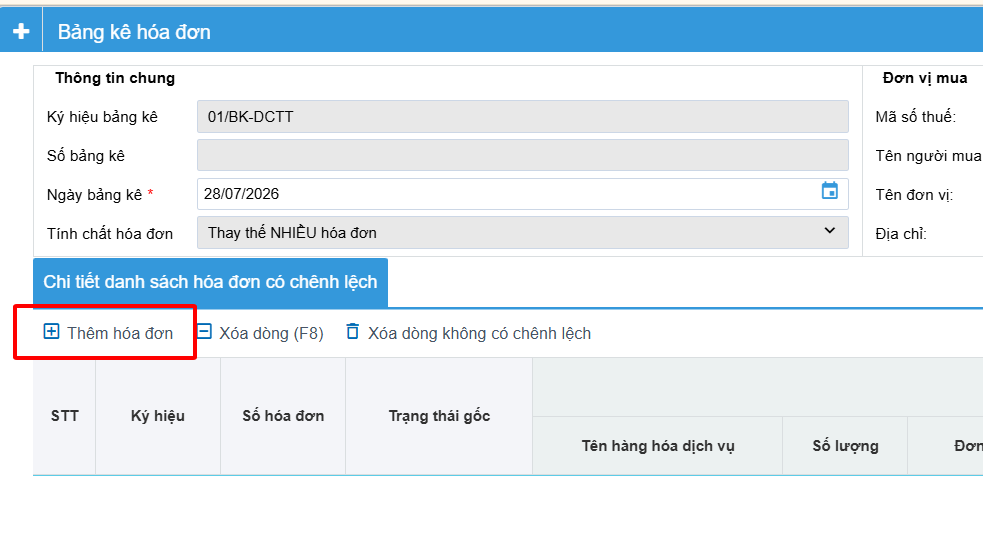

    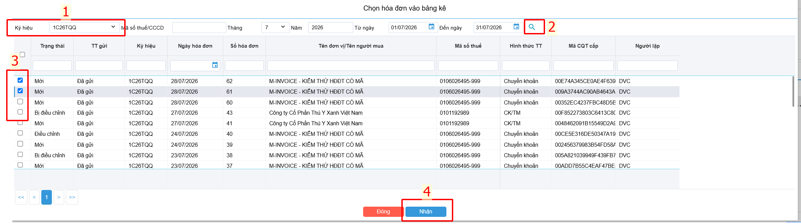

    Nhập **lý do sai sót**, hoàn thiện **thông tin điều chỉnh, thay thế và phần chênh lệch (nếu có)**

    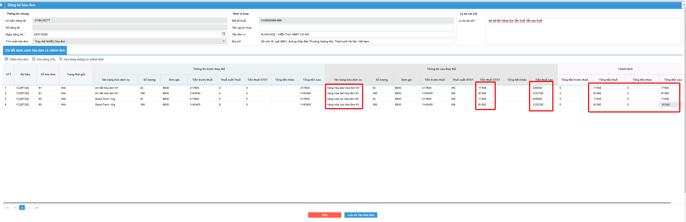

    ???+ Note
        Hình ảnh trên là **lập bảng kê Thay thế hóa đơn số 60, 61, mỗi bảng kê có 2 dòng hàng hóa**

        **Thông tin trước thay thế thể hiện tất cả dòng hàng của hóa đơn bị sai**, sai tên hàng hóa và sai tiền thuế, tiền sau thuế.

        **Thông tin sau thay thế thể hiện tên hàng hóa, tiền thuế và tiền sau thuế chính xác**
        Thông tin phần chênh lệch thể hiện phần Tiền chênh lệch trước khi làm thay thế và sau khi làm thay thế, **hệ thống tự tính toán và cho phép người dùng nhập tay**

=== "Người dùng đã có bảng kê"
    ### **Bước 3: Lập hóa đơn đính kèm bảng kê**
    Trường hợp đã có bảng kê trước đó rồi, người dùng chọn Lập hóa đơn

    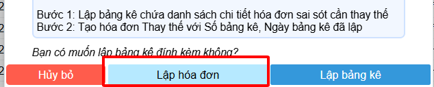

    Trường hợp vừa hoàn thiện thông tin bảng kê, người dùng chọn Lưu và tạo hóa đơn

    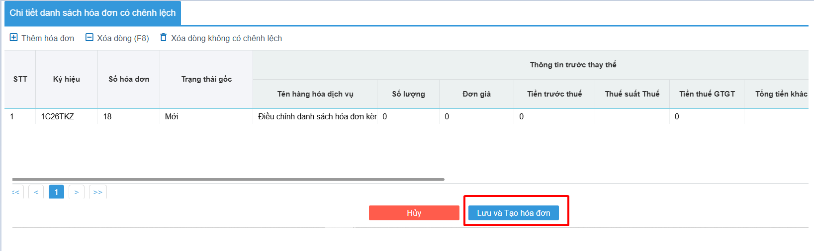

    Hệ thống sẽ mở giao diện **Lập hóa đơn điều chỉnh/thay thế đính kèm bảng kê**, người dùng cần hoàn thiện:

    1. Thông tin khách hàng
    2. Thông tin liên quan đến bảng kê (hệ thống cho phép tìm kiếm bảng kê liên quan)
    3. Chi tiết dòng hàng hóa

    

    ???+ Warning "Lưu ý"
        - Đối với hóa đơn **THAY THẾ** cho nhiều hóa đơn thì thông tin ở mục “THÔNG TIN SAU ĐIỀU CHỈNH/THAY THẾ” là căn cứ để lập hóa đơn thay thế.  
        - Đối với hóa đơn **ĐIỀU CHỈNH** cho nhiều hóa đơn thì thông tin ở mục CHÊNH LỆCH là căn cứ để lập hóa đơn điều chỉnh.
        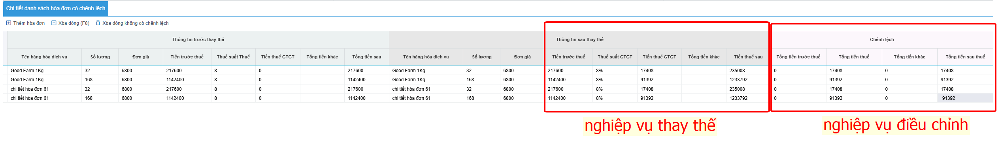

### **Bước 4: Xác nhận tạo hóa đơn điều chỉnh/thay thế đính kèm bảng kê**
Sau khi hoàn thiện thông tin hóa đơn đính kèm bảng kê, người dùng chọn **Lưu dữ liệu**, hệ thống hiển thị thông báo **Xác nhận**, cho phép người dùng kiểm tra lại thông bảng kê bằng cách **Xem bảng kê** hoặc **Xác nhận tạo hóa đơn**

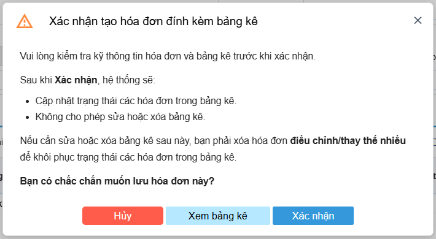

**Xác nhận tạo hóa đơn thành công**, hóa đơn điều chỉnh/thay thế đính kèm bảng kê sẽ có dấu hiệu nhận biết **Nhiều HĐ** ở cạnh **trạng thái hóa đơn**

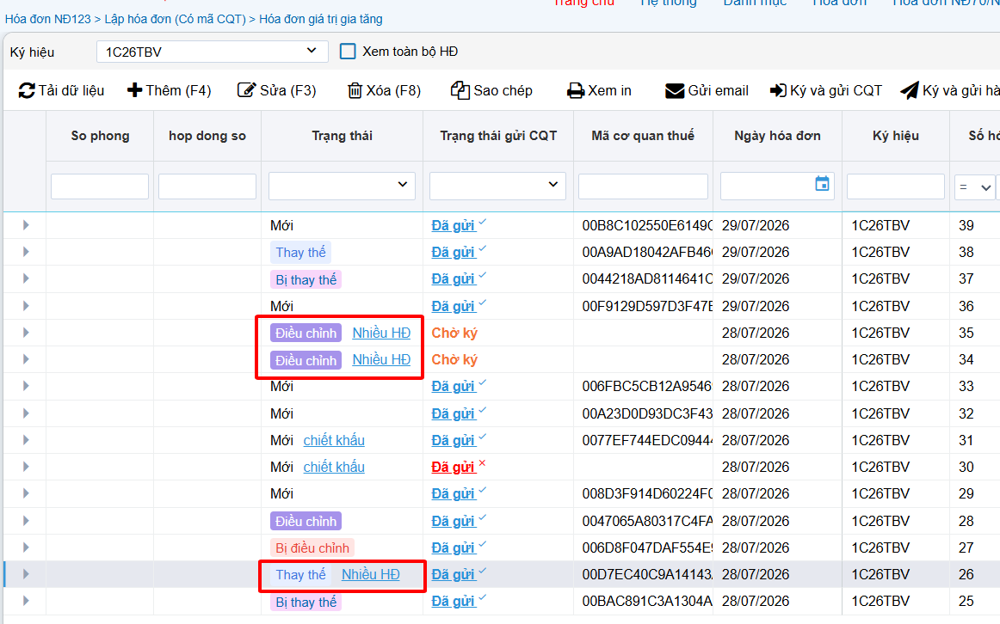

### **Bước 5: Ký và gửi CQT, kiểm tra kết quả**

???+ Note
    **Anh/chị có thể xem bảng kê của các hóa đơn điều chỉnh/thay thế**

    Chọn **hóa đơn NĐ70/NĐ254 => Bảng kê => Bk Hóa đơn thay thế, điều chỉnh**

    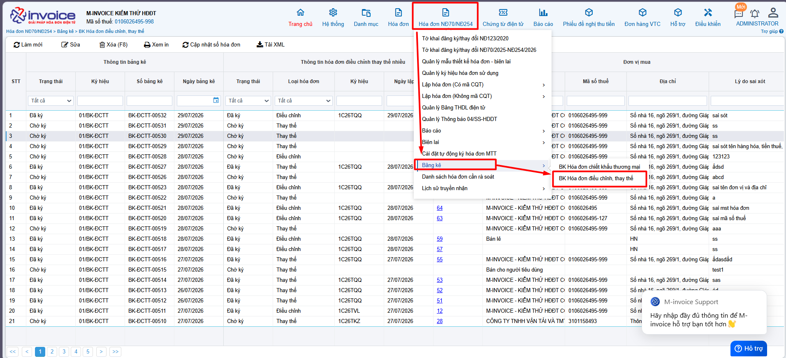

!!! info "Xin chân thành cảm ơn Quý khách hàng đã tin dùng sản phẩm của M-Invoice"

    Có bất kỳ vướng mắc nào trong quá trình sử dụng hãy liên hệ với M-Invoice tại mục Hỗ trợ kỹ thuật góc phải bên dưới màn hình hoặc gọi tổng đài kỹ thuật của M-Invoice (1900.955.557 Nhánh 1)

Last updated on <strong>Aug 04, 2026</strong> by <strong>datvt</strong>

