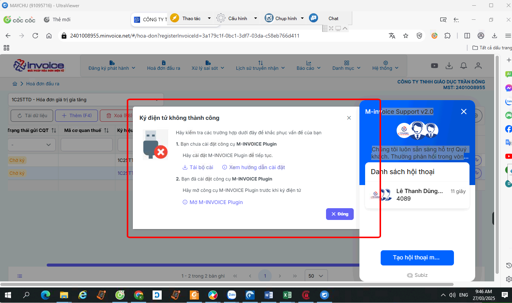
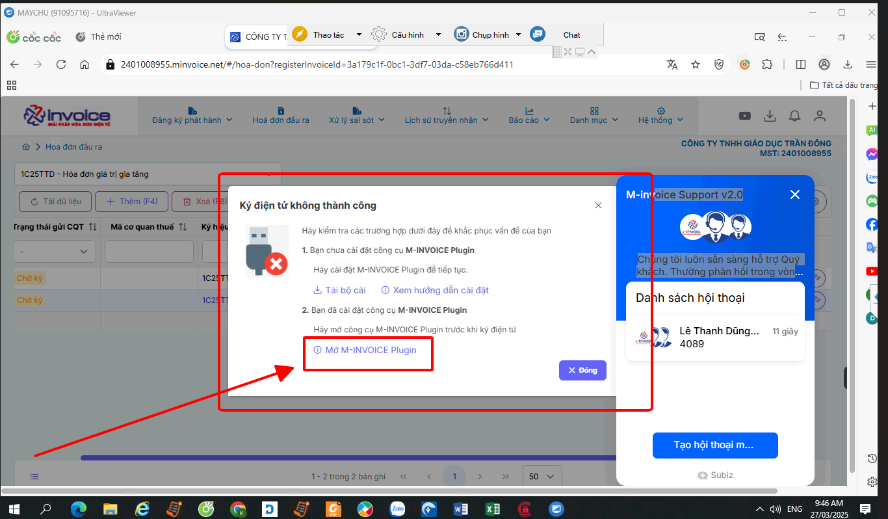
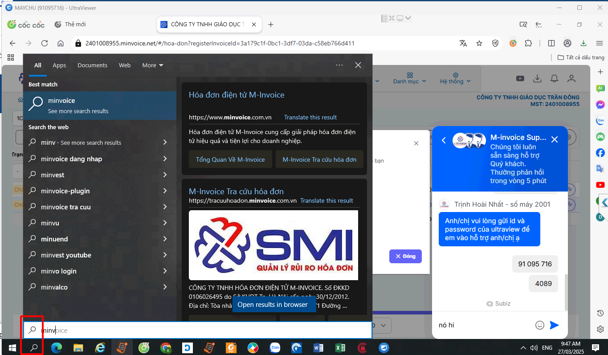

# **Lỗi "Bạn chưa cài đặt công cụ plugin để ký hoá đơn"**

## **Hướng dẫn sửa lỗi "Bạn chưa cài đặt công cụ plugin để ký hoá đơn"**

???+ Bug "Mô tả lỗi"

    Lỗi này thường xảy ra khi quý khách chưa cài plugin ký số

???+ Danger "Trường hợp đã cài đặt nhưng khi ký vẫn thông báo chưa cài"

    Có thể do trình duyệt anh chị đang sử dụng chặn không cho gọi plugin ký lên, anh chị hãy làm theo hướng dẫn sau [Tại đây](loi-ky-hoa-don-chua-cai-dat-plugin-tren-trinh-duyet-chrome.md#attribute-lists){ data-preview }

#### Kiểm tra xem plugin ký số đã cài đặt trên máy mình chưa bằng cách sau

**hoặc bằng cách sau**

**Trường hợp nếu thấy chưa cài đặt thì có thể làm theo [Hướng dẫn cài đặt plugin](plugin.md#attribute-lists){ data-preview }**

???+ info "Xin chân thành cảm ơn quý khách hàng đã tin dùng sản phẩm của M-Invoice"

    Có bất kỳ vướng mắc nào trong quá trình sử dụng hãy liên hệ với M-Invoice tại mục Hỗ trợ kỹ thuật góc phải bên dưới màn hình hoặc gọi tổng đài kỹ thuật của M-Invoice (1900.955.557 Nhánh 1)

Last updated on <strong>Jan 19, 2025</strong> by <strong>NHATTH</strong>

