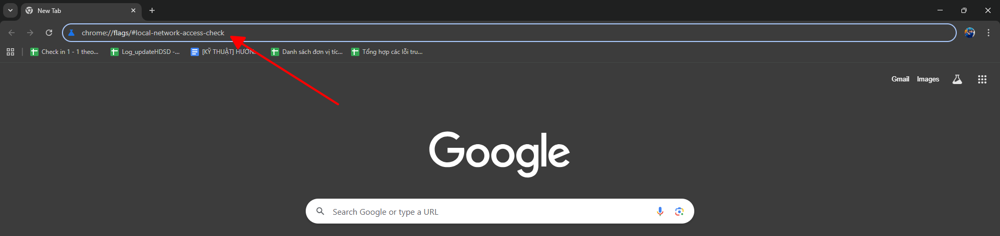
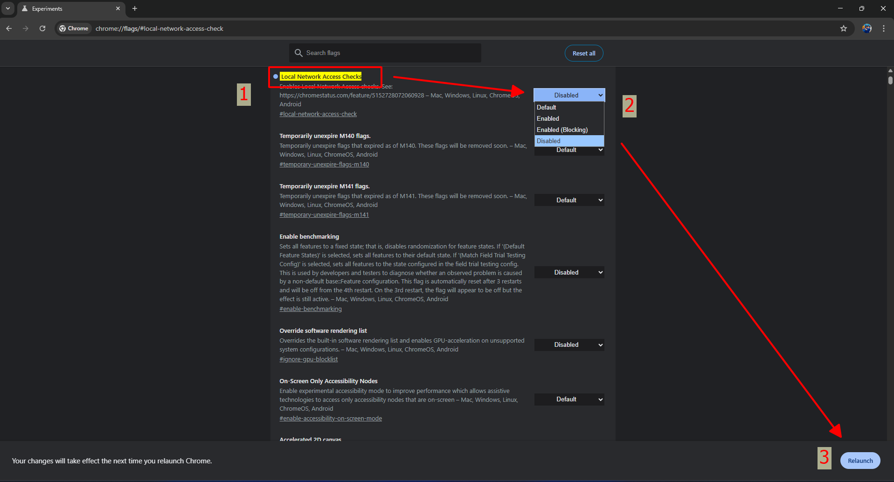

# **Lỗi "Chưa cài đặt plugin mặc dù đã cài trên trình duyệt (Google chrome, Microsoft edge, cốc cốc)"**

## **Hướng dẫn sửa lỗi "Chưa cài đặt plugin mặc dù đã cài trên trình duyệt (Google chrome, Microsoft edge, Cốc cốc)"**

???+ note "Nguyên nhân"

    Do (Google chrome, Microsoft edge, Cốc cốc) update thêm cơ chế bảo mật mạng để kiểm soát quyền truy cập của website (từ Internet) tới tài nguyên trong mạng cục bộ (Local Network)

## **Cách xử lý lỗi trên**

### Bước 1: Truy câp trình duyệt Anh/Chị đang đăng nhập vào trang hóa đơn điện tử để ký hóa đơn dán các đường link tương ứng sau với trình duyệt anh chị đang sử dụng

Dán link sau vào trình duyệt:

Nếu Anh/Chị dùng Google chrome: `chrome://flags/#local-network-access-check`

Nếu Anh/Chị dùng Microsoft edge: `edge://flags/#local-network-access-check`

Nếu Anh/Chị dùng Cốc cốc: `coccoc://flags/#local-network-access-check`

### Bước 2: Chọn "Disabled" Local network Access Checks

### Bước 3: Relaunch chạy lại trình duyệt

???+ info "Xin chân thành cảm ơn quý khách hàng đã tin dùng sản phẩm của M-Invoice"

    Có bất kỳ vướng mắc nào trong quá trình sử dụng hãy liên hệ với M-Invoice tại mục Hỗ trợ kỹ thuật góc phải bên dưới màn hình hoặc gọi tổng đài kỹ thuật của M-Invoice (1900.955.557 Nhánh 1)

Last updated on <strong>Dec 08, 2025</strong> by <strong>NHATTH</strong>

