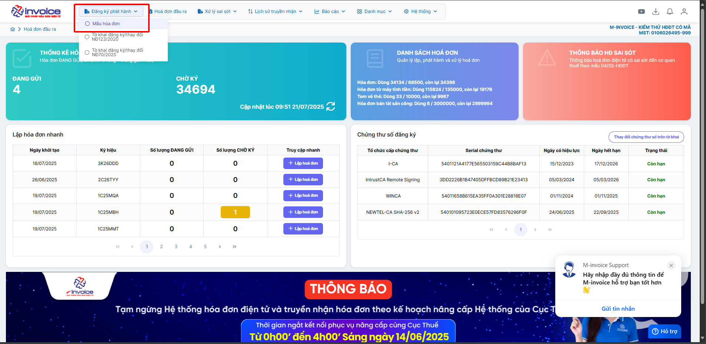
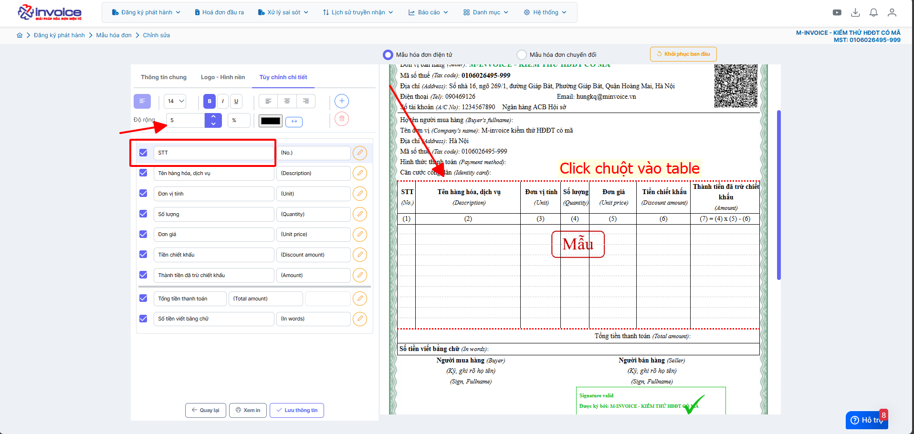

# **Hướng dẫn điều chỉnh độ rộng của các cột trên mâu hoá đơn**

???+ Note "Mục đích"

    Hướng dẫn người dùng cách điều chỉnh độ rộng của các cột trên mẫu hóa đơn trong phần mềm M-invoice.

    Tính năng này giúp doanh nghiệp tối ưu bố cục hiển thị thông tin hàng hóa, số lượng, đơn giá, thành tiền… đảm bảo nội dung không bị tràn dòng, chồng chéo hoặc thiếu cân đối. Việc căn chỉnh độ rộng cột hợp lý giúp mẫu hóa đơn rõ ràng, dễ đọc, tăng tính thẩm mỹ và thể hiện sự chuyên nghiệp khi gửi tới khách hàng.

**Hướng dẫn bằng hình ảnh chi tiết**

### **Bước 1: Truy cập Đăng ký phát hành -> Mẫu hóa đơn**

### **Bước 2: Chọn mâu cần sửa rồi bấm SỬA**

### **Bước 3: Chọn vào bảng -> tích chọn cột cần chỉnh độ rộng -> bấm chỉnh độ rộng**

Xem thêm các trường hợp chỉnh mẫu khác [tại đây.](../../huong-dan/chinh-sua-mau-hoa-don#attribute-lists){ data-preview }

???+ info "Xin chân thành cảm ơn quý khách hàng đã tin dùng sản phẩm của M-Invoice"

    Có bất kỳ vướng mắc nào trong quá trình sử dụng hãy liên hệ với M-Invoice tại mục Hỗ trợ kỹ thuật góc phải bên dưới màn hình hoặc gọi tổng đài kỹ thuật của M-Invoice (1900.955.557 Nhánh 1)

Last updated on <strong>Feb 27, 2026</strong> by <strong>nhatth</strong>

