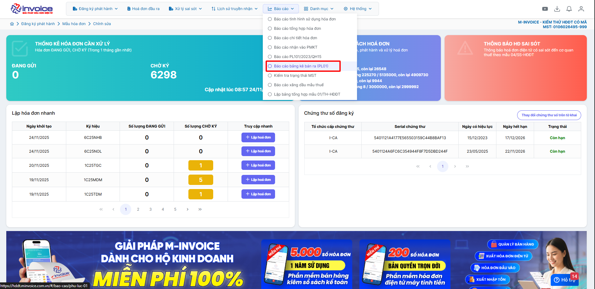
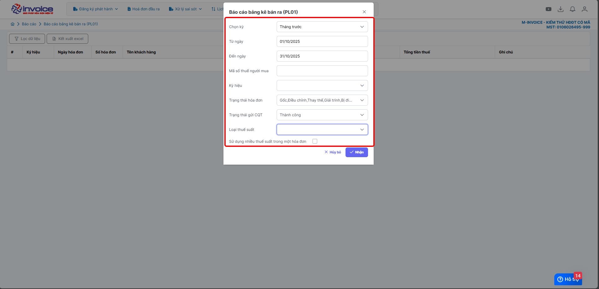
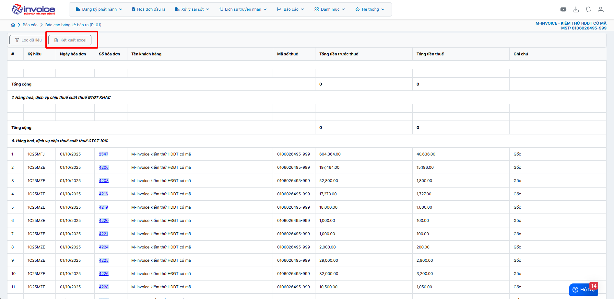

# **Báo cáo bảng kê bán ra PL01**

PL01 (hay còn gọi là Phụ lục 01 – Bảng kê hoá đơn chứng từ hàng hóa, dịch vụ bán ra) là phụ lục đính kèm theo Tờ khai thuế GTGT mẫu 01/GTGT.

???+ note "Mục đích"

    Liệt kê toàn bộ hóa đơn điện tử đầu ra (hóa đơn bán ra) trong kỳ kê khai thuế GTGT.

    Doanh nghiệp kê khai thuế theo phương pháp khấu trừ

    Khi nộp Tờ khai thuế GTGT 01/GTGT hàng tháng hoặc quý

???+ note "PL01 dùng để làm gì?"

    (1). Khai thuế GTGT

    Cơ quan thuế dựa vào PL01 để:

    Kiểm soát doanh thu doanh nghiệp

    Đối chiếu dữ liệu hóa đơn đầu vào – đầu ra

    Rà soát hóa đơn bất thường

    (2). Đối chiếu chéo hóa đơn

    So sánh giữa hóa đơn DN bán ra và hóa đơn DN khác mua vào.

    (3). Hỗ trợ kiểm tra thuế

    Cơ quan thuế yêu cầu DN cung cấp PL01 để kiểm tra việc xuất hóa đơn.

## **Hướng dẫn xem báo cáo bảng kê bán ra PL01**

### **Bước 1: Ở giao diện trang chủ chọn Báo cáo --> Báo cáo bảng kê bán ra PL01**

### **Bước 2: Chọn điều kiện lọc**

Điều kiện lọc bao gồm:

(1). Chọn kỳ: theo quý, tháng, năm (thời gian cần lọc)

(2, 3). Từ ngày đến ngày: chọn theo thời gian

(4). Mã số thuế người mua: lọc mst cụ thể

(5). Ký hiệu: lọc theo ký hiệu cụ thể trường hợp dùng nhiều ký hiệu

(6). Trạng thái hóa đơn

(7). Trạng thái gửi CQT

(8). Loại thuế suất

(9). Sử dụng nhiều thuế suất trong một hóa đơn:

- Trường hợp hóa đơn của anh chị có nhiều thuế trong 1 hóa đơn thì tích vào ô này

Bấm **Nhận** để hệ thống tải báo cáo theo điều kiện lọc

### **Bước 3 : Chọn tải file Excel để kết xuất báo cáo về**

???+ info "Xin chân thành cảm ơn quý khách hàng đã tin dùng sản phẩm của M-Invoice"

    Có bất kỳ vướng mắc nào trong quá trình sử dụng hãy liên hệ với M-Invoice tại mục Hỗ trợ kỹ thuật góc phải bên dưới màn hình hoặc gọi tổng đài kỹ thuật của M-Invoice (1900.955.557 Nhánh 1)

Last updated on <strong>Nov 24, 2025</strong> by <strong>NHATTH</strong>

