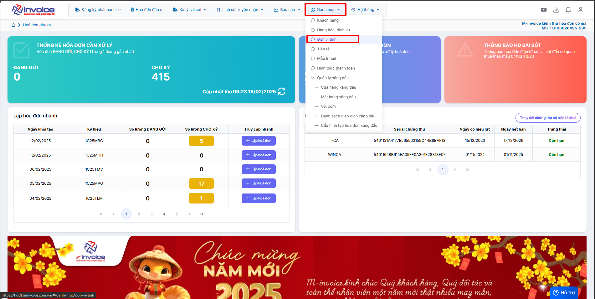
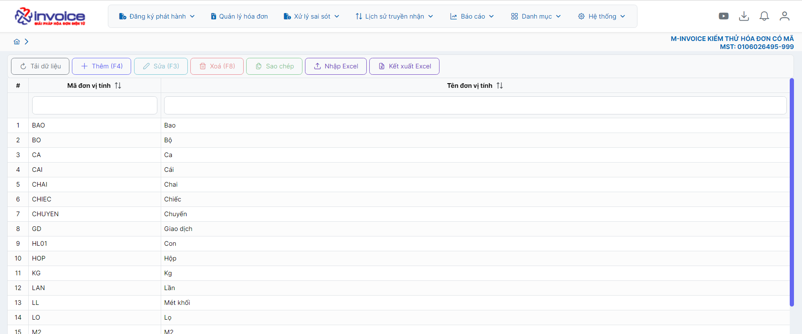
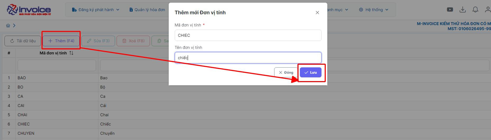
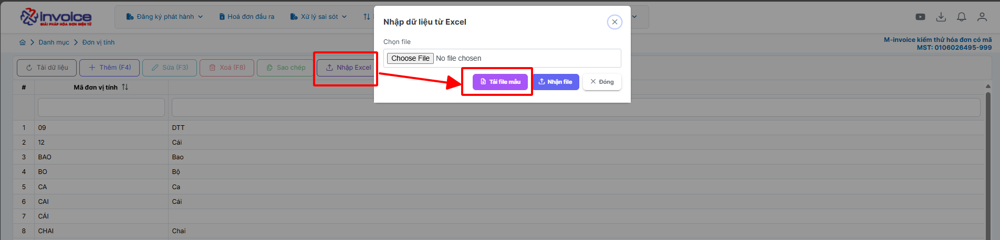
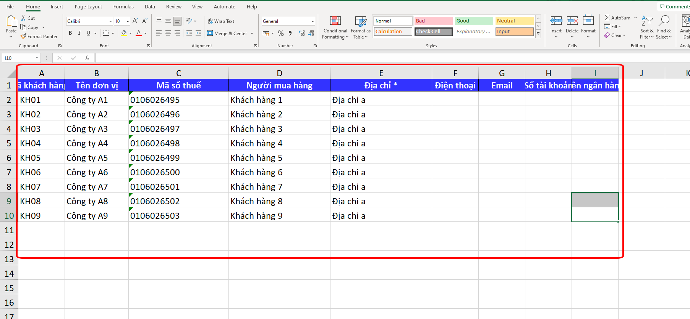
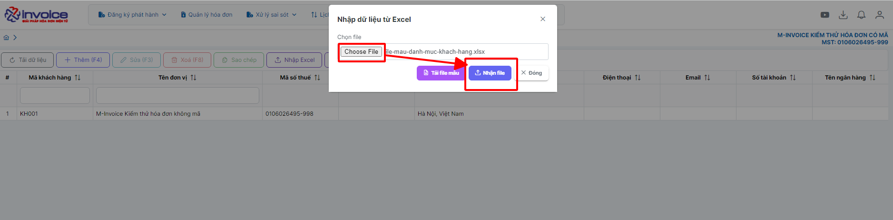

# **Danh mục đơn vị tính**

## **Thêm mới đơn vị tính**

Sử dụng để thêm đơn vị tính mới ngoài đơn vị tính có trên phần mềm

???+ Note "Mục đích"

    Chuẩn hóa đơn vị đo lường: Đảm bảo đơn vị tính (cái, chiếc, kg, giờ, lần…) được dùng thống nhất.

    Giảm sai sót khi lập hóa đơn: Tránh nhập nhầm hoặc không đúng đơn vị tính.

    Xuất hóa đơn nhanh hơn: Chỉ cần chọn đơn vị tính có sẵn thay vì nhập tay.

### **Trên giao diện trang chủ truy cập Danh mục --> đơn vị tính**

=== "Cách 1: Nhập thủ công"

    Bạn nhấn nút **Thêm(F4)** để bắt đầu thêm đơn vị tính
    Nhập đầy đủ thông tin như **Mã đơn vị tính, tên đơn vị tính ....**
    Khi nhập xong bạn nhấn Lưu để lưu đơn vị tính này vào

    

    
    Như vậy là bạn đã hoàn thành thêm mới đơn vị tính

=== "Cách 2: Nhập từ file excel"

    Trên giao diện Danh mục đươn vị tính bạn chọn **Nhập Excel**, sau đó nhấn **Tải file mẫu**

    

    

    Nhập đầy đủ thông tin bạn muốn tải lên vào file mẫu sau đó lưu lại (Những mục có dấu * là bắt buộc)

    

    Quay trở lại phần mềm nhấn Choose File để chọn file vừa lưu, sau đó nhấn Nhận File

    Như vậy là bạn đã tải file excel lên thành công

???+ info "Xin chân thành cảm ơn quý khách hàng đã tin dùng sản phẩm của M-Invoice"

    Có bất kỳ vướng mắc nào trong quá trình sử dụng hãy liên hệ với M-Invoice tại mục Hỗ trợ kỹ thuật góc phải bên dưới màn hình hoặc gọi tổng đài kỹ thuật của M-Invoice (1900.955.557 Nhánh 1)

Last updated on <strong>Feb 02, 2026</strong> by <strong>nhatth</strong>

