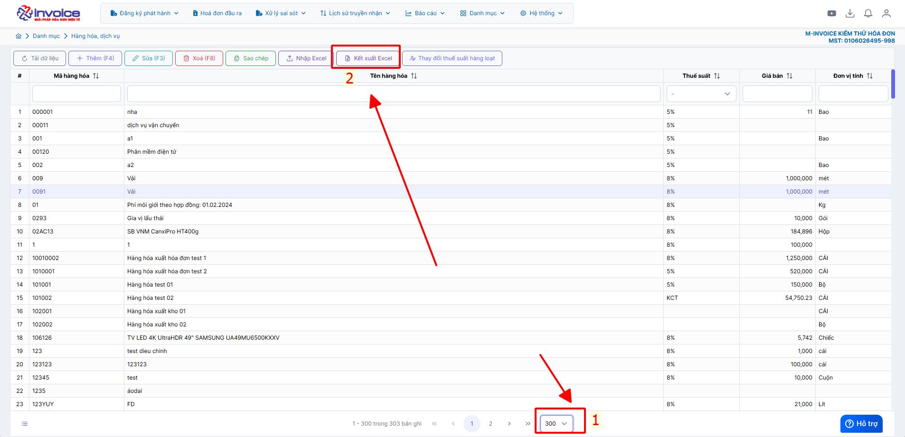

# **Danh mục hàng hóa, dịch vụ**

Dưới đây là những hướng dẫn thao tác cơ bản trên phần mềm hóa đơn điện tử M-Invoice ở phiên bản 2.0 vô cùng mạch lạc và dễ hiểu.

## **Thêm danh mục hàng hóa, dịch vụ**

Sử dụng để thêm mã hàng hoá, dịch vụ

???+ Note "Ghi chú"

    Trong quá trình lập hoá đơn, các mặt hàng được đặt theo mã do đơn vị đặt tên. Sau đây, M-Invoice hướng dẫn NSD tạo mã hàng hoá, dịch vụ

### **Trên giao diện trang chủ truy cập Danh mục --> Hàng hóa, dịch vụ**

=== "Cách 1: Nhập thủ công"

    Bạn nhấn nút **Thêm(F4)** để bắt đầu thêm Hàng hóa, dịch vụ
    Nhập đầy đủ thông tin như **mã hàng, tên hàng, thuế suât .....Vvvv**
    Khi nhập xong bạn nhấn **Lưu** để lưu hàng mã hàng hóa dịch vụ này vào

    

    
    Như vậy bạn đã tạo 1 mã hàng thành công trên hệ thống

=== "Cách 2: Nhập từ file excel"

    Trên giao diện Danh mục hàng hóa dịch vụ bạn chọn **Nhập Excel**, sau đó nhấn **Tải file mẫu**

    

    

    Nhập đầy đủ thông tin bạn muốn tải lên vào file mẫu sau đó lưu lại (Những mục có dấu * là bắt buộc)

    

    Quay trở lại phần mềm nhấn Choose File để chọn file vừa lưu, sau đó nhấn Nhận File

    Như vậy là bạn đã tải file excel lên thành công

=== "Kết xuất Excel danh mục hàng hóa"

    **Mục đích:** Tải excel danh mục hàng hóa về để lưu trữ hoặc phân tích

    

    Anh chị chọn số lượng hàng hóa muốn kết xuất tối đa 300 hàng hóa -> Kết xuất excel, trường hợp anh chị nhiều hơn có thể kết xuất nhiều lần

???+ info "Xin chân thành cảm ơn quý khách hàng đã tin dùng sản phẩm của M-Invoice"

    Có bất kỳ vướng mắc nào trong quá trình sử dụng hãy liên hệ với M-Invoice tại mục Hỗ trợ kỹ thuật góc phải bên dưới màn hình hoặc gọi tổng đài kỹ thuật của M-Invoice (1900.955.557 Nhánh 1)

Last updated on <strong>Nov 29, 2025</strong> by <strong>nhatth</strong>

