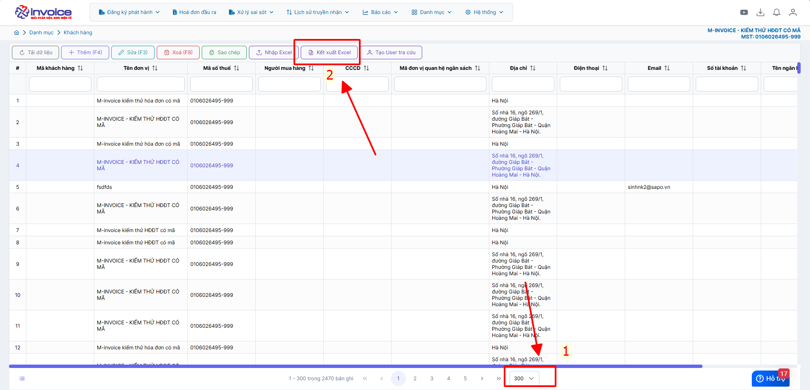

# **Danh mục khách hàng**

Dưới đây là những hướng dẫn thao tác cơ bản trên phần mềm hóa đơn điện tử M-Invoice ở phiên bản 2.0 vô cùng mạch lạc và dễ hiểu.

## **Thêm danh mục khách hàng**

Sử dụng giảm bớt thao tác điền thông tin khách hàng

???+ Note "Ghi chú"

    Trong quá trình lập hoá đơn cần điền thông tin khách hàng và để giảm bớt thao tác nhập thông tin khách hàng, M-invoice hướng dẫn NSD thực hiện thêm danh mục khách hàng

### **Trên giao diện trang chủ truy cập Danh mục --> khách hàng**

=== "Cách 1: Nhập thủ công"

    Bạn nhấn nút **Thêm(F4)** để bắt đầu thêm Khách hàng
    Nhập đầy đủ thông tin như **Mã khách hàng, mã số thuế, Tên đơn vị, Địa chỉ ....**
    Khi nhập xong bạn nhấn Lưu để lưu hàng mã hàng khách hàng này vào

    

    

    Như vậy bạn đã tạo 1 mã khách hàng thành công trên hệ thống

=== "Cách 2: Nhập từ file excel"

    Trên giao diện Danh mục khách hàng bạn chọn **Nhập Excel**, sau đó nhấn **Tải file mẫu**

    

    

    Nhập đầy đủ thông tin bạn muốn tải lên vào file mẫu sau đó lưu lại (Những mục có dấu * là bắt buộc)

    
    Quay trở lại phần mềm nhấn Choose File để chọn file vừa lưu, sau đó nhấn Nhận File

    Như vậy là bạn đã tải file excel lên thành công

=== "Kết xuất Excel danh mục khách hàng"

    **Mục đích:** Tải excel danh mục khách hàng về để lưu trữ hoặc phân tích

    

    Anh chị chọn số lượng khách hàng muốn kết xuất tối đa 300 khách -> Kết xuất excel, trường hợp anh chị nhiều hơn có thể kết xuất nhiều lần

???+ info "Xin chân thành cảm ơn quý khách hàng đã tin dùng sản phẩm của M-Invoice"

    Có bất kỳ vướng mắc nào trong quá trình sử dụng hãy liên hệ với M-Invoice tại mục Hỗ trợ kỹ thuật góc phải bên dưới màn hình hoặc gọi tổng đài kỹ thuật của M-Invoice (1900.955.557 Nhánh 1)

Last updated on <strong>Nov 29, 2025</strong> by <strong>nhatth</strong>

