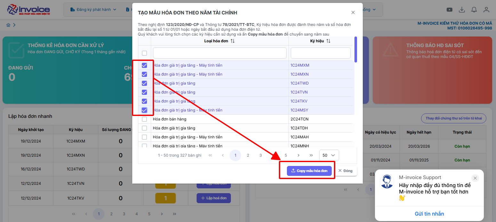
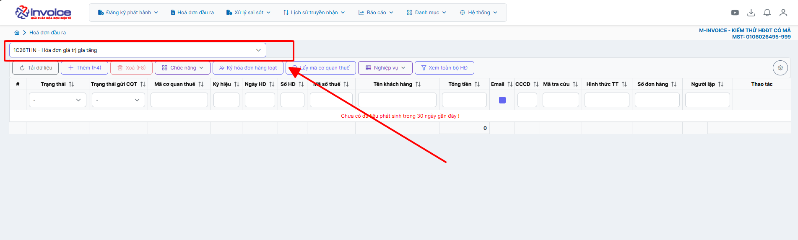
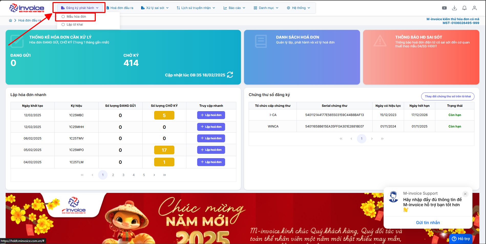
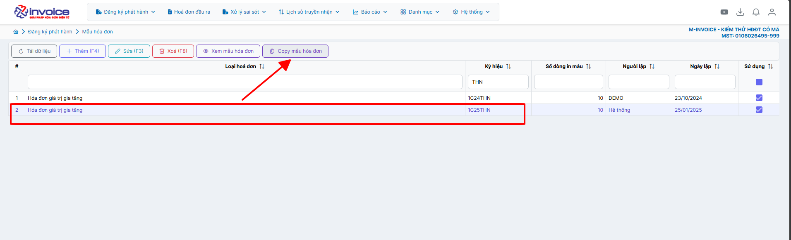
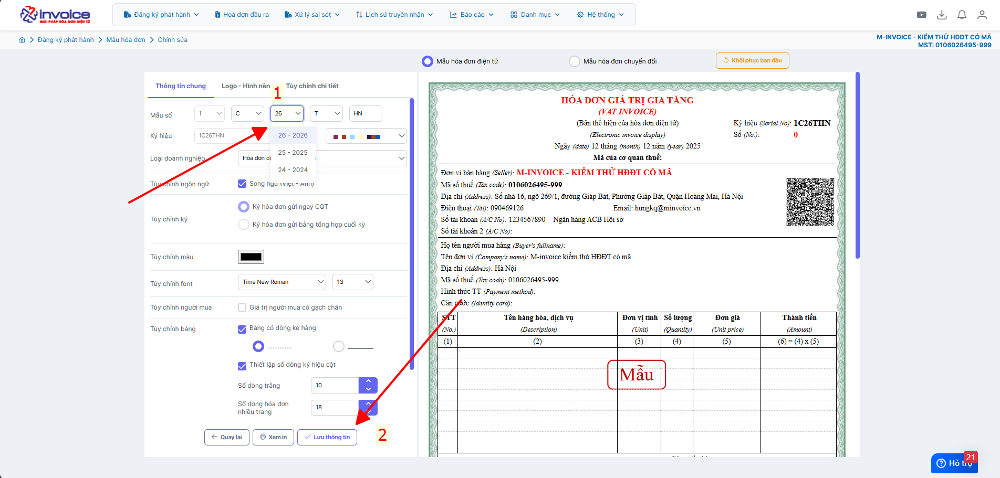
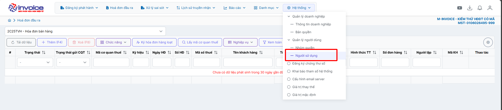
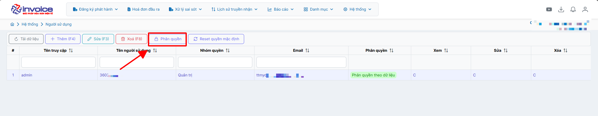
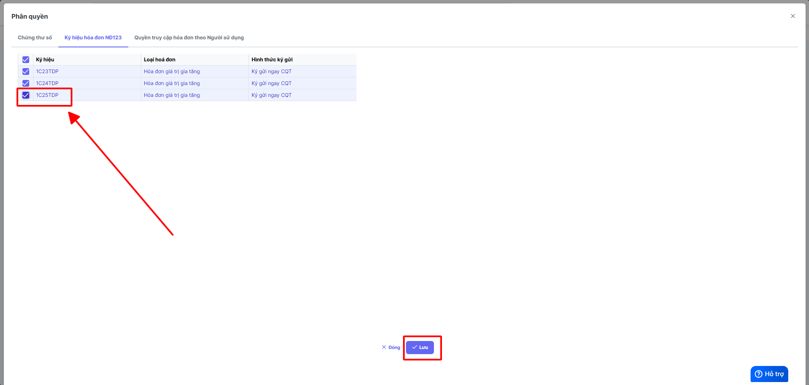

# **Cập nhật ký hiệu do thay đổi năm tài chính**

???+ Note "Mục đích"

    Cập nhật ký hiệu do thay đổi năm tài chính

## **Hướng dẫn cập nhật ký hiệu do thay đổi năm tài chính**

???+ Note "Căn cứ"

    Theo nghị định 123/2020/NĐ-CP và Thông tư 78/2021/TT-BTC, Ký hiệu hóa đơn được đánh theo năm và số hóa đơn bắt đầu lại số 1 từ 01/01 hoặc ngày bắt đầu sử dụng hóa đơn điện tử.

    Quý khách vui lòng tích chọn các ký hiệu cần sử dụng và ấn Copy mẫu hóa đơn để chuyển sang năm sau

???+ Example "Ví dụ"

    Năm 2025 quý khách đang sử dụng ký hiệu 1C25TYY đến số 1234 thì sang năm 2026 anh chị cần sử dụng ký hiệu 1C26TYY và số hóa đơn sẽ bắt đầu lại từ 1

???+ Warning "Lưu ý"

    Phần ký hiệu hóa đơn VD:1C26TYY

    + 1 là loại hóa đơn sử dụng

    + C là có mã của cơ quan thuế, K là không mã của cơ quan thuế

    + 26 đại diện cho 2 số cuối của năm hiện tại

    + YY là 2 ký tự bất kỳ bạn có thể tự chọn

### **Cách 1: Phần mềm hỗ trợ cập nhật**

Khi đăng nhập vào phần mềm bạn sẽ thấy hiện lên 1 thông báo, bạn chỉ cần **tích chọn** các ký hiệu đang sử dụng nhấn **Copy mẫu hoá đơn** để phần mềm tự động cập nhật ký hiệu mới

Truy cập vào **Hóa đơn đầu ra** ở phần ký hiệu sẽ thấy ký hiệu của năm 2026 -> khi bước sang 2026 anh chị chọn đúng ký hiệu này và xuất hóa đơn

### **Cách 2: Cập nhật thủ công**

Bạn truy cập vào phần **Đăng ký phát hành --> Mẫu hóa đơn**

Chọn ký hiệu hóa đơn đang sử dụng ở năm 2025 chọn **Copy mẫu hóa đơn**

**Sửa lại năm tài chính nên ký hiệu sang 26 sau đó nhấn Lưu thông tin**

Như vậy là bạn đã tạo thành công ký hiệu cho năm tài chính mới 2026

??? danger "Trường hợp lưu thành công nhưng không thấy hiện ký hiệu ở "Hóa đơn đầu ra""

    ### Trường hợp lưu thành công nhưng không thấy hiện ký hiệu ở "Hóa đơn đầu ra"

    Truy câp **hệ thống - người sử dụng**

    

    Bấm vào tài khoản đang sử sụng -> Phân quyền

    

    Tích chọn vào ký hiệu vừa tạo  -> Bấm Lưu

    

    Load lại trang và truy cập mục Hóa đơn đầu ra để thấy ký hiệu vừa tạo

???+ info "Xin chân thành cảm ơn quý khách hàng đã tin dùng sản phẩm của M-Invoice"

    Có bất kỳ vướng mắc nào trong quá trình sử dụng hãy liên hệ với M-Invoice tại mục Hỗ trợ kỹ thuật góc phải bên dưới màn hình hoặc gọi tổng đài kỹ thuật của M-Invoice (1900.955.557 Nhánh 1)

Last updated on <strong>Jan 19, 2025</strong> by <strong>nhatth</strong>

