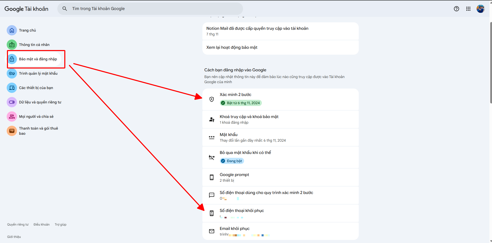
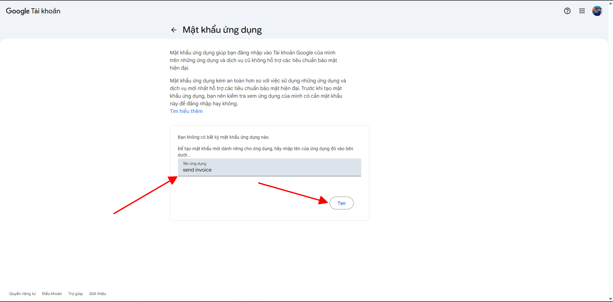
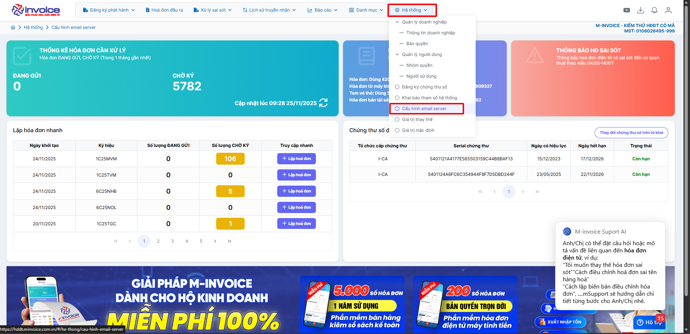
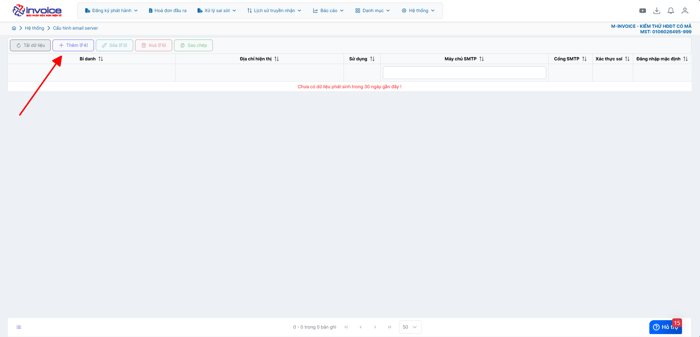
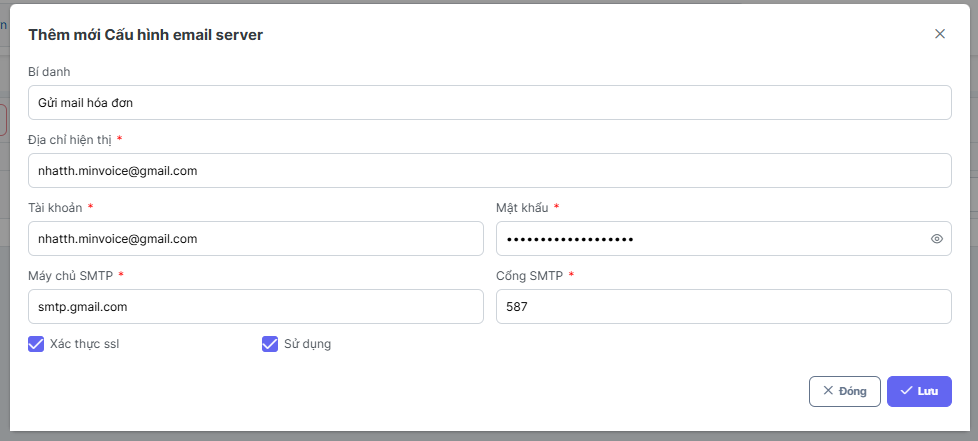

# **Cấu hình email riêng để gửi hóa đơn điện tử**

???+ Note "Mục đích"

    Giúp doanh nghiệp cấu hình SMTP riêng (ví dụ Gmail doanh nghiệp, Outlook, Zoho, mail tên miền công ty…) để gửi hóa đơn điện tử thay vì dùng mail hệ thống của M-Invoice

    Dưới đây M-invoice xin phép được hướng dẫn cấu hình qua Gmail, các cấu hình khác vui lòng tham khảo IT để thực hiện thêm

    **Lưu ý:** khi gửi đi bằng email tự cấu hình M-invoice sẽ không check được trạng thái email đã được gửi đi hãy chưa trên giao diện, mọi nhận biết đều qua hệ thống email của quý đơn vị.

### **Bước 1: [Thao tác ở Gmail] tạo mật khẩu ứng dụng trong gmail (áp dụng cho Gmail)**

#### 1. Truy cập theo đường link sau để tạo mật khẩu ứng dụng cho gmail [Tài khoản Google](https://myaccount.google.com/?pli=1&nlr=1)

#### 2. Tích chọn vào Bảo mật (Security) để xem mail của bạn đã bật xác thực 2 bước và điền số điện thoại chưa, nếu chưa hãy thực hiện

#### 3. Tìm kiếm mật khẩu ứng dụng (Để tạo mật khẩu ứng dụng)

Điền tên ứng dụng để tạo (Điền tên dễ nhớ bất kỳ)

Copy đoạn mật khẩu ứng dụng đã được tạo -> nhấn **Xong**

### **Bước 2: [Thao tác ở phần mềm hóa đơn điện tử M-invoice] truy cập Hệ thống - Cấu hình email server**

Bấm **Thêm**

Điền các thông tin

**Bí danh:** Điền tiêu đề bất kỳ

**Địa chỉ hiển thị:** Điền địa chỉ gmail (nếu quý đơn vị dùng mail server khác thì điền tương ứng)

**Tài khoản:** Điền địa chỉ gmail (nếu quý đơn vị dùng mail server khác thì điền tương ứng)

**Mật khẩu:** Điền `mật khẩu ứng dụng` đã lấy được ở **bước 1** (nếu quý đơn vị dùng mail server khác thì điền mật khẩu tương ứng)

**Máy chủ SMTP:** Điền smtp.gmail.com (nếu quý đơn vị dùng mail server khác thì điền máy chủ SMTP tương ứng)

**Cổng SMTP:** Điền 587 (nếu quý đơn vị dùng mail server khác thì điền cổng SMTP tương ứng)

**Xác thực ssl:** tích chọn

**Sử dụng:** tích chọn nếu muốn sử dụng luôn

### **Bước 3 : Kiểm tra lại thông tin rồi bấm Lưu**

**Như vậy anh chị đã cấu hình xong gmail để gửi từ mail riêng của đơn vị - Anh chị thử gửi 1 hóa đơn xem đã thành công chưa nhé ạ, nếu chưa hay liên hệ M-invoice qua hướng dẫn dưới đây**

!!! info "Xin chân thành cảm ơn Quý khách hàng đã tin dùng sản phẩm của M-Invoice"

    Có bất kỳ vướng mắc nào trong quá trình sử dụng hãy liên hệ với M-Invoice tại mục Hỗ trợ kỹ thuật góc phải bên dưới màn hình hoặc gọi tổng đài kỹ thuật của M-Invoice (1900.955.557 Nhánh 1)

Last updated on <strong>Nov 25, 2025</strong> by <strong>NHATTH</strong>

