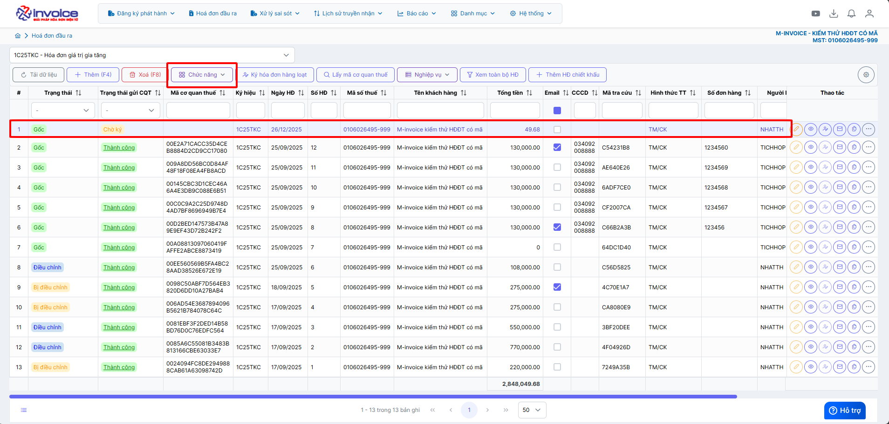
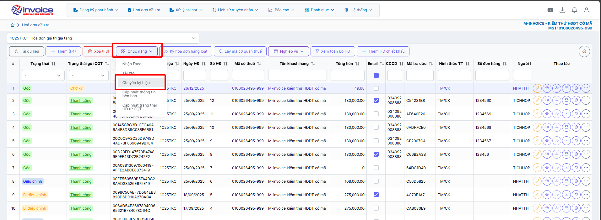
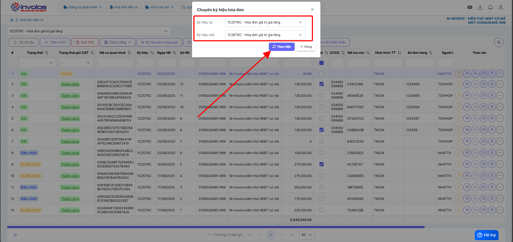

# **Chuyển hóa đơn từ ký hiệu này sang ký hiệu khác**

## **Hướng dẫn chuyển hóa đơn từ ký hiệu này sang ký hiệu khác**

???+ Note "Ghi chú"

    Chức năng này sẽ chuyển 1 hóa đơn từ ký hiệu này sang ký hiệu khác (VD: lập nhập hóa đơn ở ký hiệu 2025 muốn chuyển sang ký hiệu của năm 2026)

    Lưu ý: Chức năng này chỉ áp dụng cho hóa đơn chưa sinh số hóa đơn

### **Bước 1: Chọn hóa đơn cần chuyển ký hiệu --> Chức năng**

### **Bước 2: Ở mục Chức năng --> Chuyển ký hiệu**

### **Bước 3: Chọn ký hiệu mà bạn muốn chuyển sang --> Cập nhật**

Như vậy là bạn đã hoàn thành việc chuyển hóa đơn từ ký hiệu này sang ký hiệu khác

???+ info "Xin chân thành cảm ơn quý khách hàng đã tin dùng sản phẩm của M-Invoice"

    Có bất kỳ vướng mắc nào trong quá trình sử dụng hãy liên hệ với M-Invoice tại mục Hỗ trợ kỹ thuật góc phải bên dưới màn hình hoặc gọi tổng đài kỹ thuật của M-Invoice (1900.955.557 Nhánh 1)

Last updated on <strong>Dec 26, 2025</strong> by <strong>NHATTH</strong>

